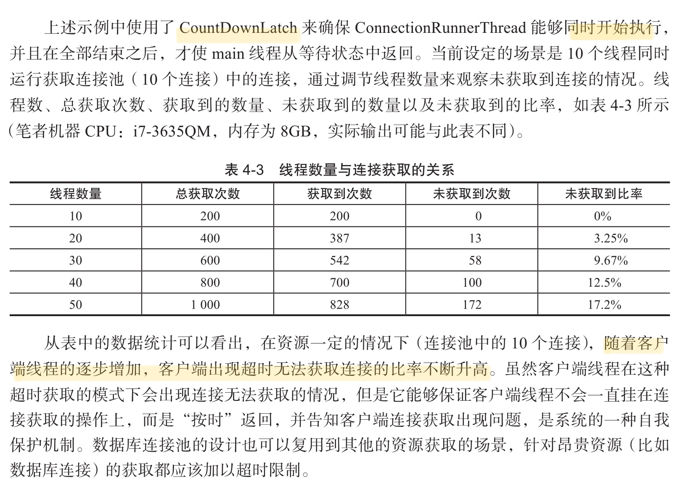

# 线程应用实例

##超时等待模型

需求:调用一个方法的时候等待一段时间(一般来说给定一个时间段),如果方法能够给定的时间段之内得到结果,那么就将结果立即返回,反之超时返回默认结果

#### 等待/通知范式

```javascript
while(value != desire){
		Thread.sleep(1000);	
}
doSomething();
```

#### 超时等待范式

```java
public synchronized Object get(long mills) throws InterruptedException{
		long future = System.currentTimeMillis() + mills;
		long remaining = mills;
		//当超时大于0 并且 result 返回值不满足要求
		while((result == null) && remaining > 0){
				wait(remaining);
				remaining = future - System.currentTimeMillis();
		}
		return result;
}
```

## 实例

一个简单的数据库连接池示例

- 等待超时模型
- 模拟从连接池中获取, 使用, 和释放连接的过程
- 客户端获取连接的过程设定为等待超时的模式,也就是在 1000 毫秒内无法获取则返回一个 null
- 设置连接池的大小为 10 个

#### 连接池

```java
/**
 * <p>
 * 连接池
 * </p>
 *
 * @author EricChen 2020/03/07 21:36
 */
public class ConnectionPool {

    private LinkedList<Connection> pool = new LinkedList<>();

    public ConnectionPool(int initialSize) {
        if (initialSize > 0) {
            for (int i = 0; i < initialSize; i++) {
                pool.add(ConnectionDriver.createConnection());
            }
        }
    }

    /**
     * 将数据源连接释放
     */
    public void releaseConnection(Connection connection) {
        if (connection == null) {
            return;
        }
        synchronized (pool) {
            //连接释放后需要进行通知,这样其他消费者就能感知到连接池中已经归还了一个链接
            pool.addLast(connection);
            pool.notifyAll();
        }
    }

    /**
     * 获取连接
     *
     * @param mills 等待超时时间
     * @return 连接
     */
    public Connection fetchConnection(long mills) throws InterruptedException {
        synchronized (pool) {
            if (mills < 0) {
                while (pool.isEmpty()) {
                    pool.wait();
                }
                return pool.removeFirst();
            } else {
                long future = System.currentTimeMillis() + mills;
                long remaining = mills;
                while (pool.isEmpty() && remaining > 0) {
                    pool.wait(remaining);
                    remaining = future - System.currentTimeMillis();
                }
                Connection result = null;
                if (!pool.isEmpty()) {
                    result = pool.removeFirst();
                }
                return result;
            }
        }
    }

}

```

#### 驱动

```java
/**
 * <p>
 * 连接池驱动
 * </p>
 *
 * @author EricChen 2020/03/07 21:41
 */
public class ConnectionDriver {

    public static final Connection createConnection() {
        return (Connection) Proxy.newProxyInstance(ConnectionHandler.class.getClassLoader(), new Class[]{Connection.class}, new ConnectionHandler());
    }


    public static class ConnectionHandler implements InvocationHandler {

        @Override
        public Object invoke(Object proxy, Method method, Object[] args) throws Throwable {
            //模拟数据库提交
            if (method.getName().equals("commit")) {
                TimeUnit.MILLISECONDS.sleep(100);
            }
            return null;
        }
    }
}
```


#### 连接池测试

```java

/**
 * <p>
 * 连接池测试
 * </p>
 *
 * @author EricChen 2020/03/07 22:04
 */
public class ConnectionPoolTest {
    private static ConnectionPool connectionPool = new ConnectionPool(10);
    private static CountDownLatch countDownLatch = new CountDownLatch(1);
    static CountDownLatch end;


    public static void main(String[] args) throws InterruptedException {
        // 线程数量，可以线程数量进行观察
        int threadCount = 50;
        end = new CountDownLatch(threadCount);
        int count = 20;
        AtomicInteger got = new AtomicInteger();
        AtomicInteger notGot = new AtomicInteger();
        for (int i = 0; i < threadCount; i++) {
            Thread thread = new Thread(new ConnectionRunner(count, got, notGot), "ConnectionRunnerThread");
            thread.start();
        }
        countDownLatch.countDown();
        end.await();
        System.out.println("total invoke: " + (threadCount * count));
        System.out.println("got connection:  " + got);
        System.out.println("not got connection " + notGot);

    }


    static class ConnectionRunner implements Runnable {
        private int count;
        private AtomicInteger got;
        private AtomicInteger notGot;


        public ConnectionRunner(int count, AtomicInteger got, AtomicInteger notGot) {
            this.count = count;
            this.got = got;
            this.notGot = notGot;
        }

        @Override
        public void run() {
            try {
                countDownLatch.await();
            } catch (InterruptedException e) {
                e.printStackTrace();
            }
            while (count > 0) {
                // 从线程池中获取连接，如果1000ms内无法获取到，将会返回null
                // 分别统计连接获取的数量got和未获取到的数量notGot
                try {
                    Connection connection = connectionPool.fetchConnection(1000);
                    if (connection == null) {
                        notGot.incrementAndGet();
                    } else {
                        try {
                            connection.createStatement();
                            connection.commit();
                        } catch (SQLException e) {
                            e.printStackTrace();
                        } finally {
                            connectionPool.releaseConnection(connection);
                            got.incrementAndGet();
                        }
                    }
                } catch (InterruptedException e) {
                    e.printStackTrace();
                } finally {
                    count--;
                }
            }
            end.countDown();
        }
    }
}

```



****