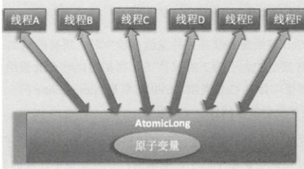
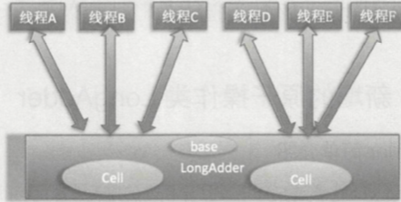
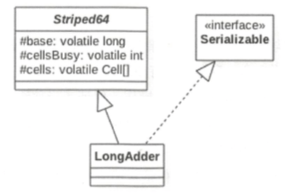

# 010-LongAdder

[TOC]

## 1.LongAdder是什么

JDK8 的 LongAdder 原子性操作类, 该类通过内部 cells 数组 分担了高并发下多线程同时对一个原子变量进行更新时的竞争量, 让多个线程可以同时 对 Cells 数组里面的元素进行并行的更新操作

数组 Cell 使用 `@Sun.misc.Contended`注解进行修饰,避免了 cells 数组内多个元素变量被放入同一个缓存行,避免伪共享, 提升性能

## 为什么要有 LongAdder

AtomicLong 通过 CAS 提供了非阻塞的原子性操作,相比使用阻塞算法的同步器性能已经提升了很多

**但是**

由于AtomicLong 底层使用的 CAS 去操作,大量线程竞争同一个原子变量时,只有一个线程能够 CAS 成功,就会造成大量线程竞争失败后,通过无线循环不断进行自旋尝试 CAS 操作,浪费 CPU 性能


原子变量图示如下




JDK8 新增了一个原子递增或者递减类 LongAdder 用来克服高并发下 AutomicLong 的缺点

#### LongAdder 简介

上面说了, AtomicLong 的性能瓶颈时由于过多线程同时去竞争一个变量的更新而产生的,那么我们可以采用分而治之的想法

**将一个变量分解为多个变量**, 让同样多的线程去竞争多个资源, 就解决了性能能问




- LongAdder 维护了一个延迟初始化的原子性更新数组 , 默认情况下 Cell 数组 是 null , 和一个基数 Base , 由于 Cells 数组占用的内存比较大,所以一开始不创建它,而是在需要时创建,懒加载,每个 Cell 里面有一个初始值为 0 的 Long 类型变量

- 多个线程在争夺同一个Cell 原子变量时,如果失败了, 不尝试一直自旋当前 Cell , 而是尝试其他 Cell ,  增加了 Cell 成功的可能性
- 最后,在获取 LongAdder 当前值的时候,把所有 Cell 变量的 value 值累加再加上 base 返回

## 累加个数

一开始判断 Cell 数组 是 null , 并且并发线程较少时, 所有的累加操作都是对 base 变量进行的,

保持 Cell 的大小是 2 的 N 次方, **在初始化时 Cell 数组中的 Cell 元素个数为 2** , 数组里面的变量实体是 Cell 类型, Cell 类型是 AtomicLong 的一个改进, 用来减少缓存的竞争,也就是解决伪共享问题

## 防止伪共享

对于大多数孤立的原子操作进行字节填充是浪费的, 因为原子性操作都是无规律地分散在内存中的 (也就是说多个原子性变量的内存地址是不连续的), 多个原子变量被放入同一个缓存行的可能性是很小的

但是原子性数组的内存地址是连续的,所以数组内的多个元素会经常共享缓存行, 因此这里使用

`@sun,misc.Contended` 注解对 Cell 类进行字节填充, 这防止了数组中多个元素共享一个缓存行, 在性能上是一个提升

## LongAdder 源码分析

为了解决高并发下多线程对一个变量 CAS 争夺失败后进行自旋而造成的降低并发性能问题, LongAddr 内部维护了一个 Cell 数组, 来分担对单变量进行争夺的开销

- [LongAdder的结构是什么样的](#LongAdder的结构是什么样的)
- [当前线程应该访问 Cell 数组里面的哪一个 Cell 元素](#当前线程应该访问 Cell 数组里面的哪一个 Cell 元素)
- [如何初始化 Cell 数组](#如何初始化 Cell 数组)
- [Cell 数组如何扩容](#Cell 数组如何扩容)
- [线程访问分配的 Cell元素有冲突如何处理](#线程访问分配的 Cell元素有冲突如何处理)
- [如何保证线程操作被分配的 Cell 元素的原子性](#如何保证线程操作被分配的 Cell 元素的原子性)

#### LongAdder的结构是什么样的



- LongAdder  类集成自 Striped64 , Striped64 内部维护了三个变量
- base: 基础值, 默认为 0
- cellsBusy 用来实现自旋锁 , 状态只有 0 或者 1 , 当创建 Cell 元素, 扩容 Cell 数组或者初始化 Cell 数组时, 使用 CAS 操作 cellsBusy 来保证同时只有一个线程可以进行操作
- cells , 用来分代对单个变量争夺的开销

Cells 构造方法

```java
    @sun.misc.Contended  // 防止伪共享
      static final class Cell {
        volatile long value; 
        Cell(long x) { value = x; }
        final boolean cas(long cmp, long val) {
            return UNSAFE.compareAndSwapLong(this, valueOffset, cmp, val);
        }

        // Unsafe mechanics Unsafe 机制
        private static final sun.misc.Unsafe UNSAFE;
        private static final long valueOffset;
        static {
            try {
                UNSAFE = sun.misc.Unsafe.getUnsafe();
                Class<?> ak = Cell.class;
                valueOffset = UNSAFE.objectFieldOffset(ak.getDeclaredField("value"));
            } catch (Exception e) {
                throw new Error(e);
            }
        }
    }
```

#### 如何保证线程操作被分配的 Cell 元素的原子性

从上面的构造方法可以看出, value 采用的是 volatile +CAS 确保原子性

### sum 方法

返回当前值,实际上是累加 Cell 内部的所有 value + base 

```java
    public long sum() {
        Cell[] as = cells; Cell a;
        long sum = base;
        if (as != null) {
            for (int i = 0; i < as.length; ++i) {
                if ((a = as[i]) != null)
                    sum += a.value;
            }
        }
        return sum;
    }
```

值得注意的是这个方法并没有使用 cas ,或者加锁, 所以**是不精确的**. 

在累加的过程中可能有其他线程对 Cell 中的值进行了修改,也有可能进行了扩容, 所以仅仅返回的是快照

#### reset 方法

将 base 置为 0 , 如果 Cell 数组有元素,则元素的值置为 0

```java
    public void reset() {
        Cell[] as = cells; Cell a;
        base = 0L;
        if (as != null) {
            for (int i = 0; i < as.length; ++i) {
                if ((a = as[i]) != null)
                    a.value = 0L;
            }
        }
    }
```

#### sumThenReset

先 sum 然后置为 0 , 多线程下调用可能会有问题,比如考虑第一个调用线程清空了 cell 的值, 后一个线程调用时累加的都是0 值

```
public long sumThenReset() {
    Cell[] as = cells; Cell a;
    long sum = base;
    base = 0L;
    if (as != null) {
        for (int i = 0; i < as.length; ++i) {
            if ((a = as[i]) != null) {
                sum += a.value;
                a.value = 0L;
            }
        }
    }
    return sum;
}
```

#### add 方法

```java
    public void add(long x) {
        Cell[] as; long b, v; int m; Cell a;
      //① 首先看 cells 是否为空, 如果为 null 则当前基础变量 base 上累加
        if ((as = cells) != null || !casBase(b = base, b + x)) {
            boolean uncontended = true;
          //②
            if (as == null || (m = as.length - 1) < 0 ||
                //③
                (a = as[getProbe() & m]) == null ||
                //④
                !(uncontended = a.cas(v = a.value, v + x)))
              //⑤
                longAccumulate(x, null, uncontended);
        }
    }
    final boolean casBase(long cmp, long val) {
        return UNSAFE.compareAndSwapLong(this, BASE, cmp, val);
    }
```

- ① 首先看 cells 是否为空, 如果为 null 则当前基础变量 base 上累加. 类似于 AtomicLong 的操作
- ② 和③ 决定了当前线程应该访问 cell 数组的哪个元素 
  - 如果当前线程的映射的元素存在,则执行代码 ④, 使用 CAS 去更新 Cell 的 value 值
  - 如果映射的元素不存在或者存在但是 CAS 失败则执行代码⑤
- 代码⑤ [longAccumulate方法](#longAccumulate方法) 会对其进行初始化,并且当前线程通过分配的 Cell 元素的 cas 函数来保证 Cell 元素 value 值更新的原子性

##### 当前线程应该访问 Cell 数组里面的哪一个 Cell 元素?

> 当前线程应该访问 cells数组的那一个 Cell 是通过 getProbe() & m 计算的
>
> - 其中m 为当前 cells 数组的个数-1

#### longAccumulate方法

初始化 Cells 数组和扩容


```java
    final void longAccumulate(long x, LongBinaryOperator fn, boolean wasUncontended) {
      //⑥
        int h;
        if ((h = getProbe()) == 0) {
            ThreadLocalRandom.current(); // force initialization
            h = getProbe();
            wasUncontended = true;
        }
        boolean collide = false;                // True if last slot nonempty
        for (;;) {
            Cell[] as; Cell a; int n; long v;
            if ((as = cells) != null && (n = as.length) > liu6 // ⑦
                if ((a = as[(n - 1) & h]) == null) {
                    if (cellsBusy == 0) {       // Try to attach new Cell
                        Cell r = new Cell(x);   // Optimistically create
                        if (cellsBusy == 0 && casCellsBusy()) {
                            boolean created = false;
                            try {               // Recheck under lock
                                Cell[] rs; int m, j;
                                if ((rs = cells) != null &&
                                    (m = rs.length) > 0 &&
                                    rs[j = (m - 1) & h] == null) {
                                    rs[j] = r;
                                    created = true;
                                }
                            } finally {
                                cellsBusy = 0;
                            }
                            if (created)
                                break;
                            continue;           // Slot is now non-empty
                        }
                    }
                    collide = false;
                }
                else if (!wasUncontended)       // CAS already known to fail
                    wasUncontended = true;      // Continue after rehash
                // 当前 Cell存在, 则执行 CAS 设置 9 
                else if (a.cas(v = a.value, ((fn == null) ? v + x :
                                             fn.applyAsLong(v, x))))
                    break;
                // 当前Cell 数组元素个数大于 CPU 个数 10
                else if (n >= NCPU || cells != as)
                    collide = false;            // At max size or stale
                // 是否有冲突  11
                else if (!collide)
                    collide = true;
                //如果当前元素个数没有达到 CPU 个数并且有冲突则扩容 (12)
                else if (cellsBusy == 0 && casCellsBusy()) {
                    try {
                        if (cells == as) {      // Expand table unless stale
                          //12.1
                            Cell[] rs = new Cell[n << 1];
                            for (int i = 0; i < n; ++i)
                                rs[i] = as[i];
                            cells = rs;
                        }
                    } finally {
                      //12.2
                        cellsBusy = 0;
                    }
                  //12.3
                    collide = false;
                    continue;                   // Retry with expanded table
                }
                //13 为了能够找到一个空间的 cell, 重新计算 hash 值, xorshift 算法生成随机数
                h = advanceProbe(h);
            }
            else if (cellsBusy == 0 && cells == as && casCellsBusy()) {
                boolean init = false;
                try {                           // Initialize table
                    if (cells == as) {
                      //14.1
                        Cell[] rs = new Cell[2];
                      //14.2
                        rs[h & 1] = new Cell(x);
                        cells = rs;
                        init = true;
                    }
                } finally {
                  //14.3
                    cellsBusy = 0;
                }
                if (init)
                    break;
            }
            else if (casBase(v = base, ((fn == null) ? v + x :
                                        fn.applyAsLong(v, x))))
                break;                          // Fall back on using base
        }
    }

```

#### 值得注意的是

- **14.3 重置了 cellBusy 标记, 显然这里没有使用 CAS 操作,因为 cellBusy 是 volatile 修饰的,所以线程安全的**

##### 如何初始化 Cell 数组

初始化从 14 开始,  cellsBusy 标志位 0 则说明当前数没有被初始化或者扩容.也没有在新建 Cell 元素

- 为 1 则说明 cells 数组在被初始化或者扩容, 或者当前在创建新的 Cell 元素 
- 通过 CAS 操作来进行 0 或者 1 状态的切换
  - 设置为 1 标识正在扩容. 其他线程不能进行扩容了

- **14.1 初始化数组的长度时 2 ,然后使用 h&1 计算当前线程应该访问 cell 数组的哪个位置,也就是 使用当前线程的 threadLocalRandomProbe 变量 & (cells 数组元素个数 -1) 然后标记已经初始化**

##### 线程访问分配的 Cell元素有冲突如何处理

> 代码 13 , 对 CAS 失败的线程重新计算当前线程的随机值 threadLocalRandomProbe 以减少下次访问 cells 元素时的冲突机会

### Cell 数组如何扩容

cells 数组的扩容时在代码 12 中进行的, 

扩容条件 10 ,11 都不满足则扩容

##### 扩容条件

- 当前 cell 元素的个数小于机器 CPU 个数
- 当前多个线程访问 cells 中同一个元素 , 从而导致其中一个线程 CAS 失败时

> 因为每个 CPU 都运行一个线程的时候,多线程效果最佳,也就是为什么 cells 数组和 CPU个数一致时, 每个 Cell 都使用一个 CPU处理,性能最佳

代码 7 和 8 中,当前线程调用 add 方法并根据当前线程随机值threadLocalRandomProbe  和 cells 元素个数计算要访问 Cell 元素的下表,然后如果发现对应下标 为 null ,则新增一个 Cell 元素到 cells 数组, 设置 cellBusy 为 1 并且添加器到 cells 数组

##### 扩容了多少

> 代码 12 进行扩容操作

- 先 cas 设置 cellsBusy 为 1 ,

- 容量为之前的 2 倍,并复制 Cell 元素到扩容后数组
- 扩容后的 cells 数组里面除了包含复制过来的元素外,还包含其他新元素, 这些元素的值目前是 null