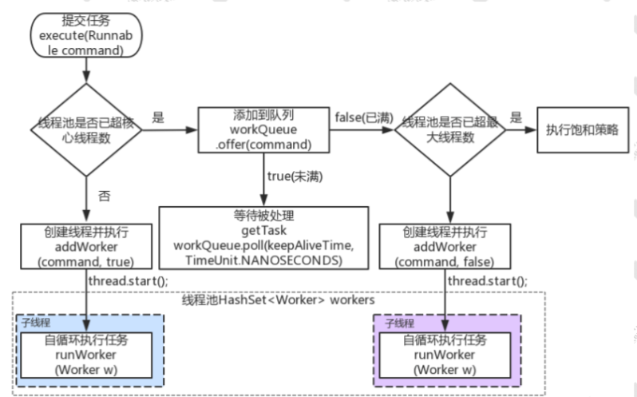

# 021-线程池的工作流程

[TOC]

## 工作流程

当向一个线程池提交一个任务之后,线程池是如何处理任务的呢?

1. 如果正在运行的线程数少于 `corePoolSize `, 线程池会立刻创建线程并执行该线程任务
2. 如果大于 `corePoolSize` ,该任务先加到阻塞队列中
3. 如果**阻塞队列满了**且**阻塞线程正在运行的线程数**小于 `maximumPoolSize`时,线程池会创建非核心线程立即执行该线程任务
4. 如果阻塞线程正在运行的线程数大于等于`maximumPoolSize`,线程池将拒绝执行该线程任务并抛出`RejectExecutionExceptopn`异常
5. 在线程任务执行完毕之后,该任务将被从线程池队列中移除,线程池将从队列中取出下一个线程任务继续执行
6. 在线程出于空闲状态的超过`keepAliveTime`, 正在运行的线程数会收缩到`corePoolSize`

## 图示

## 方法参考

