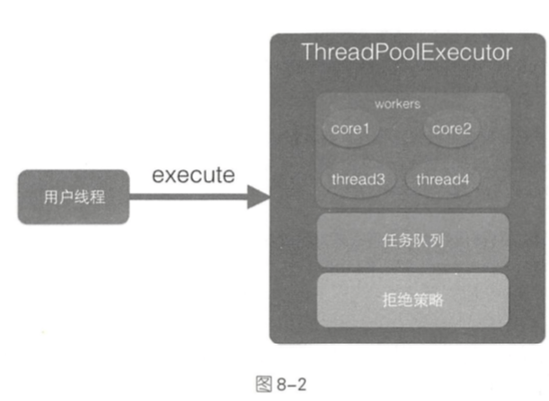

# 041-040-ThreadPoolExecutor-源码分析-execute方法

[TOC]

## 一言蔽之

execute 方法的作用是提交任务 command 到线程池中进行执行 . 用户线程提交任务到线程池的模型图

## execute方法

execute 方法的作用是提交任务 command 到线程池中进行执行 . 用户线程提交任务到线程池的模型图



## 一个生产消费模型

从图中可以看出 ThreadPoolExecutor 实际上就是一个生产消费模型,

- 当用户添加任务到线程池时,相当于生产者生产元素
- workers 集中的线程直接执行任务或者从任务队列里面获取任务时则相当于消费者消费元素

```java
    public void execute(Runnable command) {
      // ① 如果任务为 null , 则排除 NPE
        if (command == null)
            throw new NullPointerException();
      // ②    获取当前线程池的状态 + 线程个数变量的组合值
        int c = ctl.get();
      //// ③ 如果当前线程池的状态个数是否小于 corePoolSize ,小于则开启新线程运行
        if (workerCountOf(c) < corePoolSize) {
            if (addWorker(command, true))
                return;
            c = ctl.get();
        }
      // ④ 如果线程池出于 RUNNING 状态则添加任务到阻塞队列
        if (isRunning(c) && workQueue.offer(command)) {
          // 4.1 二次检查
            int recheck = ctl.get();
          // 4.2 如果当前线程状态不是 Running 状态,则从队列中删除任务, 并执行拒绝策略
            if (! isRunning(recheck) && remove(command))
                reject(command);
          // 4.3 否则如果当前线程池为空,则添加一个线程
            else if (workerCountOf(recheck) == 0)
                addWorker(null, false);
        }
      //⑤ 如果队列满,则新增线程池,新增失败则执行拒绝策略
        else if (!addWorker(command, false))
            reject(command);
    }
```

- 代码 ③ 判断如果当前线程小于 corePoolSize ,则会向 works 里面新增一个核心线程 core 线程执行该任务
- 如果当前线程池中线程个数大于等于 corePoolSize 则执行④代码,判断一下线程池是不是非 running 状态,如果是非 Running 状态,则抛弃
- 4.1 处的二次检查实际上是因为添加任务到任务队列后,执行代码 4.2 前有可能线程池的状态已经变化了
  - 如果不是线程池 running 状态了,则把任务从任务队列中移除并执行拒绝策略
- 如果二次校验通过则执行 4.3 , 添加一个线程
- 如果 添加失败,说明任务队列已经满了,那么执行 ⑤尝试新开启一个线程来执行任务 , 如果当前线程池中的线程个数 > maximumPoolSize 则执行拒绝策略

