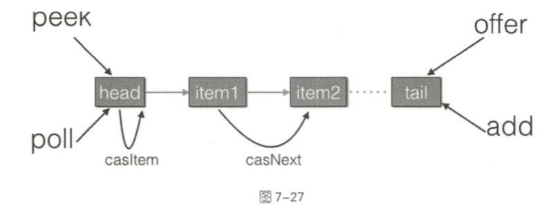

# ConcurrentLinkedQueue

## 是什么

ConcurrentLinkedQueue 是一个线程安全的, **无界 非阻塞队列**, 其底层使用单向链表数据结构来保存队列元素,每个元素包装成一个 Node 节点 , 对列是靠**头节点** 和 **尾结点**来维护的 

- 创建队列时, **头结点**和**尾结点**会指向一个 item 为 null 的哨兵元素
- 第一次执行 peek 操作或者 first 操作时会把 head 执行第一个真正的队列元素

## 核心原理

如图所示 , 入队和出队都是操作使用 **volatile** 修饰的 **tail** 和 **head** 节点, 要保证在多线程下出队列和入队列的线程安全性, 只需要保证这两个 Node 操作的可见性以及原子性即可

由于 volatile 本身可以保证可见性, 所以只需要保证对两个变量操作的原子性即可

#### 如何保证操作 tail 和 head 的原子性

- offer 操作是在 tail 后面添加元素, 也就是调用 tail.casNext 方法, 而这个方法使用的是 CAS 操作, 只有一个线程会成功, 然后失败的线程会循环 , 重新获取 tail , 再执行 casNext 方法
- poll 操作也通过类似的 CAS 算法保证出队时移除节点操作的原子性

## QA

#### 说一说 ConcurrentLinkedQueue

ConcurrentLinkedQueue 是并发包中的一个 线程安全的阻塞队列, 底层维护了一个单项链表, 两个 volatile 类型的 jie

#### 为什么 ConcucrrentLinkedQueue 是线程安全的

> 它并不是全部方法线程安全, 对于出出队操作和入队操作来说,使用 CAS 算法确保了线程安全性, 但是对于 size 操作或者是 contains 操作来说 , 线程是非安全的

#### 为什么 offer等 操作是线程安全的?

> offer 操作是在队列末尾添加一个元素,如果传递的参数是 null 则抛出 NPE 异常, 否则 ,由于 ConcurrentLinkedQueue 是一个**无界队列**, 该方法一直返回 true 
>
> 由于使用 CAS 无阻塞算法,因此该方法不会阻塞挂起调用线程

#### 为什么 contains 方法是线程非安全的

> 判断队列里是否包含有指定的对象,由于是遍历整个队列,所以像 size 操作一样的结果也不是那么精确,有可能调用该方法时元素还在队列里面,但是遍历过程中其他线程才把该元素删除了,那么就会返回 false

## 源码分析

 [032-ConcurrentLinkedQueue源码分析.md](032-ConcurrentLinkedQueue源码分析.md) 

