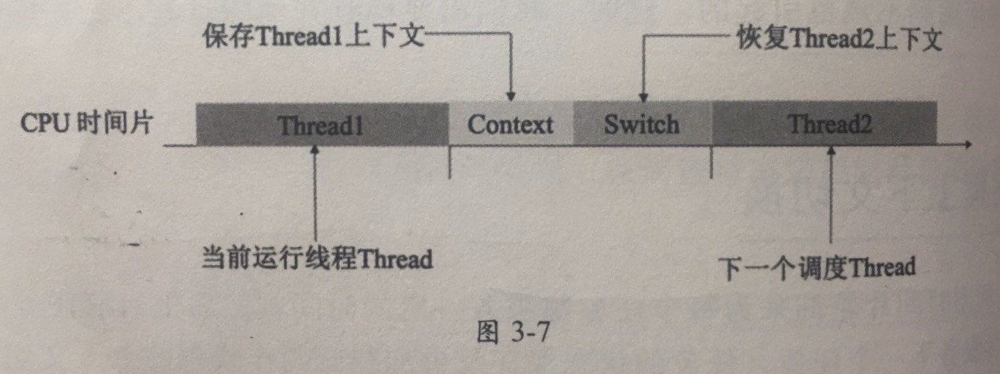

# 上下文切换

即使是单核处理器也支持多线程执行代码,CPU 通过给每个线程分配 CPU 时间片来实现这个机制

> 上下文切换指的是内核(操作系统核心)在 CPU 上对进程或者线程进行切换,上下文切换过程中的信息被保存在进程控制块(PCB-Process Control Block)
>
> PCB又被称作切换帧(SwitchFrame),上下文切换的信息会被一直保存在 CPU内存中,直到被再次使用
>
> 流程如下
>
> - 挂起一个进程,将这个进程在 CPU 中的状态(上下文信息) 存储于内存的 PCB 中
> - 在 PCB 中检索下一个进程的上下文并将其在 CPU 的寄存器中恢复
> - 跳转到程序计数器所指向的位置,并恢复进程
>
> 时间片轮换方式是多个任务在同一 CPU 上执行变成可能,
>
> 

## 上下文切换的原因

引起线程上下文切换的原因如下

- 当前正在执行的任务完成,系统的 CPU 正常调度下一个任务
- 当前正在执行的任务遇到 IO 等阻塞操作,调度器挂起此任务,继续调度下一个,
- 多个任务并发抢占锁资源,当前任务没有抢到锁资源,被调度器挂起,继续调度下一个任务
- 用户的代码挂起大年任务,比如线程执行 sleep 方法,让出 CPU
- 硬件中断

## 上下文切换的开销

CPU通过给每个线程分配CPU时间片来实现多线程。时间片是CPU分配给各个线程的时间，因为时间片非常短，所以CPU通过不停地切换线程执行，让我们感觉多个线程是在同时执行。然而，**上下文切换开销非常大**。

## 测试串行和并行执行的执行时间

```java
/**
 * 并发和单线程执行测试
 * 
 * @author tengfei.fangtf
 * @version $Id: ConcurrencyTest.java, v 0.1 2014-7-18 下午10:03:31 tengfei.fangtf Exp $
 */
public class ConcurrencyTest {

    /** 执行次数 */
    private static final long count = 10000L *10;

    public static void main(String[] args) throws InterruptedException {
        //并发计算
        concurrency();
        //单线程计算
        serial();
    }

    private static void concurrency() throws InterruptedException {
        long start = System.currentTimeMillis();
        Thread thread = new Thread(new Runnable() {
            @Override
            public void run() {
                int a = 0;
                for (long i = 0; i < count; i++) {
                    a += 5;
                }
                System.out.println(a);
            }
        });
        thread.start();
        int b = 0;
        for (long i = 0; i < count; i++) {
            b--;
        }
        thread.join();
        long time = System.currentTimeMillis() - start;
        System.out.println("concurrency :" + time + "ms,b=" + b);
    }

    private static void serial() {
        long start = System.currentTimeMillis();
        int a = 0;
        for (long i = 0; i < count; i++) {
            a += 5;
        }
        int b = 0;
        for (long i = 0; i < count; i++) {
            b--;
        }
        long time = System.currentTimeMillis() - start;
        System.out.println("serial:" + time + "ms,b=" + b + ",a=" + a);
    }

}

```


可以看出，当并发执行累加操作不超过百万次时，速度回比串行执行操作慢，原因就是线程有**创建**和**上下文切换**的开销。

##减少上下文切换
- **无锁并发编程**
多线程竞争锁时，会引起上下文切换，所以多线程处理数据时，可以用一些办法来避免使用锁，如将数据的ID按照Hash算法取模分段，不同的线程处理不同段的数据。
- **CAS算法**
Java的`Atomic`包使用CAS算法来更新数据，而不需要加锁。
- **使用最少线程**
避免创建不需要的线程，比如任务很少，但是创建了很多线程来处理，这样会造成大量线程都处于等待状态。
- **协程**
在单线程里实现多任务的调度，并在单线程里维持多个任务间的切换。