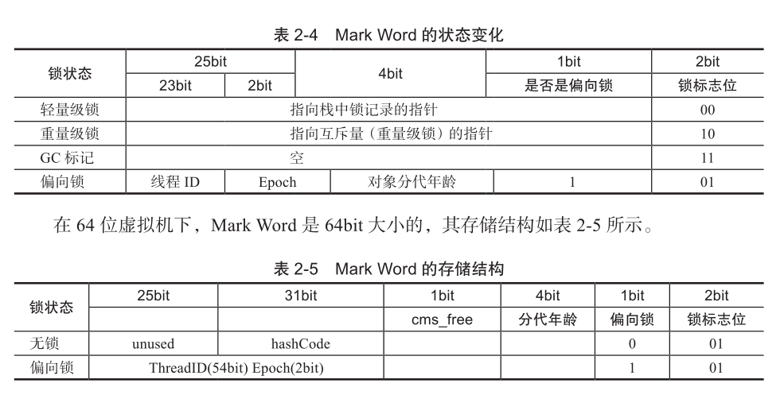
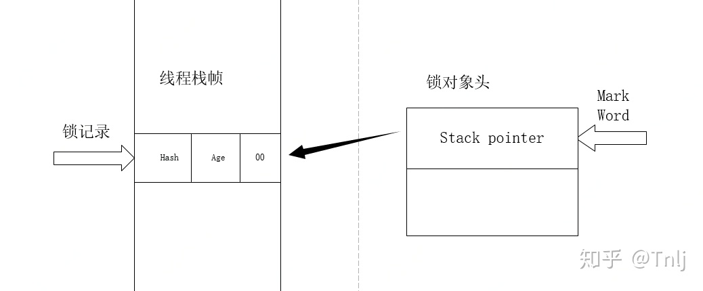
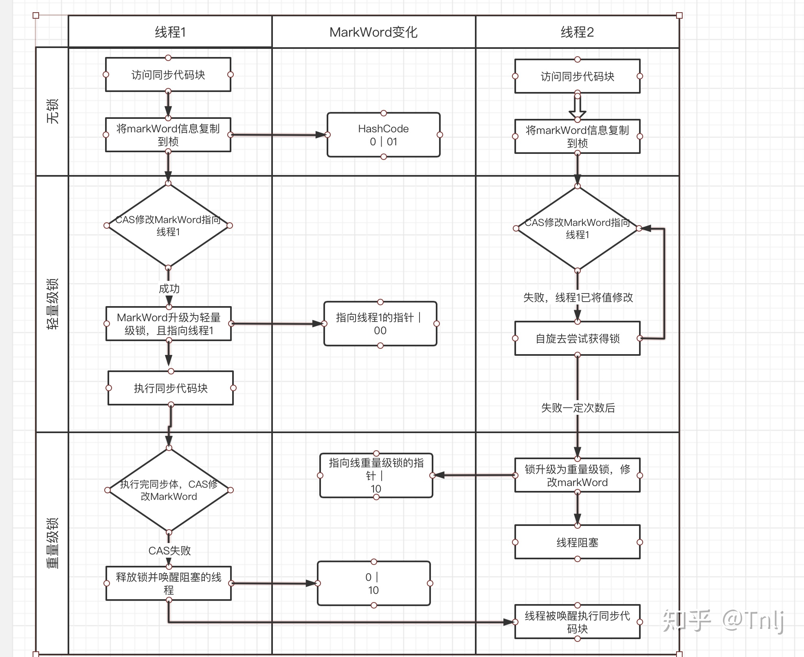

# Synchronzied的实现原理

---

[TOC]

## Synchronzied是什么

在多线程并发编程中 synchronized 一直是元老级角色，很多人都会称呼它为重量级锁。但是，随着 Java SE 1.6 对 synchronized 进行了各种优化之后，有些情况下它就并不那么重，Java SE 1.6 中为了减少获得锁和释放锁带来的性能消耗而引入的**偏向锁**和**轻量级锁**。以及锁的升级过程和存储结构

## Synchronzied的内存语义

Synchronzied 的内存语义可以解决内存可见性问题

- 进入 Synchronzied 块 的内存语义是把 Synchronzied 块内使用到的变量从线程的工作内存中清除,这样在Synchronzied 块内使用到 该变量时就不会从线程的工作内存中获取,而是直接从主内存中获取
- 退出 Synchronzied 块的内存语义是把 Synchronzied 块内对共享变量的修改刷新到主内存

值得注意的是 Synchronzied 会引起线程上下文切换的开销

## Java对象的锁
Java中每一个对象都可以作为锁：
1. 对于普通的同步方法，锁是当前**实例对象。**
1. 对于静态同步方法，锁是当前**类的Class对象**。
1. 对于同步方法块，锁是symchronized括号里配置的对象。

```java
public class SynchronizedExample {
    /**
     * 普通同步方法,锁是当前实例对象
     */
    public synchronized void test1() {

    }
    /**
     * 静态同步方法,锁是当前类的 Class对象
     */
    public static synchronized void test2() {

    }
    /**
     * 对于同步代码块,锁是 synchronized 括号内配置的对象
     */
    public void test3() {
        synchronized (this) {

        }
    }
}
```

当一个线程访问同步代码块时，它首先必须得到锁，退出或者抛出异常时必须释放锁。

## monitorenter 和 monitorexit 指令

```java
public class Synchronized {
    public static void main(String[] args) {
        // 对Synchronized Class对象进行加锁
        synchronized (Synchronized.class) {

        }
        // 静态同步方法，对Synchronized Class对象进行加锁
        m();
    }

    public static synchronized void m() {
    }
}

```

我们使用 `javap -v Synchronized `获得输出汇编指令


- 同步代码块使用的是`monitorenter`和`monitorexit`
- 同步方法使用的是`ACC_SYNCHRONIZED`完成

其本质是获取对象的监视器(minitor),这个过程是排他的,**同一个时刻只有一个线程能获取到对象的监视器**

任意一个对象都拥有自己的监视器,当这个对象由同步块或者这个同步方法调用时,执行方法的线程必须先湖区到该对象的监视器才能进入同步块或者同步方法,而没有获取到监视器(执行该方法)的线程就会被阻塞在同步块或者同步方法的入口外,进入 BLOCKED 状态 


- 任意线程对 Object(Synchronized 修饰)的访问,首先要获得 Object 的监视器
- 获取失败会进入同步队列 , 线程变为阻塞状态 BLOCKED
- 当访问 Object 的前驱(获得锁的线程)释放了锁,释放操作会唤醒在同步队列中的线程

JVM 基于进入和退出` Monitor`对象来实现方法同步和代码同步,但是细节不一样.

- `monitorenter`指令是在编译后插入到同步代码块的开始位置
- `monitorexit`指令是插入到方法结束处和异常处

JVM要保证每个 `monitorenter`必须有对应的 `monitorexit` 与之配对

任何对象都有一个 monitor 与之关联,当且一个 monitor 被持有后,它将进入锁定状态,线程执行到`monitorenter`指令时,将会尝试获取对象所对应的 monitor 的所有权,即尝试获取对象的锁

## Java 对象头
synchronized 用的锁是存在Java对象头里的。如果对象是数组类型，则虚拟机用3个字宽(Word)存储对象头，如果对象时非数组类型，则使用2个字宽存储对象头。在32为虚拟机中，1字宽=4字节，即32bit 。

#### java对象头的长度

| 长度     | 内容                   | 说明                           |
| -------- | ---------------------- | ------------------------------ |
| 32/64bit | Mark Word              | 存储对象的 hashCode 或者锁信息 |
| 32/64bit | Class Metadata Address | 存储到对象类型数据的指针       |
| 32/32bit | Array length           | 数组的长度(如果当前对象是数组) |

Java 对象头里的 Mark word 里默认存储的是对象的 hashCode, 分代年龄和所标记位,32 位 JVM 的 Mark Word 的默认存储结构:

| 锁状态   | 25bit           | 4bit         | 1bit 是否是偏向锁 | 2bit 锁标志位 |
| -------- | --------------- | ------------ | ----------------- | ------------- |
| 无锁状态 | 对象的 hashCode | 对象分代年龄 | 0                 | 01            |

在运行状态, Mark Word里存储的数据会随着标志位的变化而变化:



## 锁的升级与对比

Java SE 1.6 为了减少获得锁和释放锁的性能消耗,引入了"偏向锁"和"轻量级锁"

#### 锁的四种状态

级别从高到低依次是:

- 无锁状态
- 偏向锁状态
- 轻量级锁状态
- 重量级锁状态

这几个状态可以随着竞争情况主键升级,但是不能降级例如 偏向锁升级成轻量级锁后不能再降级到偏向锁

### 偏向锁
在大多数情况下，锁不存在多线程竞争，且总是由同一个线程多次获得，为了让线程获得锁的代价更低而引入了**偏向锁**。

那么只需要在锁第一次被拥有的时候，记录下偏向线程ID。这样偏向线程就一直持有着锁，直到竞争发生才释放锁。以后每次同步，检查锁的偏向线程ID与当前线程ID是否一致，如果一致直接进入同步，退出同步也无需每次加锁解锁都去CAS更新对象头，如果不一致意味着发生了竞争，锁已经不是总是偏向于同一个线程了，这时候需要锁膨胀为轻量级锁，才能保证线程间公平竞争锁。

#### 偏向锁的撤销

**偏向锁使用了一种等到竞争出现才释放锁的机制，所以当其他线程尝试竞争偏向锁时，持有偏向锁的线程才会释放锁。**

偏向锁的撤销，需要等待全局安全点（在这个时间点上没有字节码正在执行），它会首先暂停拥有偏向锁的线程，然后检查持有偏向锁的线程是否活着，如果线程不处于活动状态，则将对象头设置成无锁状态，如果线程仍然活着，拥有偏向锁的栈会被执行，遍历偏向对象的锁记录，栈中的锁记录和对象头的Mark Word要么重新偏向于其他线程，要么恢复到无锁或者标记对象不适合作为偏向锁，最后唤醒暂停的线程。下图中的线程1演示了偏向锁初始化的流程，线程2演示了偏向锁撤销的流程

#### 关闭偏向锁

- 默认是开启的, Java6, java7
- 但是在程序启动几秒后才激活,如有必要刻意使用 JVM参数来关闭延迟

```
-XX：BiasedLockingStartupDelay = 0
```

- 如果你确定自己应用程序里所有的锁通常情况下处于竞争状态，可以通过JVM参数关闭偏向锁，那么默认会进入轻量级锁状态。

```
-XX:-UseBiasedLocking=false
```

### 轻量级锁

#### **轻量级锁加锁**

线程在执行同步块之前，JVM会先在当前线程的栈桢中创建用于存储锁记录的空间，并将对象头中的Mark Word复制到锁记录中，官方称为`Displaced Mark Word`。然后线程尝试使用CAS将对象头中的Mark Word替换为指向锁记录的指针。如果成功，当前线程获得锁，如果失败，表示其他线程竞争锁，当前线程便尝试使用自旋来获取锁。

#### **轻量级锁解锁**

轻量级解锁时，会使用原子的CAS操作来将Displaced Mark Word替换回到对象头，如果成功，则表示没有竞争发生。如果失败，表示当前锁存在竞争，锁就会膨胀成重量级锁。下图是两个线程同时争夺锁，导致锁膨胀的流程图。


因为自旋会消耗CPU，为了避免无用的自旋（比如获得锁的线程被阻塞住了），一旦锁升级成重量级锁，就不会再恢复到轻量级锁状态。当锁处于这个状态下，其他线程试图获取锁时，都会被阻塞住，当持有锁的线程释放锁之后会唤醒这些线程，被唤醒的线程就会进行新一轮的夺锁之争。

 轻量锁与偏向锁不同的是：
1. **轻量级锁每次退出同步块都需要释放锁，而偏向锁是在竞争发生时才释放锁** 
1. **轻量级锁每次进入退出同步块都需要CAS更新对象头。**
1. **争夺轻量级锁失败时，自旋尝试抢占锁。**

 可以看到轻量锁适合在竞争情况下使用，其自旋锁可以保证响应速度快，但自旋操作会占用CPU，所以一些计算时间长的操作不适合使用轻量级锁。

##  锁的优缺点对比

| 锁       | 优点                                                         | 缺点                                             | 适用场景                             |
| -------- | ------------------------------------------------------------ | ------------------------------------------------ | ------------------------------------ |
| 偏向锁   | 加锁和解锁不需要额外的消耗，和执行非同步方法比仅存在纳秒级的差距。 | 如果线程间存在锁竞争，会带来额外的锁撤销的消耗。 | 适用于只有一个线程访问同步块场景。   |
| 轻量级锁 | 竞争的线程不会阻塞，提高了程序的响应速度。                   | 如果始终得不到锁竞争的线程使用自旋会消耗CPU。    | 追求响应时间。同步块执行速度非常快。 |
| 重量级锁 | 线程竞争不使用自旋，不会消耗CPU。                            | 线程阻塞，响应时间缓慢。                         | 追求吞吐量。同步块执行速度较长。     |

# 轻量级锁加解锁过程详解

> https://zhuanlan.zhihu.com/p/141554048

从Java SE 1.6开始，为了减少获得锁和释放锁带来的性能消耗，就引入了轻量级锁。轻量级锁在对象内存布局中 MarkWord 锁标志位为 00，它可以由偏向锁对象因存在多个线程访问而升级成轻量级锁，当然，轻量级锁也可能因多个线程同时访问同步代码块升级成重量级锁。

## **一、加锁过程**

加锁过程主要分为3步：

1、在线程执行同步代码块之前，JVM会现在当前线程的栈桢中创建用于存储锁记录的空间，并将锁对象头中的 markWord 信息复制到锁记录中，这个官方称为 Displaced Mard Word。然后线程尝试使用 CAS 将对象头中的 MarkWord 替换为指向锁记录的指针。


2、将锁对象头中的 markWord 信息复制到锁记录中，这个官方称为 Displaced Mard Word。然后线程尝试使用 CAS 将对象头中的 MarkWord 替换为指向锁记录的指针。如果替换成功，则进入步骤3，失败则进入步骤4。

3、CAS 替换成功说明当前线程已获得该锁，此时在栈桢中锁标志位信息也更新为轻量级锁状态：00。此时的栈桢与锁对象头的状态如图二所示。



4、如果CAS 替换失败则说明当前时间锁对象已被某个线程占有，那么此时当前线程只有通过自旋的方式去获取锁。如果在自旋一定次数后仍为获得锁，那么轻量级锁将会升级成重量级锁。

**升级成重量级锁带来的变化就是对象头中锁标志位将变为 10（重量级锁），MarkWord 中存储的也就是指向互斥量（重量级锁）的指针。（注意！！！此时，锁对象头的 MarkWord 已经发生了改变）。**

轻量级锁升级过程大概流程图如下：




## 2、解锁过程

轻量级锁解锁时，会使用CAS将之前复制在栈桢中的 Displaced Mard Word 替换回 Mark Word 中。如果替换成功，则说明整个过程都成功执行，期间没有其他线程访问同步代码块。

但如果替换失败了，表示当前线程在执行同步代码块期间，有其他线程也在访问，当前锁资源是存在竞争的，那么锁将会膨胀成重量级锁。图三中重量级锁部分也就演示了锁膨胀的过程。

## 3、轻量级锁的优缺点

轻量级锁涉及到一个自旋的问题，而自旋操作是会消耗CPU资源的。为了避免无用的自旋，当锁资源存在线程竞争时，偏向锁就会升级为重量级锁来避免其他线程无用的自旋操作。所以这就引出了偏向锁的一个缺点：如果始终无法获得锁资源，线程就会自旋消耗CPU资源。

但是偏向锁相对于重量级锁的一个优点就是：因为线程在竞争资源时采用的是自旋，而不是阻塞，也就避免了线程的切换带来的时间消耗，提高了程序的响应速度。

## Synchronized 的实现原理

synchronized 内部包括

- ContentionList

  > 锁竞争队列,所有请求锁的线程都被放在竞争队列中

- EntryList

  > 竞争候选列表, 在`ContentionList` 中才有资格成为候选者来竞争锁资源的线程被移动到了 Entry List 中

- WaitSet

  > 等待集合,调用 wait 方法后被阻塞的线程将被放在 WaitSet 中

- OnDesk

  > 竞争候选者,在同一个时刻,最多只有一个线程在竞争锁资源,该线程被称为 OnDesk

- Owner

  > 竞争到锁资源的线程被称为 Owner 状态线程

- !Owner

  > 在Owner 线程释放后,会从 Owner 的状态 变成 !Owner

这 6 个区域,每个区域的数据都代表锁的不同状态

### 步骤

- `synchronized`在收到新的锁请求时首先自旋,如果通过自旋也没有获取锁资源,则将被放入锁竞争队列` ContentionList `中
- 为了防止锁竞争时 `ContentionList`尾部的元素被大量的并发线程进行 CAS 访问而影响性能, Owner 线程会在释放锁资源时将`ContentionList`中的部分线程移动到 EntryList 中,并制定 EntryList 中的某个线程(一般为先进入的线程)为 `OnDeck` 线程
- Owner 线程并没有直接把锁传递给  `OnDeck` 线程,而是把锁竞争的权利交给 `OnDeck` ,让 OnDeck 线程重新竞争锁,Java 中把这行为成为"竞争切换" , 该行为牺牲了公平性,但是提高了性能

- 获取到锁的OnDeck线程会变成 Owner 线程,而未获取到锁资源的线程依然会停留在 EntryList 中
- Owner 线程被 wait 方法阻塞后,会被转移到 WaitSet 队列中,直到某个时刻被 notify 方法或者 notifyAll 方法唤醒,会再次进入 EntryList 中, `ContentionList`  , `EntryList` ,` WaitSet`中的线程均为阻塞状态,该阻塞是由操作系统来完成的(在 LInux内核下是采用 `pthread_mutex_lock`)


在 `synchronized` 中, 在线程进入 ` ContentionList `之前,等待的线程会先尝试以自旋的方式获取锁,如果获取不到就进入` ContentionList `,该做法对于已经进入队列的线程是不公平的,因此`synchronized`是非公平锁,另外,自旋获取锁的线程也可以直接抢占 Deck 线程的锁资源

