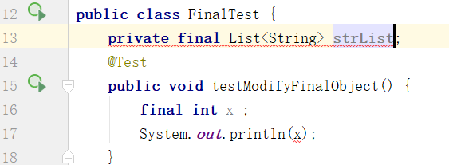
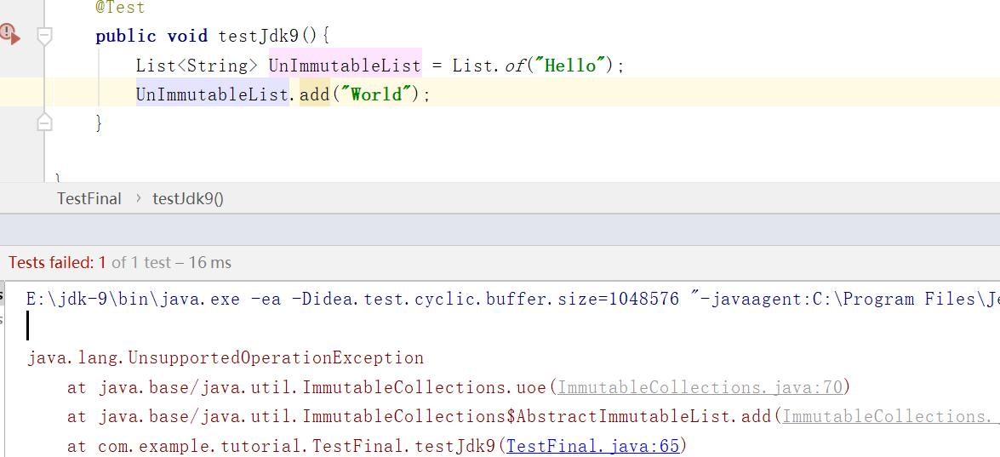
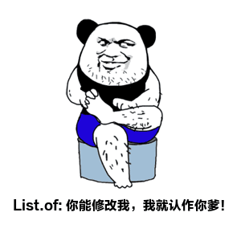
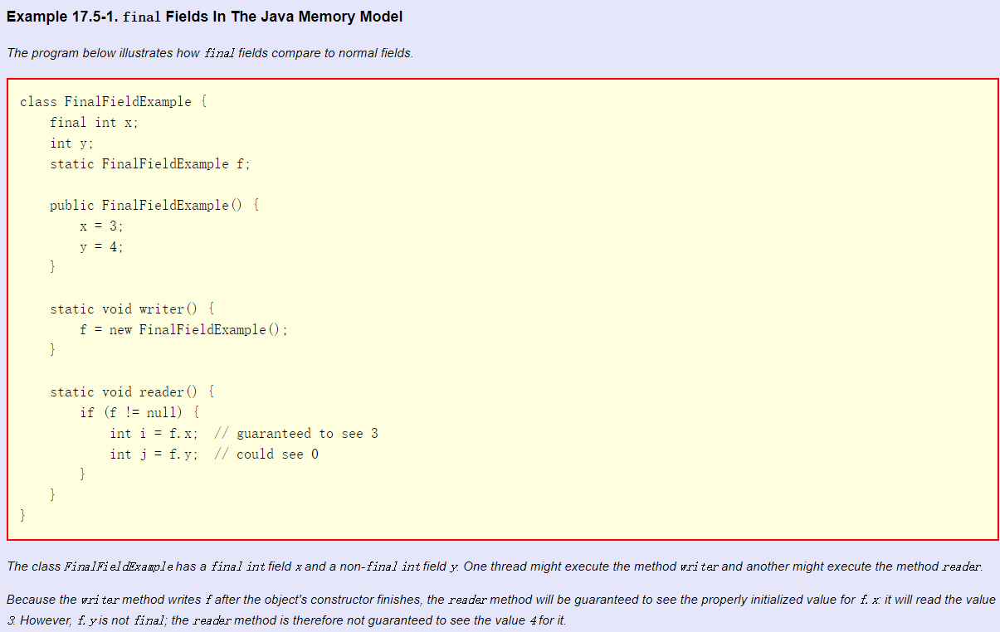
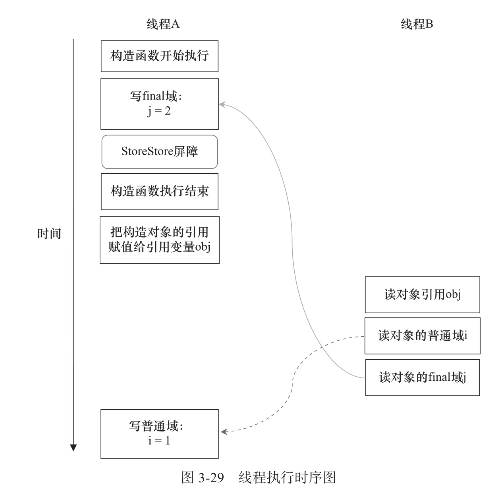
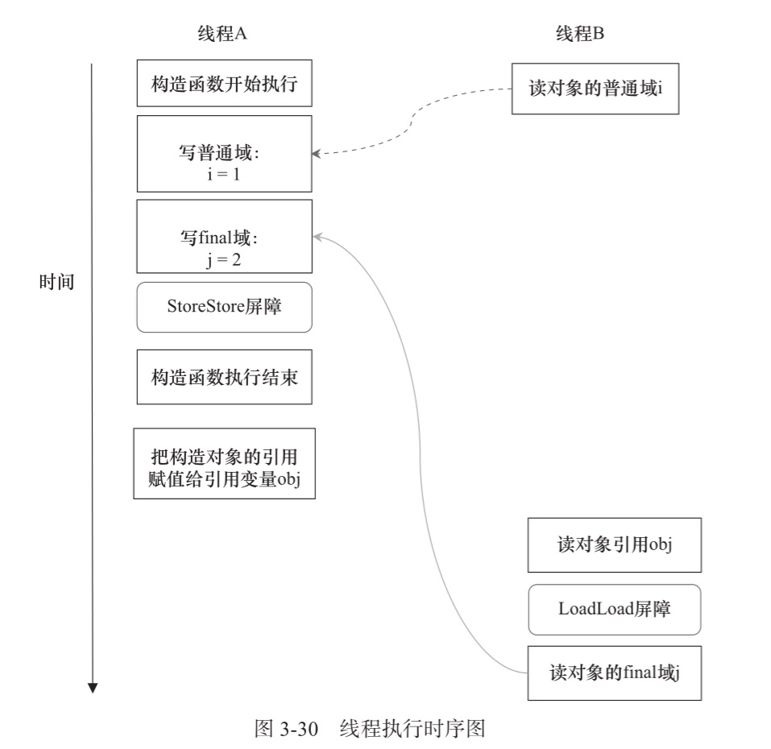

# final 域的内存语义

通过为 final 域增加写和读重排序骨子额,可以为 Java 程序员提供初始化安全保障:

**只要对象正确地被构造了,(被构造对象的引用在构造函数里没有逸出),那么就不需要使用同步(Lock 和 Volatile)就可以确保任意线程都能看到这个 final 域在构造函数中被初始化之后的值**

final 重排序语义:

- **在对象引用为任意线程可见之前,对象的 final 域已经被正确地初始化了,而普通域不会有这个保障**

- **在读一个对象的 final 域 之前,一定会先读包含这个 final 域的对象的引用**

> https://www.cnblogs.com/michaelwwx/p/10526991.html


## 概述

  final关键字能够告诉编译器一块数据是恒定不变的，thinking in java 中提到的不想被改变的两种理由：设计和效率。

### 修饰变量

作用：表示该变量不可以被再次赋值修改；

变量主要分为基本数据类型和引用；

- 如果修饰的是基本数据类型，就表示该变量的值永远不会改变，如果你试图改变他，例如下面的代码则会出现编译器警告：

  > Cannot assign a value to final variable 

```
 private final int par = 0;
    public void modifyFinalTest() {
        par = 4;
    }
```

另外需要注意的是java允许用final修饰某个未进行初始化复制的变量，这叫做“**空白final**”，但是编译器一定能够确保空白final在使用前被初始化，不然报错给你看  

例如下图中的 13 行代码，以及17行的变量未进行初始化都无法通过编译。



- 修饰引用

某个被final修饰的引用一旦被初始化指向一个对象后，就不可以将它改为指向另一个对象，**需要注意的是该对象本身所属的类行为是不会受到限制的。**

　**例如下面的list，初始化后如果想要修改其引用则无法通过编译，但是strList对象对于的List类的行为是不会受到改变的，如add方法**


这里只是限制了引用不可变，还有更狠的操作，JDK 9 之后出现的List.of 方法创建的“不可变list”连list里面的“内容”都不能变了。






List.of 方法创建的list是“不可变”的，如果试图去修改不可变list中的内容则会抛出异常；

另外大家实际开发中常见的问题，匿名内部类访问外部类中的局部变量时，为什么要将该变量声明为final类型的？（JDK8 之后不需要手动添加final关键字了）

**原因：匿名内部类对象的生命周期比外部类中的局部变量长；**


- 局部变量的生命周期：当有方法调用并使用到该变量时，变量入栈，方法执行结束后，出栈，变量就销亡了；

- 对象的生命周期：当没有引用指向这个对象，GC会在某个时候将其回收，也就是销毁了。

问题：成员方法执行完了，局部变量销毁了，但是对象还仍然存活（没有被GC），这时候对象要去引用该局部变量就引用不到了。

解决方法：java中的内部类访问外部变量时，必须将该变量声明为final，并且inner class会copy一份该变量，而不是直接去使用该局部变量，这样就可以防止数据不一 致的问题了。

java的改进：JDK8 后，如果有内部类访问局部变量，java会自动将该变量修饰成final类型的，所以我们不需要再去手动添加该关键字。

### 修饰方法

 表示该方法不可以被重写（override）；比较简单就不展开了。

### 修饰类；

 表示该类不可以被继承扩展；

### final的内存语义

**Oracle官方对于final的说明： https://docs.oracle.com/javase/specs/jls/se7/html/jls-17.html#jls-17.5**  

**注：还可以去看看《Java并发编程的艺术》 P55 ；对这个官方文档进行了很好的说明及补充；**

总结如下：

**Java内存模型规定了**

**第一条，对于final变量的初始化重排序规则：  final 关键字修饰的变量初始化的代码 不能重排序到构造函数结束之后；**　　　　　　　　　　　

**第二条，对于final变量的读取重排序规则：    初次读对象引用与初次读该对象包含的final 域，JMM禁止处理器重排序这两个操作。而这两个操作间存在依赖关系，一般编译器遵守间接依赖关系，不会对其进行重排序。大多数处理器也会遵守间接依赖原则，不会对其重排序。（少数傻吊会对其重排序。。。后面会讲到）**


首先第一条是什么意思呢？来看看官方的例子



场景： 这个例子中定义了一个final 变量 x 和一个普通变量 y ；在构造函数中赋值。 此时有写和读两个线程开始分别调用writer（） 和reader（）方法；

最后的结果你猜猜有多少种可能呢？

| 情况       | 结果         |
| ---------- | ------------ |
| 正常情况   | i = 3; y =4  |
| 非正常情况 | i = 3; y = 0 |

为什么会出现这种非正常情况呢？

因为我前面说到的是final关键字修饰的变量才能确保不会被重排序到构造函数之后。 普通变量就没这待遇了。

所以经过编译器和处理器重排序后的代码的非正常情况就是这样的：

| 写线程                              | 读线程                                    |
| ----------------------------------- | ----------------------------------------- |
| 1. 构造函数开始执行；               |                                           |
| 2. 构造函数中给 final 变量赋值为3； |                                           |
| 3. 构造函数执行结束；               |                                           |
| 4.将构造对象的引用赋值给引用变量f   |                                           |
|                                     | 1.读取初始化完成的对象                    |
|                                     | **2.读取该对象中的普通变量 y （有问题）** |
| 5.给普通变量y 赋值 为4              |                                           |

结论： 对于空白final 变量在构造函数中的初始化 代码 不可以重排序到 构造函数之后，必须在构造函数里面完成初始化， 普通变量在不改变单线程运行结果的情况下的初始化可以重排序到构造函数之后。


第二条啥意思呢？上面讲到有少数“傻吊”处理器会对 读对象和 读对象中的变量操作进行重排序。

场景：

有一个写线程和一个读线程；

读线程的操作：

| 正常读取               | 重排序后的读取                     |
| ---------------------- | ---------------------------------- |
| 1.读取对象obj          | **1. 读取obj中的普通变量（问题）** |
| 2.读取obj中的普通变量  | 2.读取对象obj                      |
| 3.读取obj中的final变量 | 3.读取对象obj中的final变量         |
|                        |                                    |

重排序后的读取问题在于 读取普通变量 时该普通域还未被初始化，所以读取到的数据时不对的，但是JMM对于final变量读取限制了必须先要读取包含它的对象，然后再去读取该final变量；


## final 域的重排序规则

- 在构造函数内对一个 final 域的写入,与随后把这个被构造对象的引用复制给一个引用变量,这两个操作之间不能重排序
- 初次读一个包含 final 域的对象的引用,与随后初次读这个 final 域,这两个操作之间不能重排序

```java
public class FinalExample {
    int                 i;  //普通变量
    final int           j;  //final变量
    static FinalExample obj;

    public FinalExample() { //构造函数
        i = 1; //写普通域
        j = 2; //写final域
    }

    public static void writer() { //写线程A执行
        obj = new FinalExample();
    }

    public static void reader() { //读线程B执行
        FinalExample object = obj; //读对象引用
        int a = object.i; //读普通域
        int b = object.j; //读final域
    }
}
```

## 写 final 域的重排序

- JMM禁止编译器把 final 域的写重排序到构造函数之外
- 编译器会在 final 域的写之后, 构造函数的 return 之前,插入一个 StoreStore 屏障,禁止处理器把 final 域写重排序到构造函数之外



我们可以先看 write()方法,这个方法只包含一行代码

```
        obj = new FinalExample();
```

这行代码分为两个步骤:

- 构造一个 FinalExample 类型的对象
- 把这个对象的引用赋值给引用变量 obj

**假设线程 B 读对象引用与读对象的成员域之间没有重排序**,那么图 2-29 是一种可能的执行时序:

- 写普通域的操作被编译器重排序到了构造方法之外
- 读线程 B 错误地读取了普通变量 i 初始化之前的值
- 写 final 域的重排序规则被"**限定**"在了构造方法中
- 读线程 B 正确地读取到了 final变量初始化之后的值

写 final 的重排序规则可以确保:

**在对象引用为任意线程可见之前,对象的 final 域已经被正确地初始化了,而普通域不会有这个保障**

## 读final 域的重排序规则

读 final 域的重排序规则是,在一个线程中,**初次读对象引用与初次读该对象包含的 final 域**,JMM 禁止处理器重排序这两个操作

编译器会在 final域的前面插入一个 LoadLoad 屏障

**初次读对象引用与初次读该对象包含的 final 域.这两个操作之间存在间接依赖关系**. 由于编辑器遵守间接依赖关系,因此编译器不会重排序这两个操作

reader()方法:

```
    public static void reader() { //读线程B执行
        FinalExample object = obj; //读对象引用
        int a = object.i; //读普通域
        int b = object.j; //读final域
    }
```

- 初次读引用变量 obj
- 初次读引用变量 obj 指向对象的普通域 j
- 初次读对象引用变量 obj 指向的对象的 final 域

假设写线程 A 没有发生任何重排序,同时程序在不遵守间接依赖的处理器上执行,那么可能出现:



- 读对象的普通域的操作被处理器重排序到读对象引用之前

读普通域时,这个域还没有被线程 A写入,这是一个错误的读取操作

- 读 final 域的重排序规则会把读对象的 final 域的操作限定在读对象引用之后,

此时 final 域已经被线程 A 初始化过了,所以读取正确


读 final 域的重排序规则可以确保:

**在读一个对象的 final 域 之前,一定会先读包含这个 final 域的对象的引用**

在这个实例程序中,如果该引用不为null,那么 final 域一定已经被线程 A初始化过了

### final 域为引用类型

https://www.cnblogs.com/michaelwwx/p/10526991.html

### final 语义在处理器中的实现

以 X86 处理器为例:

上面提到:

- **写 final域的重排序规则会要求编译器在 final 域的写之后,构造函数 return 之前插入一个 StoreStore 屏障**

- **读 final 域的重排序规则要求编译器在读 final 域的操作前面插入一个 LoadLoad 屏障**

但是 x86 处理器中,不会对写-写操作做重排序,所以忽略了 StoreStore 屏障,也不会对存在间接依赖关系的操作做重排序,所以在 X86 处理器中,读 final 域需要的 LoadLoad 屏障也会被省略掉,所以不会写任何屏障