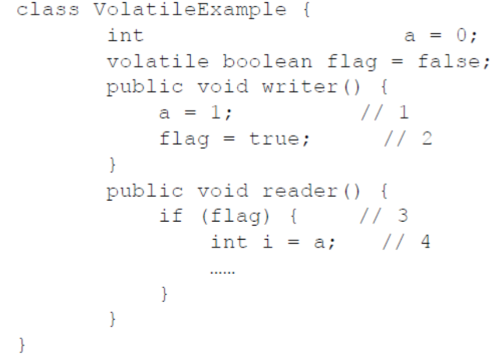

# Happens-bofore

它的意思表示的是前一个操作的结果对于后续操作是可见 的，所以它是一种表达多个线程之间对于内存的可见性。 所以我们可以认为在 JMM 中，如果一个操作执行的结果需 要对另一个操作课件，那么这两个操作必须要存在 happens-before 关系。这两个操作可以是同一个线程，也 可以是不同的线程

## JMM 中有哪些方法建立 happen-before 规则

#### 程序顺序规则

- 一个线程中的每个操作，happens-before 于该线程中的 任意后续操作; 可以简单认为是 as-if-serial。单个线程中的代码顺序不管怎么变，对于结果来说是不变的顺 序 规 则 表 示 
  - 1 happenns-before 2; 
  - 3 happens- before 4



- volatile 变量规则，对于 volatile 修饰的变量的写的操作， 一定 happen-before 后续对于 volatile 变量的读操作; 根据 volatile 规则，2 happens before 3

- 传递性规则，如果 `1 happens-before 2;` `3happens- before 4;` 那么传递性规则表示:` 1 happens-before 4;`

- start 规则，如果线程 A 执行操作` ThreadB.start()`,那么线 程 A 的 `ThreadB.start()`操作 `happens-before `线程 B 中
  的任意操作

```
public StartDemo{
int x=0;
Thread t1 = new Thread(()->{
// 主线程调用 t1.start() 之前
// 所有对共享变量的修改，此处皆可见 // 此例中，x==10
});
// 此处对共享变量 x 修改 x = 10;
// 主线程启动子线程 t1.start();
}
```


- join 规则，如果线程 A 执行操作 ThreadB.join()并成功返 回，那么线程 B 中的任意操作 happens-before 于线程 A 从 ThreadB.join()操作成功返回。

```
Thread t1 = new Thread(()->{ // 此处对共享变量 x 修改 x= 100;
});
// 例如此处对共享变量修改，
// 则这个修改结果对线程 t1 可见 // 主线程启动子线程
t1.start();
t1.join()
// 子线程所有对共享变量的修改
// 在主线程调用 t1.join() 之后皆可见 // 此例中，x==100
```


- 监视器锁的规则，对一个锁的解锁，happens-before 于 随后对这个锁的加锁

```
synchronized (this) { // 此处自动加锁 // x 是共享变量, 初始值 =10
	if (this.x < 12) {
		this.x = 12; 
		}
} // 此处自动解锁
```

- 假设 x 的初始值是 10，线程 A 执行完代码块后 x 的 值会变成 12(执行完自动释放锁)，线程 B 进入代码块 时，能够看到线程 A 对 x 的写操作，也就是线程 B 能 够看到 x==12。