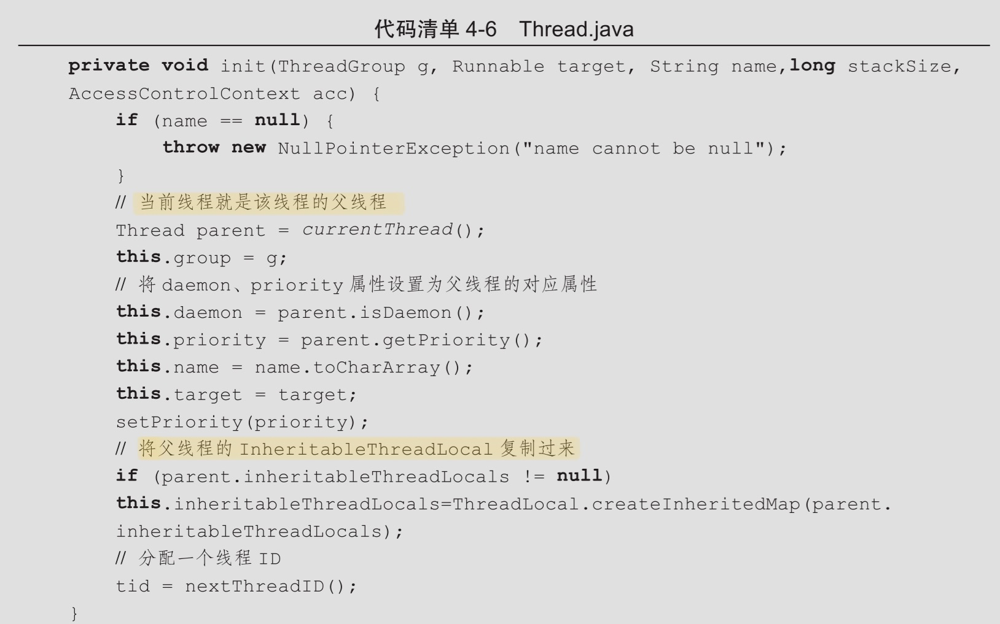

# 启动和终止线程

## 构造线程

我们可以看到Thread 的源码



- 一个新构造的线程对象是由其 父线程来进行空间分配的
- 子线程集成了父线程是否为 Deamon , 优先级 和加载资源的 `contextClassLoader`以及可继承的` ThreadLocal`
- 分配了一个唯一的ID 给子线程

## 启动线程

调用`start()`方法启动线程

即:

当前线程(父线程) 同步告诉 Java 虚拟机,只要线程规划期空闲,应立即启动调用 start() 方法的线程

## 过期的 suspend()方法,resume ()方法和 stop 方法

不建议使用的原因:

- ` suspend()`方法调用时 , 线程不会释放已经占有的资源(例如锁), 而是占有着资源进入睡眠状态,容易死锁
- `stop()`方法终结了一个线程时不会保证线程的资源正常地释放,通常是没有给与线程完成资源释放的机会

## 正确地中断程序

使用`Thread.currentThread().isInterrupted()`判断

```
public class Shutdown {
    public static void main(String[] args) throws Exception {
        Runner one = new Runner();
        Thread countThread = new Thread(one, "CountThread");
        countThread.start();
        // 睡眠1秒，main线程对CountThread进行中断，使CountThread能够感知中断而结束
        TimeUnit.SECONDS.sleep(1);
        countThread.interrupt();
        Runner two = new Runner();
        countThread = new Thread(two, "CountThread");
        countThread.start();
        // 睡眠1秒，main线程对Runner two进行取消，使CountThread能够感知on为false而结束
        TimeUnit.SECONDS.sleep(1);
        two.cancel();
    }

    private static class Runner implements Runnable {
        private long             i;

        private volatile boolean on = true;

        @Override
        public void run() {
            while (on && !Thread.currentThread().isInterrupted()) {
                i++;
            }
            System.out.println("Count i = " + i);
        }

        public void cancel() {
            on = false;
        }
    }
}

```

