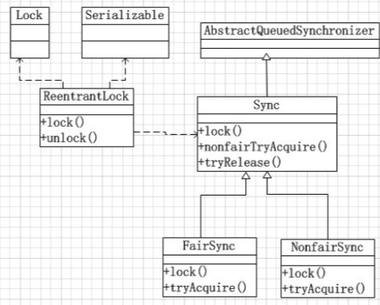

# 使用ReentrantLock



从Java 5开始，引入了一个高级的处理并发的`java.util.concurrent`包，它提供了大量更高级的并发功能，能大大简化多线程程序的编写。

> ReentrantLock 继承了 Lock 接口并实现了在接口中定义的方法,是一个可重入的独占锁,内部通过自定义 队列同步器(Abstract Queued Sychronized, AQS) 来实现锁的获取与释放

独占锁指该锁同一时刻只能被一个线程获取,而其他线程只能在同步队列中等待,可重入锁能够支持一个线程对同一个资源执行多次加锁操作

> ReentrantLock 支持公平锁和非公平锁的实现,公平锁指的是线程竞争锁 的机制是公平的,非公平锁指的是不同的线程获取锁的机制是不公平的

## ReentrantLock 的用法

我们知道Java语言直接提供了`synchronized`关键字用于加锁，但这种锁一是很重，二是获取时必须一直等待，没有额外的尝试机制。

`java.util.concurrent.locks`包提供的`ReentrantLock`用于替代`synchronized`加锁，我们来看一下传统的`synchronized`代码：

```java
public class Counter {
    private int count;

    public void add(int n) {
        synchronized(this) {
            count += n;
        }
    }
}
```

如果用`ReentrantLock`替代，可以把代码改造为：

```java
public class Counter {
    private final Lock lock = new ReentrantLock();
    private int count;

    public void add(int n) {
        lock.lock();
        try {
            count += n;
        } finally {
            lock.unlock();
        }
    }
}
```

因为`synchronized`是Java语言层面提供的语法，所以我们不需要考虑异常，而`ReentrantLock`是Java代码实现的锁，我们就必须先获取锁，然后在`finally`中正确释放锁。

顾名思义，`ReentrantLock`是可重入锁，它和`synchronized`一样，一个线程可以多次获取同一个锁。

**和`synchronized`不同的是，`ReentrantLock`可以尝试获取锁：**

```java
if (lock.tryLock(1, TimeUnit.SECONDS)) {
    try {
        ...
    } finally {
        lock.unlock();
    }
}
```

上述代码在尝试获取锁的时候，最多等待1秒。如果1秒后仍未获取到锁，`tryLock()`返回`false`，程序就可以做一些额外处理，而不是无限等待下去。

所以，使用`ReentrantLock`比直接使用`synchronized`更安全，线程在`tryLock()`失败的时候不会导致死锁。

## 可重入

ReentrantLock 之所以被称为可重入锁,是因为ReentrantLock 锁可以反复进入,即允许连续获取两次同一把锁,

- 释放锁的次数和获取锁的次数要一致,不然 Java 会抛出 `java.lang.illegalMonitorStateException`
- 如果释放锁的次数少于获取锁的次数,那么线程一直会持有该所,其他线程也将无法获取锁资源

## ReentrantLock 如何避免死锁

#### 响应中断

- synchronized 中如果有一个线程尝试获取锁,则其结果是要么获取锁继续执行,要么保持等待
- ReentrantLock 提供了可响应中断的可能,在加锁的过程中,线程可以根据需要取消对锁的请求

```java
/**
 * <p>
 * description
 * </p>
 *
 * @author EricChen 2020/06/30 07:12
 */
public class InterruptiblyReentrantLock {

    static ReentrantLock lock1 = new ReentrantLock();
    static ReentrantLock lock2 = new ReentrantLock();


    public Thread lock1() {
        Thread t = new Thread(new Runnable() {
            @Override
            public void run() {
                try {
                    //TODO 3.1 如果当前没有被中断,则获取锁
                    lock1.lockInterruptibly();
                    try {
                        //TODO 4.1 sleep 500ms 这里执行具体的业务逻辑
                        Thread.sleep(500);
                    } catch (InterruptedException e) {
                        e.printStackTrace();
                        lock2.lockInterruptibly();
                        System.out.println(Thread.currentThread().getName() + ",执行完毕");
                    }
                } catch (InterruptedException e) {
                    e.printStackTrace();
                } finally {
                    //TODO 5.1 在业务逻辑执行完成之后,检查当前线程是否持有该锁,如果持有则释放
                    if (lock1.isHeldByCurrentThread()) {
                        lock1.unlock();
                    }
                    if (lock2.isHeldByCurrentThread()) {
                        lock2.unlock();
                    }
                    System.out.println(Thread.currentThread().getName() + ",退出");
                }

            }
        });
        t.start();
        return t;
    }

    public Thread lock2() {
        Thread t = new Thread(new Runnable() {
            @Override
            public void run() {
                try {
                    lock2.lockInterruptibly();
                    try {
                        Thread.sleep(500);
                    } catch (InterruptedException e) {
                        e.printStackTrace();
                        lock1.lockInterruptibly();
                        System.out.println(Thread.currentThread().getName() + ",执行完毕");
                    }
                } catch (InterruptedException e) {
                    e.printStackTrace();
                } finally {
                    if (lock2.isHeldByCurrentThread()) {
                        lock2.unlock();
                    }
                    if (lock1.isHeldByCurrentThread()) {
                        lock1.unlock();
                    }
                    System.out.println(Thread.currentThread().getName() + ",退出");
                }

            }
        });
        t.start();
        return t;
    }

    public static void main(String[] args) {
        final long l = System.currentTimeMillis();
        InterruptiblyReentrantLock reentrantLock = new InterruptiblyReentrantLock();
        final Thread thread = reentrantLock.lock1();
        final Thread thread1 = reentrantLock.lock2();
        for (; ; ) {
            if (System.currentTimeMillis() - l >= 4000) {
              //超过等待时间,就中断 thread1,这样就可以 thread2 顺利获得锁
                thread.interrupt();
            }
        }
    }
}

```

### 实现重入

重进入是指,任意线程在获取到锁之后能够再次获取该锁,而不被锁阻塞,该特性的实现需要解决一下两个问题:

- **线程再次获取锁**,锁需要去识别锁的线程数会否为当前占据的线程,如果是,则再次成功获取
- **锁的最终释放**: 线程重复 n 次获取了锁,随后在第 n 次释放该锁后,其他线程能够获取到该锁,锁的最终释放要求锁对于获取进行计数自增,计数表示当前锁被重复获取的次数,而锁被释放时,当计数等于0 时表示锁已经被成功释放


## 总结 `ReentrantLock` 与`synchronized`的对比

#### 相同支持

- 都是控制多线程对线程对象的访问
- 都是可重入锁
- 都保证了可见性和互斥性

#### 不同点

- `ReentrantLock` 显式地获取和释放锁,`synchronized` 隐式的获取和释放锁, `ReentrantLock` 必须在 finally 块中解锁
- `ReentrantLock` 可相应中断,可轮回,为处理锁提供了更多的灵活性
- `ReentrantLock`是 API级别的,可轮回,为处理锁提供了更多的灵活性
- `ReentrantLock`可以定义公平锁或者非公平锁
- `ReentrantLock` 可以通过 Condition 绑定多个条件
- 底层实现原理不一样, `ReentrantLock` 是同步非阻塞,采用乐观并发策略,`synchronized`是同步阻塞,采用悲观的并发策略

- Lock 是一个接口,而`synchronized`是 Java 的关键字,`synchronized`由内置的语言实现


## ReentrantLock 实现原理

### Lock 加锁


#### ReentrantLock.lock()

```java
public void lock() { 
	sync.lock();
}
```

sync 实际上是一个抽象的静态内部类，它继承了 AQS 来实现重入锁的逻辑，我们前面说过 AQS 是一个同步队列，它能够实现线程的阻塞以及唤醒，但它并不具备 业务功能，所以在不同的同步场景中，会继承 AQS 来实现对应场景的功能
Sync 有两个具体的实现类，分别是: 

- NofairSync:表示可以存在抢占锁的功能，也就是说不管当前队列上是否存在其他 线程等待，新线程都有机会抢占锁
- FailSync: 表示所有线程严格按照 FIFO 来获取锁

#### NofairSync.lock

以非公平锁为例，来看看 lock 中的实现

1. 非公平锁和公平锁最大的区别在于，在非公平锁中抢占锁的逻辑是，不管有没有线程排队，我先上来 cas 去抢占一下 
2. CAS 成功，就表示成功获得了锁
3. CAS 失败，调用` acquire(1`)走锁竞争逻辑

```java

    /**
     * Sync object for non-fair locks
     */
    static final class NonfairSync extends Sync {
        private static final long serialVersionUID = 7316153563782823691L;

        /**
         * Performs lock.  Try immediate barge, backing up to normal
         * acquire on failure.
         * CAS 设置获取锁,如果成功就设置当前线程为独占线程
         	如果失败,则走锁竞争
         */
        final void lock() {
            if (compareAndSetState(0, 1))
                setExclusiveOwnerThread(Thread.currentThread());
            else
                acquire(1);
        }

        protected final boolean tryAcquire(int acquires) {
            return nonfairTryAcquire(acquires);
        }
    }
```

