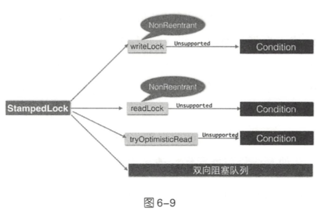

# StampedLock

`StampedLock` 提供的读写锁与`ReentrantReadWriteLock` 类似,只是前者提供的是**不可重入锁**

`StampedLock`  提供乐观读锁再多线程多读的情况下提供更好的性能,这是因为获取乐观锁时不需要进行 CAS 操作锁的状态,而只是简单地测试状态

StampedLock 的读写锁都是不可重入锁，所以在获取锁后释放锁前不应该再调用 会获取 锁的操作，以避免造成调用线程被阻 塞。当多个线程同时 尝 试获取读锁和写锁 时，谁先获取锁没有一定 的规则，完全都是尽力而为，是随机的 。并且该锁不是直接实现 Lock或 ReadWriteLock接口，而是其在内部自己维护了一个双向阻塞队列。

测试状态

```java
public class StampedLockExample {
    private final StampedLock stampedLock = new StampedLock();

    private double value = 0;


    public double getValue() {
        long stamp = stampedLock.tryOptimisticRead();
        if (stampedLock.validate(stamp)) {// 检查乐观读锁后是否有其他写锁发生
            return value;
        } else {
            try {
                stamp = stampedLock.readLock(); //获取一个悲观读锁
                return value;
            } finally {
                stampedLock.unlockRead(stamp);// 释放悲观读锁
            }
        }
    }

    public void incr(double value) {
        long stamp = stampedLock.writeLock();// 获取写锁
        try {
            this.value += value;
        } finally {
            stampedLock.unlockWrite(stamp);// 释放写锁
        }

    }
```

## 组成



## 组成

StampedLock 有三种状态,三种状态可以互相转换,

- [写锁writeLock](#写锁writeLock)
- [悲观读锁readLock](#悲观读锁readLock)
- [乐观读锁tryOptimisticRead](#乐观读锁tryOptimisticRead)

### 写锁writeLock

- 独占锁,但是不可以重入,请求读锁会返回一个stamp 变量用来表示该锁的版本

- 当释放该锁时需要调用 `unLockWrite` 方法并传递获取锁时的版本号 stamp

- 提供了 非阻塞 的 tryWriteLock 方法 。

```java
//StampedLockExample
public void incr(double value) {
  long stamp = stampedLock.writeLock();//获取读锁,返回版本号
  try {
    this.value += value;
  } finally {
    stampedLock.unlockWrite(stamp); // 释放写锁,传入版本号
  }
}
```

### 悲观读锁readLock

是一个共享锁 ，在没有线程获取独占写锁的情况下，多个线程可以同时获取该锁 。

如果己经有线程持有写 锁，则其他线程请求获取该读锁会被阻塞，这类似于 `ReentrantReadWriteLock`的读锁 (不同的是这里的读锁是不可重入锁〉。 

这里说的悲观是指在 具体操作数据前其会悲观地认为其他线程可能要对自己操作的 数据进行修改，所以需要先对数据加锁，这是在读少写多的情况下的一种考虑 。

请求该锁成功后会返回一个 stamp 变量用来表示该锁的版本，当释放该锁时需要调用 `unlockRead` 方法并传递 `stamp` 参数。并且它提供了非阻塞的 `tryReadLock` 方法

### 乐观读锁tryOptimisticRead

它是相对于悲观锁来说的，在操作数据前并没有通过 CAS 设置锁的状态，仅仅通过位运算测试。

如果当前没有线程持有写锁 ，则简单地返回一个非0的stamp版本信息。 

获取该stamp后在具体操作数据前还需要调用 validate 方法验证 该 stamp 是否己经不可用，也就是看当调用 trγOptimisticRead 返回 stamp后到当前时间期间是否有其他线程持有了写锁，如果是则 validate会返回 o, 否则就可以使用该 stamp 版本的锁对数据进行操作 。

由于 tryOptimisticRead 并没有 使用 CAS 设置锁状态，所以不需要显式地释放该锁 。 

该锁的一个特点是适用于读多写少的场景 ，因为获取读锁只是使用位操作进行检验，不涉及 CAS 操作，所以效率会高很多，但是同时由于没有使用真正的锁，在保证数据 一致性上需要复制一份要操作的变量到方法栈，并且在操作数据时可能其他写线程己经修改了数据，而我们操作的是方法栈里面的数据，也就是一个快照，所以最多返回 的不是最新的数据，但是一致性还是得到保障的 。

