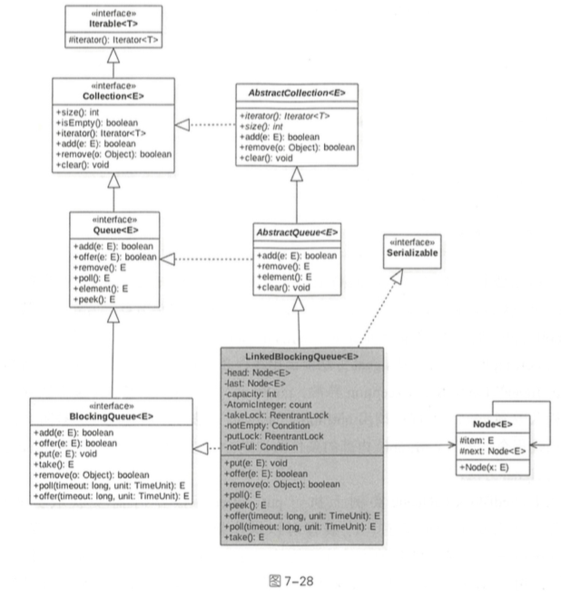

# ArrayBlockingQueue

ArrayBlockingQueue 通过使用全局独占锁实现了同时只能有一个线程进行入队和出队的动作, 这个锁的粒度比较大,有点类似于在方法上添加 synchronized 的意思

-  offer 操作 和 poll 操作通过简单的加锁进行入队, 出队操作

- put 操作和 take 操作则使用条件变量实现了,如果队列满则等待,如果队列为空则等待,然后分别在出队和入队操作中发送信号激活等待线程实现同步

#### ArrayBlockingQueue 对比 LinkedBlockingQueue

- ArrayBlockingQueue 的 size 操作是精确的, 因为加了全局锁

- LinkedBlockingQueue 的 size操作是不精确的

## 类图

- LinkedBlockingQueue 是使用单向链表实现的, 存储两个 Node , 一个 是 head 代表 头节点 , 一个是是 tail节点代表尾节点
- count 变量 的初始值为 0 , 用来计算元素的个数
- 两个 ReentrantLock , 分别代表了 