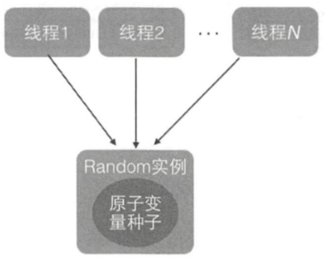
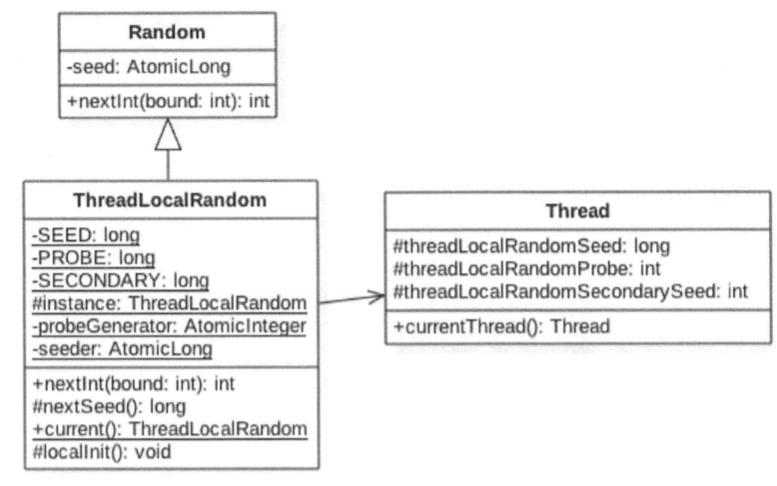

# ThreadLocalRandom

由于 Random 类多线程下竞争种子变量线程下 CAS 有可能会造成大量 CAS 从而影响性能

所以引入了 ThreadLocalRandom 类, ThreadLocalRandom 使用 ThreadLocal 的原理,让每个线程都持有一个本地的种子变量, 该种子变量只有在使用随机数的时候才会被初始化, 在多线程下计算新种子时是根据自己线程内维护的种子变量进行更新,从而避免了竞争

**ThreadLocalRandom** 是 JDK 7 在 JUC 包下新增的额随机数生成器, 它弥补了 Random 类在多线程下的缺陷

## Random 类的缺陷以及其局限性

java.util.Random 用于产生随机数

```java
public class RandomTest {
    public static void main(String[] args) {
        Random random = new Random();
        for (int i = 0; i < 10; i++) {
            //随机生成一个 [0,5)之间的数
            System.out.println(random.nextInt(5));
        }
    }
}
```

#### 为什么 Random 效率有缺陷

```java
    public int nextInt(int bound) {
      //③ 参数检查
        if (bound <= 0)
            throw new IllegalArgumentException(BadBound);
				//④ 根据老的种子生成新的种子
        int r = next(31);
      // ⑤ 根据新的种子计算随机数
        int m = bound - 1;
        if ((bound & m) == 0)  // i.e., bound is a power of 2
            r = (int)((bound * (long)r) >> 31);
        else {
            for (int u = r;
                 u - (r = u % bound) + m < 0;
                 u = next(31))
                ;
        }
        return r;
    }
```

新的随机数的生成需要两个步骤

- 首先根据老的种子生成新的种子
- 然后步骤⑤根据新的种子计算随机数

在单线程情况下,每次调用 nextInt 都是根据老的种子计算出新的种子,这是可以保证随机数产生的随机性的

但是在多线程下,多个线程可能拿到同一个老的种子去获取新的种子, 由于生成种子的算法(步骤⑤)是固定的,所以会导致多个线程产生同样的随机值

为了避免出现相同的随机值, 我们必须确保步骤④ 产生的值不一样

#### Random 如何确保获取的新的种子每次都是不一样的

```java
    protected int next(int bits) {
        long oldseed, nextseed;
        AtomicLong seed = this.seed;
        do {
          // 6 获取当前原子变量种子的值
            oldseed = seed.get();
          //7 根据当前的种子计算新的种子
            nextseed = (oldseed * multiplier + addend) & mask;
          //8 使用 CAS 操作, 用新的种子去替换老的种子,
        } while (!seed.compareAndSet(oldseed, nextseed));
      //使用固定的算法根据新的种子计算随机数
        return (int)(nextseed >>> (48 - bits));
    }
```

- 6 代码如果有多个线程都执行到了,那么可能多个线程拿到的当前种子的值是同一个
- 执行步骤 7 的时候, 计算的新种子也是一样的
- 执行步骤 8 的时候, CAS 操作会保证只有一个线程可以更新老的种子为新的
- 失败的线程会通过循环重新获取更新后的种子作为当前种子去计算老的种子,从而确保随机数的随机性

### 为什么Random 有缺陷

每个Random 实例里面都有一个原子性的种子变量用来记录当前的种子值,当要生成新的随机数时需要根据当前种子计算的新种子并更新回原子变量

在多线程下使用单个Random 实例生成随机数时, 当多个线程同时计算随机数来计算新的种子,多个线程会竞争同一个原子变量更新操作,由于原子变量更新时 CAS , 同时只有一个线程会成功,所以会早成大量的线程进行自旋重试,从而降低了性能 

**所以这就是为什么需要 ThreadLocalRandom** 

## ThreadLocalRandom

```java
public class ThreadLocalRandomTest {
    public static void main(String[] args) {
      // 10 获取一个随机数生成器
        ThreadLocalRandom threadLocalRandom = ThreadLocalRandom.current();
        for (int i = 0; i < 10; i++) {
          //11 输出 10 个在 [0,5)之间的随机数
            System.out.println(threadLocalRandom.nextInt(5));
        }
    }
}
```

其中

```java
ThreadLocalRandom.current();
```

ThreadLocalRandom 的原理和 ThreadLocal 类似, Random 的缺点是多个线程会使用同一个原子性种子变量, 从而导致对原子变量更新的竞争



如果每个线程都维护一个种子变量, 则每个线程生成随机数时都会根据自己老的种子变量计算新的种子, 并使用新的种子更新老的种子,再根据新种子计算随机值, 就不会有竞争问题了


## 源码分析

### 类图



可以看出

- ThreadLocalRandom 继承自 Random , 并重写了 nextInt 方法
- 种子变量存储在 调用线程的 Thread 的 ThreadLocalRandomSeed 变量里
- ThreadLocalRandom 类似于 ThreadLocal ,就是一个工具类
  - 当线程调用 ThreadLocalRandom 的 current 方法时, ThreadLocalRandom 负责初始化调用线程的 threadLocalRandomSeed 变量 , 也就是初始化种子
  - 当调用 ThreadLocalRandom 的 nextInt 方法时, 实际上调用的是当前线程的 ThreadLocalRandomSeed 变量作为种子来计算新的种子,然后更新新的种子到 ThreadLocalRandomSeed 
  - ThreadLocalRandom 就是一个普通 long 类型的变量
- seeder 和 probeGenerator 是两个原子性变量,在初始化调用线程的种子和探针变量时会用到他们,每个线程只使用一次

值得注意的是

- 变量 instance 是 ThreadLocalRandom 的一个实例, static 类型的,当多线程通过 ThreadLocalRandom 的 current 方法获取 ThreadLocalRandom 的实例时, 其实获取的是同一个实例,
- 由于具体的种子是存放在线程里面的, 所有在 ThreadLocalRandom 的实例里面只包含线程无关的通用算法,所以它是线程安全的

#### ThreadLocalRandom 中的Unsafe

```java
    // Unsafe mechanics
    private static final sun.misc.Unsafe UNSAFE;
    private static final long SEED;
    private static final long PROBE;
    private static final long SECONDARY;
    static {
        try {
          //获取 Unsafe 实例
            UNSAFE = sun.misc.Unsafe.getUnsafe();
            Class<?> tk = Thread.class;
          	//获取到 Thread 类中的 threadLocalRandomSeed 变量的偏移量
            SEED = UNSAFE.objectFieldOffset
                (tk.getDeclaredField("threadLocalRandomSeed"));
          	//获取到 Thread 类中的 threadLocalRandomProbe 的偏移量
            PROBE = UNSAFE.objectFieldOffset
                (tk.getDeclaredField("threadLocalRandomProbe"));
          //获取到 Thread 类中的 threadLocalRandomSecondarySeed 的偏移量
            SECONDARY = UNSAFE.objectFieldOffset
                (tk.getDeclaredField("threadLocalRandomSecondarySeed"));
        } catch (Exception e) {
            throw new Error(e);
        }
    }
```

### ThreadLocalRandom#current() 方法

该方法获取 ThreadLocalRandom 实例, 并初始化调用线程中的 threadLocalRandomSeed 和

threadLocalRandomProbe 变量

```java
    public static ThreadLocalRandom current() {
      //12
        if (UNSAFE.getInt(Thread.currentThread(), PROBE) == 0)
          //13 
            localInit();
      //14
        return instance;
    }
    static final void localInit() {
        int p = probeGenerator.addAndGet(PROBE_INCREMENT);
        int probe = (p == 0) ? 1 : p; // skip 0
        long seed = mix64(seeder.getAndAdd(SEEDER_INCREMENT));
        Thread t = Thread.currentThread();
        UNSAFE.putLong(t, SEED, seed);
        UNSAFE.putInt(t, PROBE, probe);
    }
```


- 代码 12 , 如果当前线程中的 threadLocalRandomRrobe 的变量为 0 (默认值) ,则说明当前线程是第一调用 current 方法, 那么久需要调用 localInit 方法计算当前线程的初始化种子变量
- 代码 13 首先根据 probeGenerator 计算当前线程中 threadLocalRandomProbe 的初始化值,然后根据 seeder 计算当前线程的初始化种子,而后把这两个变量设置到当前线程
- 代码 14 返回 threadLocalRandom 的实例 ,这个方法是静态方法,多个线程返回的是同一个 ThreadLocalRandom 实例

#### int nextInt(int bound)方法

```java
    public int nextInt(int bound) {
      //参数校验
        if (bound <= 0)
            throw new IllegalArgumentException(BadBound);
      //16 根据当前线程中的种子计算新种子
        int r = mix32(nextSeed());
      // 根据新种子和 bound 计算随机值
        int m = bound - 1;
        if ((bound & m) == 0) // power of two
            r &= m;
        else { // reject over-represented candidates
            for (int u = r >>> 1;
                 u + m - (r = u % bound) < 0;
                 u = mix32(nextSeed()) >>> 1)
                ;
        }
        return r;
    }
```

```java
    final long nextSeed() {
        Thread t; long r; // read and update per-thread seed
        UNSAFE.putLong(t = Thread.currentThread(), SEED,
                       r = UNSAFE.getLong(t, SEED) + GAMMA);
        return r;
    }
```

可以看出和 Random类的区别了,这里是使用` UNSAFE.getLong(t, SEED) + GAMMA)` 获取当前线程中的 threadLocalRandomSeed 变量的值, 然后再种子的基础上累加 GAMMA 作为新种子

然后使用 UNSAFE 的 putLong 方法把新种子放入当前线程的 threadLocalRandomSeed 变量中

