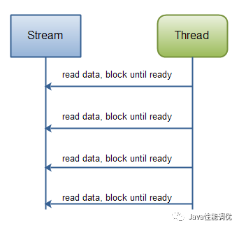
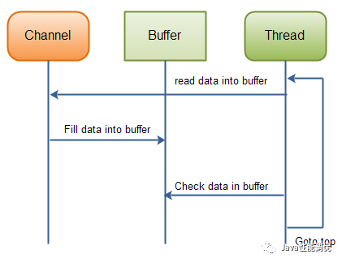
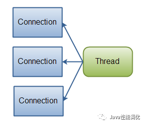
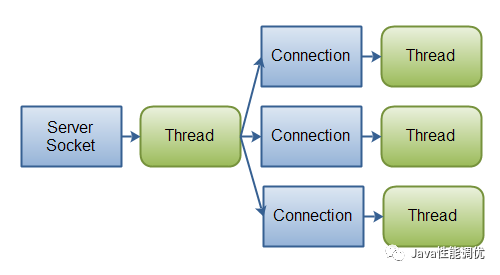

# 阻塞(Block)和非阻塞(Non-Block)

阻塞和非阻塞是进程在访问数据的过程中,数据是否准备就绪的一种方式,当数据没有准备的时候

- 阻塞: 需要等待缓冲区中的数据准备好之后才能处理其他事情,否则一直等待在那里
- 非阻塞: 当我们的进程访问我们的数据缓冲区的时候,如果没有准备好数据则直接返回,不会进行等待,如果数据已经准备好,也直接返回

## 同步(Synchronziation)和异步 Asynchronous

同步和异步都是基于应用程序和操作系统处理 IO 事件所采用的方式

- 同步: 应用程序直接参与 IO 读写的操作
- 异步: 所有的 IO 读写交给操作系统去处理,应用程序值需要等待通知

同步方式在处理 IO 事件的时候,必须阻塞在某个方法上面等待我们的 IO 事件完成(阻塞 IO 事件或者通过轮询 IO 事件的方式)

异步方式,所有的 IO 读写都交给操作系统,这个时候我们可以去做其他的事情,并不需要去完成真正的 Io

## 阻塞 IO 和 非阻塞 IO

阻塞 IO 模型是常见的 IO 模型,在读写数据的时候客户端会发生阻塞,阻塞 I/O 模型的工作流程为: 

在用户线程发出 I/O 请求后,内核会检查数据是否准备就绪,此时用户线程一直阻塞等待内存数据就绪

- 内存就绪后,内核将数据复制到用户线程中,并返回 I/O 执行结果到用户线程,此时用户线程将解除阻塞状态并开始处理数据
- 如果内核数据没有就绪,Socket 线程就会一直阻塞在 read()等待内核数据就绪

典型的阻塞 IO 模型的例子为

```java
data= socket.read();
```

非阻塞 IO 模型指的是用户线程在发起一个 I/O操作之后,无需阻塞便可以马上得到内核返回的一个结果

- 如果内核数据还没有准备好,返回的是 false,需要稍后发送 I/O操作
- 如果内核数据准备好了,内核就会立刻将数据复制到用户线程中并将复制的结果通知用户线程

在非阻塞 IO 模型中,用户线程需要不断询问内核数据是否就绪,在内存数据还没有就绪的时候,用户线程可以处理其他任务,在内核数据就绪之后可以立即获取数据并进行 相应的操作

典型的非阻塞IO 模型为

```java
while(true){
	data= socket.read();
	if(data == true){
	//内核主内就绪
	break;
	}else{
		//内核没有准备就绪,用户线程处理其他线程
	}
	
}
```

## BIO 和 NIO 的对比

下表总结了 Java BIO(Block IO)和 NIO(Non-Block IO)之间的主要差别异。

| IO 模型 | BIO                     | NIO                          |
| ------- | ----------------------- | ---------------------------- |
| 通讯    | 面向流(Stream oriented) | 面向缓冲 (Buffer oriented)   |
| 处理    | 阻塞 IO 多线程          | 非阻塞 IO (反应堆 Reactor)   |
| 触发    | 无                      | 选择器(轮询机制) (Selectors) |

#### 面向流与面向缓冲 **Stream Oriented vs. Buffer Oriented**

**Java NIO 和 BIO 之间第一个最大的区别是，BIO 是面向流的，NIO 是面向缓冲区的。**

面向流的Java IO意味着您可以从流中一次读取一个或多个字节。你对读取的字节做什么取决于你。它们不会缓存在任何地方。此外，您无法在流中的数据中前后移动。如果需要在从流中读取的数据中前后移动，则需要先将其缓存在缓冲区中。 

Java NIO的面向缓冲区的方法略有不同。数据被读入缓冲区，稍后处理该缓冲区。你可以根据需要在缓冲区中前后移动。这使你在处理过程中具有更大的灵活性。但是，你还需要检查缓冲区是否包含完整处理所需的所有数据。并且，你需要确保在将更多数据读入缓冲区时，不要覆盖尚未处理的缓冲区中的数据。-

#### 阻塞与非阻塞 Blocking vs. Non-blocking IO

Java IO的各种流都是blocking的。这意味着，当线程调用`read（）`或`write（）`时，该线程将被阻塞，直到有一些数据要读取，或者数据被完全写入，在此期间，该线程无法执行任何其他操作。

Java NIO的非阻塞模式允许线程请求从通道读取数据，并且只获取当前可用的内容，或者根本没有数据，如果当前没有数据可用。线程可以继续使用其他内容，而不是在数据可供读取之前保持阻塞状态。

非阻塞写入也是如此，线程可以请求将某些数据写入通道，但不要等待它完全写入。然后线程可以继续并在同一时间做其他事情。

线程在IO调用中没有阻塞时花费空闲时间，通常在此期间在其他通道上执行IO。也就是说，单个线程现在可以管理多个输入和输出通道。

#### 选择器的问世

Java NIO 的选择器(Selector)允许一个单独的线程来监视多个输入通道，你可以注册多个通道使用一个选择器，然后使用一个单独的线程来“选择”通道:这些通道里已经有可以处理的输入，或者选择已准备写入的通道。这种选择机制， 使得一个单独的线程很容易来管理多个通道。

> BIO （Blocking I/O）：同步阻塞I/O模式，数据的读取写入必须阻塞在一个线程内等待其完成。这里假设一个烧开水的场景，有一排水壶在烧开水，BIO的工作模式就是， 叫一个线程停留在一个水壶那，直到这个水壶烧开，才去处理下一个水壶。但是实际上线程在等待水壶烧开的时间段什么都没有做。
>
> NIO （New I/O）：同时支持阻塞与非阻塞模式，但这里我们以其同步非阻塞I/O模式来说明，那么什么叫做同步非阻塞？如果还拿烧开水来说，NIO的做法是叫一个线程不断的轮询每个水壶的状态，看看是否有水壶的状态发生了改变，从而进行下一步的操作。
>
> AIO （ Asynchronous I/O）：异步非阻塞I/O模型。异步非阻塞与同步非阻塞的区别在哪里？异步非阻塞无需一个线程去轮询所有IO操作的状态改变，在相应的状态改变后，系统会通知对应的线程来处理。对应到烧开水中就是，为每个水壶上面装了一个开关，水烧开之后，水壶会自动通知我水烧开了。
> ————————————————
> 版权声明：本文为CSDN博主「小尘鸟_」的原创文章，遵循 CC 4.0 BY-SA 版权协议，转载请附上原文出处链接及本声明。
> 原文链接：https://blog.csdn.net/u010541670/java/article/details/91890649

## NIO和IO如何影响应用程序设计

选择NIO或IO作为IO工具包可能会影响应用程序设计的以下方面:

1. API调用NIO或IO类。
2. 处理数据。
3. 用于处理数据的线程数。

#### **API调用**

当然，使用NIO时的API调用看起来与使用IO时不同。这并不奇怪。而不是仅仅从例如InputStream读取字节的数据字节，必须首先将数据读入缓冲区，然后从那里进行处理。

```java
    public static void readFileByBufferReader(String filePath) {
        FileInputStream input = null;
        try {
            input = new FileInputStream(filePath);
            BufferedReader reader = new BufferedReader(new InputStreamReader(input));
            final String value = reader.readLine();
            System.out.println(value);
        } catch (Exception e) {
        }
    }
```

注意处理状态是如何，由程序执行的程度决定的。换句话说，一旦第一个`reader.readLine()` 方法返回，您就确定已经读取了整行文本。`readLine()`会阻塞直到读取整行，这就是原因。您还知道此行包含名称。同样，当第二个`readLine()`调用返回时，您知道此行包含年龄等。

正如您所看到的，只有当有新数据要读取时，程序才会进行，并且对于每个步骤，您都知道该数据是什么。一旦执行的线程已经超过读取代码中的某个数据片段，该线程就不会在数据中向后移动（通常不会）。此图中还说明了此原则：

**Java IO：从阻塞流中读取数据。**



#### NIO 

NIO的实现看起来会有所不同。这是一个简化的例子：

```java
ByteBuffer buffer = ByteBuffer.allocate(48);

int bytesRead = inChannel.read(buffer);
```

注意第二行从通道读取字节到 ByteBuffer。当该方法调用返回时，您不知道所需的所有数据是否都在缓冲区内。你只知道缓冲区包含一些字节，这使得处理更加困难。

想象一下，在第一次读取（缓冲）调用之后，是否所有读入缓冲区的内容都是半行。例如，“姓名：An”。你能处理这些数据吗？并不是的。在完成任何数据的处理之前，您需要等待至少一整行数据进入缓冲区。

那么你怎么知道缓冲区是否包含足够的数据来处理它？好吧，你没有。找出的唯一方法是查看缓冲区中的数据。结果是，在您知道所有数据是否存在之前，您可能需要多次检查缓冲区中的数据。这既低效又可能在程序设计方面变得混乱。

例如：

```
ByteBuffer buffer = ByteBuffer.allocate(48);

int bytesRead = inChannel.read(buffer);

while(! bufferFull(bytesRead) ) {
    bytesRead = inChannel.read(buffer);
}
```

bufferFull（）方法必须跟踪读入缓冲区的数据量，并返回true或false，具体取决于缓冲区是否已满。换句话说，如果缓冲区已准备好进行处理，则认为它已满。

bufferFull（）方法扫描缓冲区，但必须使缓冲区保持与调用bufferFull（）方法之前相同的状态。如果不是，则可能无法在正确的位置读入读入缓冲区的下一个数据。这不是不可能的，但这是另一个需要注意的问题。

如果缓冲区已满，则可以对其进行处理。如果它不满，您可能能够部分处理那里的任何数据，如果这在您的特定情况下是有意义的。在许多情况下，它没有。

这个图中说明了is-data-in-buffer-ready循环：

   **Java NIO：从通道读取数据，直到所有需要的数据都在缓冲区中。**



## 摘要

NIO允许您仅使用一个（或几个）线程来管理多个通道（网络连接或文件），但成本是解析数据可能比从阻塞流中读取数据时更复杂。

如果您需要同时管理数千个打开的连接，每个只发送一些数据，例如聊天服务器，在NIO中实现服务器可能是一个优势。同样，如果您需要与其他计算机保持大量开放连接，例如在P2P网络中，使用单个线程来管理所有出站连接可能是一个优势。此图中说明了这一个线程，多个连接设计：

**Java NIO：管理多个连接的单个线程。**



如果您拥有较少带宽的连接，一次发送大量数据，那么可能最经典的IO服务器实现可能是最合适的。此图说明了经典的IO服务器设计：

**Java IO：经典的IO服务器设计 - 由一个线程处理的一个连接。**




## **简化理解**

```
就读取速度来说：CPU > 内存 > 硬盘
I- 就是从硬盘到内存
O- 就是从内存到硬盘

```

- 第一种方式：从硬盘读取数据，然后程序一直等，数据读完后，继续你的操作。这种方式是最简单的，叫阻塞IO。

- 第二种方式：从硬盘读取数据，然后程序继续向下执行，等数据读取完后，通知当前程序读取完成（对硬件来说叫中断，对程序来说叫回调），然后此程序可以立即处理读取的数据，也可以执行完当前操作后再对读取完的数据进行操作。

