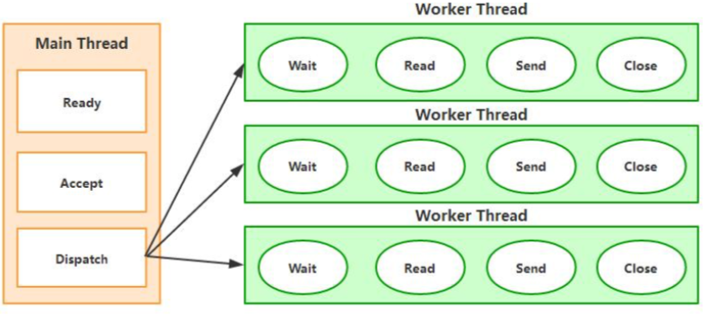
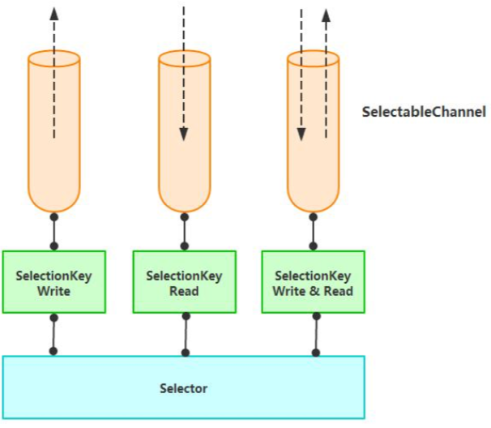

# 选择器 Selector

传统的 Server/Client 模式会基于 TPR(Thread per Request),服务器会为每个客户端请求建立一个线程，由该线程单独负责处理 一个客户请求。这种模式带来的一个问题就是线程数量的剧增，大量的线程会增大服务器的开销。大多数的实现为了避免这个问题， 都采用了线程池模型，并设置线程池线程的最大数量，这又带来了新的问题，如果线程池中有 200 个线程，而有 200 个用户都在 进行大文件下载，会导致第201个用户的请求无法及时处理，即便第201个用户只想请求一个几KB大小的页面。

传统的 Server/Client 模式如下图所示:



NIO 中非阻塞 I/O 采用了基于 Reactor 模式的工作方式，I/O 调用不会被阻塞，相反是注册感兴趣的特定 I/O 事件，如可读数据到达，新的套接字连接等等，在发生特定事件时，系统再通知我们。NIO 中实现非阻塞 I/O 的核心对象就是 Selector，Selector 就是 注册各种 I/O 事件地方，而且当那些事件发生时，就是这个对象告诉我们所发生的事件，如下图所示:



从图中可以看出，当有读或写等任何注册的事件发生时，可以从 Selector 中获得相应的 SelectionKey，同时从 SelectionKey 中可 以找到发生的事件和该事件所发生的具体的 SelectableChannel，以获得客户端发送过来的数据。

使用 NIO 中非阻塞 I/O 编写服务器处理程序，大体上可以分为下面三个步骤:

1. 向 Selector 对象注册感兴趣的事件。 
2. 从 Selector 中获取感兴趣的事件。 
3. 根据不同的事件进行相应的处理。

接下来我们用一个简单的示例来说明整个过程。首先是向 Selector 对象注册感兴趣的事件:

```java
/*
* 注册事件 
*/
private Selector getSelector() throws IOException { // 创建 Selector 对象
	Selector sel = Selector.open();
	// 创建可选择通道，并配置为非阻塞模式
	ServerSocketChannel server = ServerSocketChannel.open();
	server.configureBlocking(false);
	// 绑定通道到指定端口
	ServerSocket socket = server.socket();
  InetSocketAddress address = new InetSocketAddress(port); 
	socket.bind(address);
	// 向 Selector 中注册感兴趣的事件
	server.register(sel, SelectionKey.OP_ACCEPT);
	return sel;
}
```

创建了 ServerSocketChannel 对象，并调用 configureBlocking() 方法，配置为非阻塞模式，接下来的三行代码把该通道绑定到指定 端口，最后向 Selector 中注册事件，此处指定的是参数是 OP_ACCEPT，即指定我们想要监听 accept 事件，也就是新的连接发 生 时所产生的事件，对于 ServerSocketChannel 通道来说，我们唯一可以指定的参数就是 OP_ACCEPT。

从 Selector 中获取感兴趣的事件，即开始监听，进入内部循环:

```java
/*
* 开始监听
*/
public void listen() {
    System.out.println("listen on " + port);
    try {
while(true) {
// 该调用会阻塞，直到至少有一个事件发生
selector.select();
           Set<SelectionKey> keys = selector.selectedKeys();
           Iterator<SelectionKey> iter = keys.iterator();
           while (iter.hasNext()) {
               SelectionKey key = (SelectionKey) iter.next();
               iter.remove();
               process(key);
	} 
}
    } catch (IOException e) {
       e.printStackTrace();
    }
}
```

在非阻塞 I/O 中，内部循环模式基本都是遵循这种方式。首先调用 select()方法，该方法会阻塞，直到至少有一个事件发生，然后 再使用 selectedKeys()方法获取发生事件的 SelectionKey，再使用迭代器进行循环。

最后一步就是根据不同的事件，编写相应的处理代码:

```java
/*
* 根据不同的事件做处理 */
private void process(SelectionKey key) throws IOException{
// 接收请求
if (key.isAcceptable()) {
       ServerSocketChannel server = (ServerSocketChannel) key.channel();
       SocketChannel channel = server.accept();
       channel.configureBlocking(false);
       channel.register(selector, SelectionKey.OP_READ);
}
// 读信息
else if (key.isReadable()) {
    SocketChannel channel = (SocketChannel) key.channel();
    int len = channel.read(buffer);
    if (len > 0) {
       buffer.flip();
       content = new String(buffer.array(),0,len);
       SelectionKey sKey = channel.register(selector, SelectionKey.OP_WRITE);
       sKey.attach(content);
} else {
       channel.close();
    }
    buffer.clear();
}
// 写事件
else if (key.isWritable()) {
SocketChannel channel = (SocketChannel) key.channel();
String content = (String) key.attachment();
ByteBuffer block = ByteBuffer.wrap(("输出内容:" + content).getBytes());
if(block != null){
           channel.write(block);
}else{
           channel.close();
       }
} }
```

此处分别判断是接受请求、读数据还是写事件，分别作不同的处理。在 Java1.4 之前的 I/O 系统中，提供的都是面向流的 I/O 系统，系统一次一个字节地处理数据，一个输入流产生一个字节的数据，一个输出流消费一个字节的数据，面向流的 I/O 速度非常慢，而在 Java 1.4 中推出了 NIO，这是一个面向块的 I/O 系统，系统以块的方式处理处理，每一个操作在 一步中产生或者消费一个数据库，按块处理要比按字节处理数据快的多。