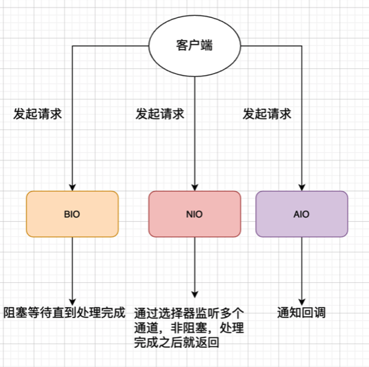

#   003-四种主要的IO模型

[TOC]

## 什么是同步和异步

同步IO和异步IO , 是一种用户空间与内核空间的IO发起方式

- 同步IO 指的是用户空间的线程是主动发起IO请求的一方, 内核空间是被动接受方
- 异步IO 反过来, 指的是系统内核主动发起IO操作的一方 , 用户空间的线程是被动接受的一方

## BIO/NIO/AIO图示

## 同步阻塞IO(Blocking IO)

 [031-同步阻塞IO(BlockingIO).md](031-同步阻塞IO(BlockingIO).md) 

阻塞IO, 指的是需要内核IO操作彻底完成之后, 才返回到用户空间执行用户的操作. 阻塞操作指的是用户空间程序的执行状态

- 传统的IO模型都是同步阻塞IO
- 默认创建的socket都是阻塞的

## 同步非阻塞IO(Non-Blocking IO)

 [032-同步非阻塞IO(NoneBlockingIO).md](032-同步非阻塞IO(NoneBlockingIO).md)

非阻塞IO,指的是 **用户空间的程序不需要等待内核IO操作彻底完成, 可以立即返回用户空间执行空间执行用户的操作**, 即处于非阻塞的状态, 与此同时, 内核会立即返回给用户一个状态值

简单来说 :

-  阻塞是指用户空间(调用线程) 一直在等待,不能干其别的事, 

- 非阻塞值得是用户空间(调用线程) 拿到内核返回的状态值后就返回到自己的空间, IO可以干就干, 不能干就干别的

非阻塞IO要求socket被设置为NONBLOCK

这里的NIO(同步非阻塞IO) 并不是Java 的 NIO库

## IO多路复用(IO Multiplexing)

 [033-IO多路复用模型(IOMutiplexing).md](033-IO多路复用模型(IOMutiplexing).md) 

经典的Reactor反应器设计模式, 有时候也成为 异步阻塞IO, Java中的Selector选择器 和Linux中的epoll 都是这种模型

## 异步IO(Asynchronous IO)

 [034-异步IO模型(AsynchronousIO).md](034-异步IO模型(AsynchronousIO).md) 

异步IO, 指的是, 用户空间与内核空间的调用方式反过来,

- 用户空间的线程编程被动接受者
- 内核空间成为了主动的调用者

这点有点类似Java 中比较典型的回调模式, 用户空间的线程向内核空间注册了各种IO事件的回调函数, 由内核去主动调用

