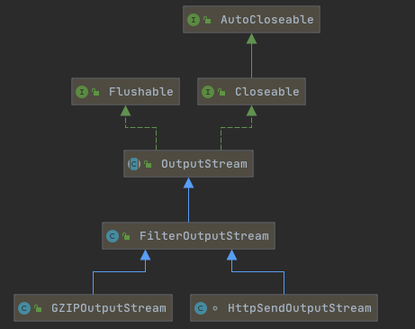
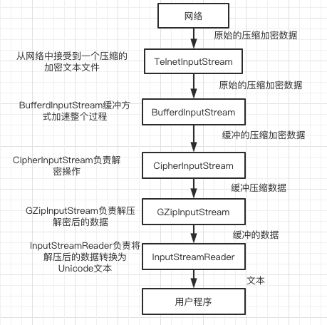

#  012-过滤器流.md

[TOC]

## 为什么要有过滤器流

InputStream 和OutputStream是相当原始的类,他们可以单个或者成组的读取字节,但是仅此而已

比如,

- 读取的类是什么类型, 是整型还是浮点数还是Unicode还是文本

这些要由程序员和代码确定,Java给我们提供了最常见的数据格式来 **翻译**这些字节, 用来在原始字节和各种格式之间来回转换



## 过滤器流采用的是包装器模式

仅仅只是包装一下 [04-decorator-pattern.md](../../../01-design-patterns/03-structural-patterns/04-decorator-pattern.md) 

```java
package java.io;
public class FilterOutputStream extends OutputStream {
    /**
     * The underlying output stream to be filtered.
     */
    protected OutputStream out;

    public FilterOutputStream(OutputStream out) {
        this.out = out;
    }

 
    public void write(int b) throws IOException {
        out.write(b);
    }

    
    public void write(byte b[]) throws IOException {
        write(b, 0, b.length);
    }

  
    public void write(byte b[], int off, int len) throws IOException {
        if ((off | len | (b.length - (len + off)) | (off + len)) < 0)
            throw new IndexOutOfBoundsException();

        for (int i = 0 ; i < len ; i++) {
            write(b[off + i]);
        }
    }

    
    public void flush() throws IOException {
        out.flush();
    }

    
    @SuppressWarnings("try")
    public void close() throws IOException {
        try (OutputStream ostream = out) {
            flush();
        }
    }
}

```

## 过滤器流的定义

过滤器(filter)流可以串链到输入流和输出流上

- 读/写数据是可以修改数据(例如 : 加密或者压缩)

- 过滤器流提供一些额外的方法,将读/写数据转化为其他格式
  - java.io.DataOutputStream类就提供了一个方法,将int转化为4个字节并把这些字节写入底层的输出流

## 过滤器的两个版本

- 过滤器流 : 处理原始数据作为字节处理, 例如通过压缩数据或者解释为二进制数字
-  [013-Reader(阅读器)和Writer(书写器).md](013-Reader(阅读器)和Writer(书写器).md)  : 用来处理多种编码文本的特殊情况,如UTF-8

## 过滤器流的工作原理

过滤器以链的形式进行组织,链中的每个环节都接受前一个过滤器或流的数据,并把数据传递给链中的下一个环节



## 将过滤器串联到一起

除了链中的最后一个过滤器之外,无论如何你都不应该从其他的过滤器中读取数据,或向器写入数据

例如

我们读取一个文件

```java
FileInputStream fin = new FileInputStream("xxx.txt");
```

使用BufferedInputStream做一个缓冲, 加速整个过程

```java
FileInputStream fin = new FileInputStream("xxx.txt");
BufferedInputStream bin = new BufferedInputStream(fin);//包装器模式
```

**执行完这两段代码以后,再没有任何方法能访问底层的文件输入流了**,所以就不会不小心读取到这个流而破坏缓冲区

如果我们想使用指定实现类的方法,那么也是一个,直接丢到构造器中

```java
DataOutputStream dout = new DataOutputStream(
			new BufferdOutputStream(
					new FileOutputStream("data.txt")
			)
)
```

这种连接是永久的,过滤器无法与流断开连接