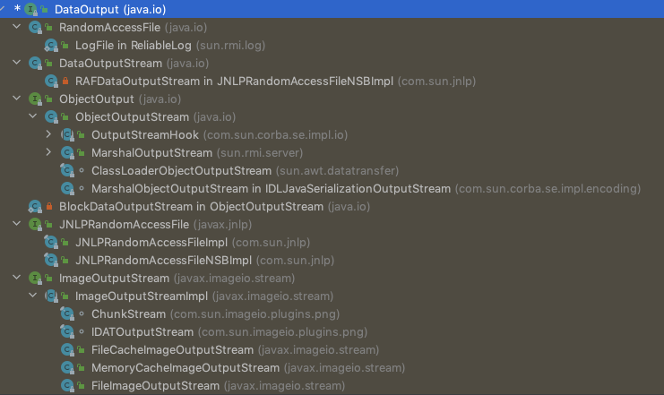

# 010-DataInput和DataOutput接口

[toc]

## 1.DataOutput接口:输出二进制数据

#### 图示



DataOutput接口定义了以二进制格式写数组、字符、boolean值和字符串的方法 

- writeInt总是将一个整数写出为4字节的二进制数量值，而不管它有多少位，

- writeDouble总是将一个double值写出为8字节的二进制数量值。

这样产生的结果对人阅读不友好，但是对于给定类型的每个值，所需的空间都是相同的，而且将其读回也比解析文本要更快。

```java
write
write
write
writeBoolean
writeByte
writeShort
writeChar
writeInt
writeLong
writeFloat
writeDouble
writeBytes
writeChars
writeUTF
```

writeUTF方法使用修订版的8位Unicode转换格式写出字符串。这种方式与直接使用标准的UTF-8编码方式不同，其中，Unicode码元序列首先用UTF-16表示，其结果之后使用UTF-8规则进行编码。

修订后的编码方式对于编码大于0xFFFF的字符的处理有所不同，这是为了向后兼容在Unicode还没有超过16位时构建的虚拟机。

因为没有其他方法会使用UTF-8的这种修订，所以你应该只在写出用于Java虚拟机的字符串时才使用writeUTF方法，例如，当你需要编写一个生成字节码的程序时。对于其他场合，都应该使用writeChars方法。

## 2.Java数据文件的平台无关性

根据你所使用的处理器类型，在内存存储**整数**和**浮点数**有两种不同的方法。

例如，假设你使用的是4字节的int，

- **高位在前顺序** : 如果有一个十进制数1234，也就是十六进制的4D2（1234=4×256+13×16+2），那么它可以按照内存中4字节的第一个字节存储最高位字节的方式来存储为：00 00 04 D2，这就是所谓的高位在前顺序（MSB）；

- **低位在前顺序** : 我们也可以从最低位字节开始：D2 04 00 00，这种方式自然就是所谓的低位在前顺序（LSB）。

例如，SPARC使用的是高位在前顺序，而Pentium使用的则是低位在前顺序。这就可能会带来问题，当存储C或者C++文件时，数据会精确地按照处理器存储它们的方式来存储，这就使得即使是最简单的数据在从一个平台迁移到另一个平台上时也是一种挑战。

**在Java中，所有的值都按照高位在前的模式写出，不管使用何种处理器，这使得Java数据文件可以独立于平台。**

## 3.DataOutput接口:输入二进制数据

```java
readFully(byte[])
readFully(byte[], int off, int len) // 将字节读入到数组b中,其间阻塞直至所有字节都读入; off 数据其实位置的偏移量; len 读入字节的最大数量
skipBytes
readBoolean
readByte
readUnsignedByte
readShort
readUnsignedShort
readChar
readInt
readLong
readFloat
readDouble
readLine
readUTF
```

DataInputStream 类实现了DataInput接口,为了从文件中读入二进制数据,可以将DataInputStream于某个字节源相组合

```
DataInputStream in = new DataInputStream(new FileInputStream("employee.dat"));
```


