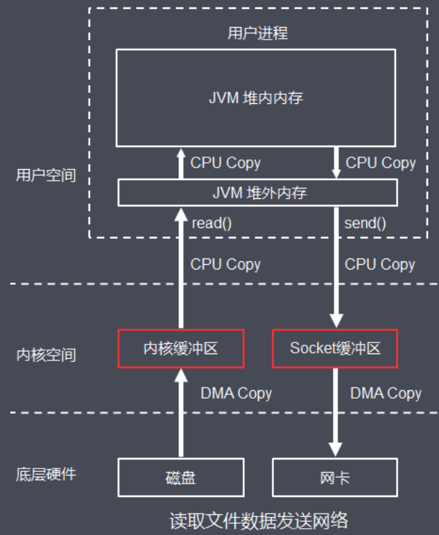

# 010-JavaNIO简介

[TOC]

## JavaNIO是什么

- 版本特点
  - 1.4 之前 Java是 阻塞IO
  - 1.4 之后 Java 引入了异步IO库, 也就是Java new IO

- NIO的目标是让Java支持非阻塞IO, NIO弥补了原来面向流OIO同步阻塞的不足, 为标准Java代码提供了告诉的, 面向缓冲区的IO

## Java NIO的核心三大组件

- 通道 Channel
- 缓冲区 Buffer
- 选择器 Selector

可以看出 Java NIO 的模型属于 - **IO多路复用模型**

Java NIO组件, 提供了统一的API, 屏蔽了底层不同操作系统的差异

## NIO与OIO的对比

- NIO 是面向缓冲区的( Buffer Channel) ; OIO 是面向流的 (Stream Oriended) 的
- NIO 的操作是非阻塞的; OIO 的操作是阻塞的
- NIO 基于多路复用技术, 有选择器 (Selector) 的概念

#### NIO 是面向缓冲区的( Buffer Channel) ; OIO 是面向流的 (Stream Oriended) 的]

- OIO的是面向字节流或者字符流的, 在一般的OIO 操作中, 我们以流式的方式顺序地从一个流 (Stream) 中读取一个或者多个字节, 因为, 我们不能随便的改变指针的位置

- NIO中引入了Channel 和 Buffer 缓冲区的概念, 读取和写入, 只需要从通道中读取数据到缓冲区中, 或者将数据从缓冲区中写入到通道中
- NIO不像OIO 那样是顺序操作可以随意的读取Buffer 中任意位置和数据

#### OIO的操作是阻塞的,而NIO的操作是非阻塞的

- OIO的操作是非阻塞的, 例如, 我们调用一个read 读取一个文件的内容, 那么调用read的线程会被阻塞住, 直到read操作完成

- NIO的操作非阻塞模型中, 当我们调用read方法时
  - 如果此时有数据, 则read读取数据并返回
  - 如果此时没有数据, 则read直接返回, 而不会阻塞当前线程

## NIO拷贝和BIO拷贝

**总共经历6次数据拷贝，执行效率较低**

标准I/O处理，完成一次完整的数据读写，至少需要从底层硬件读到内核空间，再读到用户文件，又从用户空间写入内核空间，再写入底层硬件

此外，底层通过write、read等函数进行I/O系统调用时，

- 需要传入数据所在缓冲区**起始地址和长度**
- 由于JVM GC的存在，导致对象在堆中的位置往往会发生移动，移动后传入系统函数的地址参数就不是真正的缓冲区地址了

可能导致读写出错，为了解决上面的问题，使用标准I/O进行系统调用时，还会额外导致一次数据拷贝：

- **把数据从JVM的堆内拷贝到堆外的连续空间内存(堆外内存)**

