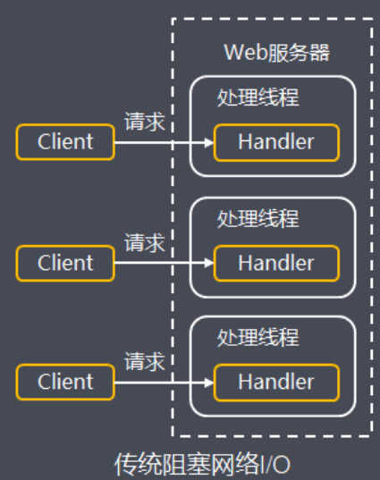

## 010-标准IO基本原理

[TOC]

## 简述

Java NIO(New I/O)是一个可以替代标准Java I/O API的IO API(从Java 1.4开始)，Java NIO提供了与标准I/O不同的I/O工作方式，目的是为了解决标准 I/O存在的以下问题：

- 数据多次拷贝
- 操作阻塞

https://mp.weixin.qq.com/s/khyOVIqFp1vNK29OIMBBuQ

## 磁盘I/O工作原理

值得注意的是：

- 读写操作基于系统调用实现
- 读写操作经过用户缓冲区，内核缓冲区，应用进程并不能直接操作磁盘
- 应用进程读操作时需阻塞直到读取到数据


## DMA:直接内存存取

DMA：全称叫直接内存存取（Direct Memory Access），是一种允许外围设备（硬件子系统）直接访问系统主内存的机制。基于 DMA 访问方式，系统主内存与硬件设备的数据传输可以省去CPU 的全程调度

## 网络I/O工作原理

> recvfrom，经socket接收数据的函数

值得注意的是：

- 网络I/O读写操作经过用户缓冲区，Sokcet缓冲区
- 服务端线程在从调用recvfrom开始到它返回有数据报准备好这段时间是阻塞的，recvfrom返回成功后，线程开始处理数据报


## 标准I/O存在问题

#### 数据多次拷贝

标准I/O处理，完成一次完整的数据读写，至少需要从底层硬件读到内核空间，再读到用户文件，又从用户空间写入内核空间，再写入底层硬件

此外，底层通过write、read等函数进行I/O系统调用时，需要传入数据所在缓冲区**起始地址和长度**由于JVM GC的存在，导致对象在堆中的位置往往会发生移动，移动后传入系统函数的地址参数就不是真正的缓冲区地址了

可能导致读写出错，为了解决上面的问题，使用标准I/O进行系统调用时，还会额外导致一次数据拷贝：把数据从JVM的堆内拷贝到堆外的连续空间内存(堆外内存)

所以总共经历6次数据拷贝，执行效率较低

#### 操作阻塞

传统的网络I/O处理中，由于请求建立连接(connect)，读取网络I/O数据(read)，发送数据(send)等操作是线程阻塞的

```java
// 等待连接
Socket socket = serverSocket.accept();

// 连接已建立，读取请求消息
StringBuilder req = new StringBuilder();
byte[] recvByteBuf = new byte[1024];
int len;
while ((len = socket.getInputStream().read(recvByteBuf)) != -1) {
	req.append(new String(recvByteBuf, 0, len, StandardCharsets.UTF_8));
}

// 写入返回消息
socket.getOutputStream().write(("server response msg".getBytes()));
socket.shutdownOutput();
```

以上面服务端程序为例，当请求连接已建立，读取请求消息，服务端调用read方法时，客户端数据可能还没就绪(例如客户端数据还在写入中或者传输中)，线程需要在read方法阻塞等待直到数据就绪

为了实现服务端并发响应，每个连接需要独立的线程单独处理，当并发请求量大时为了维护连接，内存、线程切换开销过大

