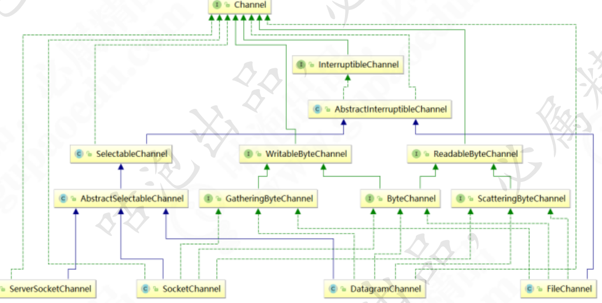

# 020-通道-Channel

[TOC]

## 简介

OIO中, 同一个网络连接会连接到两个流

- 一个输入流(input Stream)
- 一个输出流(Output Stream)

通过这两个流, 不断的进行输入和输出操作

NIO 中, 同一个同一个网络连接使用一个通道表示, 所有的NIO的IO操作都是从通道开始的 类似于OIO中的两个流的结合体, 既可以从通道中读取, 又可以从通道中写入

一个Channel 可以表示一个底层的文件描述符， 例如硬件，文件，网络连接，除了这些， Java NIO通道还可以更加细化， 例如， 对应不同的网络传输协议

## Channel的主要类型

主要的类型有四个

- FileChannel  文件通道， 用于文件的数据读取
- SocketChannel 套接字通道， 用于Socket套接字 TCP连接的数据读写
- ServerSocketChannel 服务器嵌套字通道（或者服务器监听通道），允许我们监听TCP连接要求，为每个监听到的请求， 创建一个SocketChannel套接字通道
- DatagramChannel数据报通道，用于UDP 协议读取

