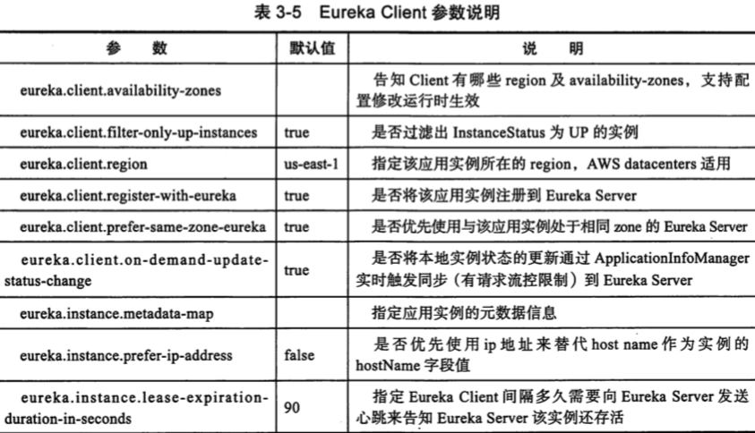
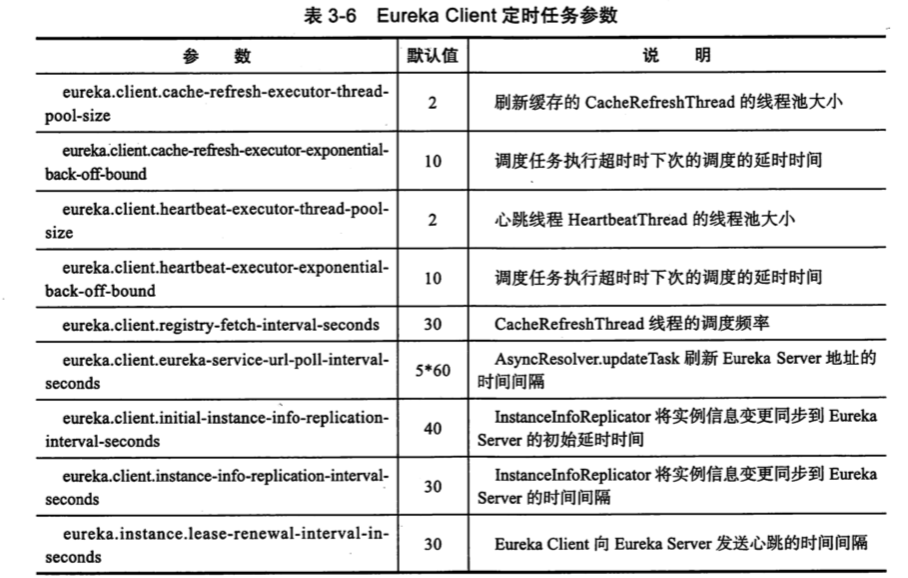
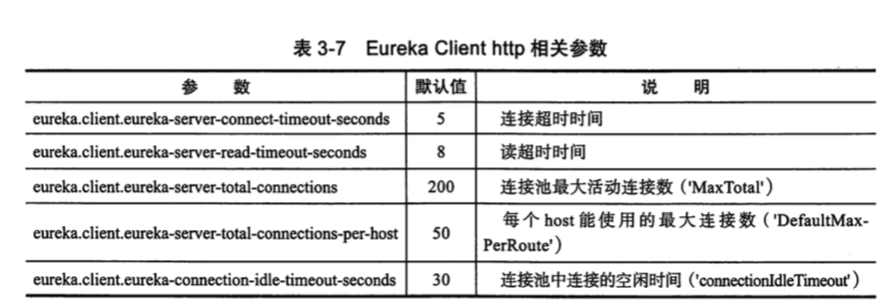
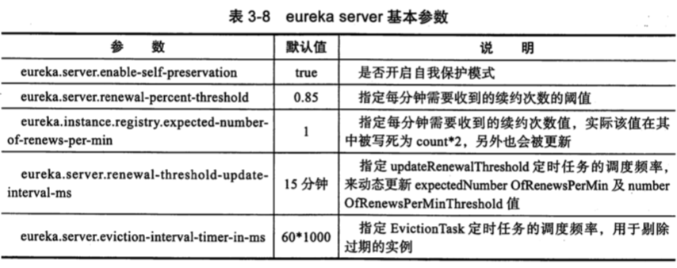
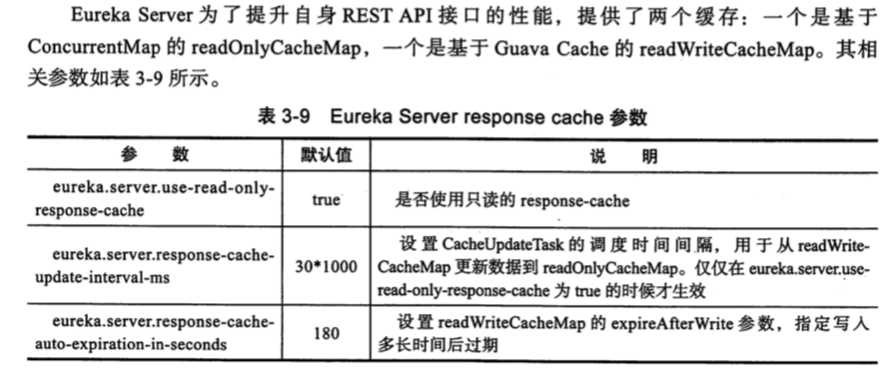
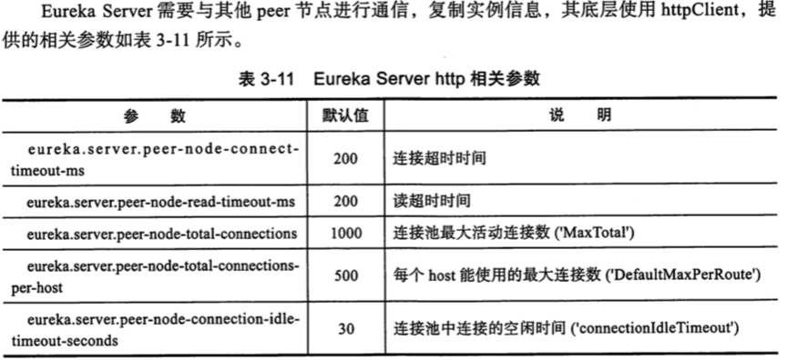
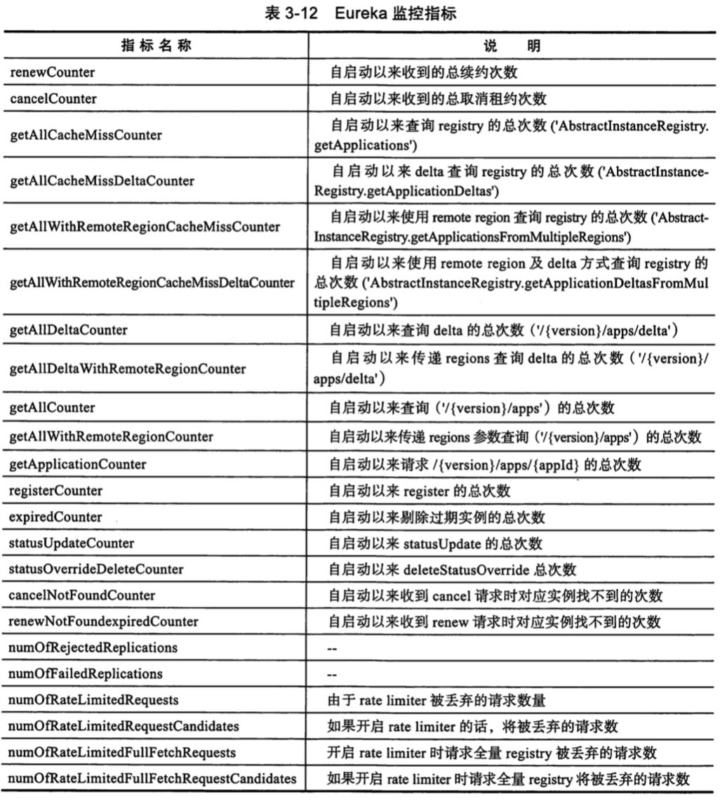

# Eureka 性能调优与监控

## 核心参数

### Client 端

Client 端的参数分别为基本参数,定时任务参数,http 参数三大类来梳理

## 推荐配置

| 属性                                         | 描述                                                         |
| -------------------------------------------- | ------------------------------------------------------------ |
| eureka.client.serviceUrl.defaultZone         | 注册中心位置,高可用应该配置多个地址,可以根据启动参数传入,也可以使用配置中心托管 |
| eureka.instance.prefer-ip-address            | 是否优先使用 ip 地址来替代 hostname 作为实例的 hostName 字段值, 推荐大家都可以用 ip 来注册 |
| eureka.server.enable-self-preservation       | 默认开启,关闭自我保护,如果规模较大,可以考虑不关闭(AP)        |
| eureka.servier.eviction-interval-timer-in-ms | 主动失效检测间隔,默认为 60s,可以设置短一点如 30 秒           |


#### 基本参数



#### 定时任务参数



#### http 参数

Eureka Client 底层 HttpClient 与 EurekaServer 通讯,提供的相关参数



### Server端

- 基本参数
- response cache 参数
- peer 参数
- http 参数

#### 基本参数



#### reponse cache 参数



#### Peer 参数


#### http 参数



## 参数调优

- 为什么服务下线了,Eureka Server 接口返回的信息还会存在
- 为什么服务上线了, Eureka Client 不能机制获取到
- 为什么会出现


#### 为什么服务下线了,Eureka Server 接口返回的信息还会存在

Eureka Server 不是强一致性的,因此 registery 中会存留过期的实例信息:

- 应用实例异常挂掉,没能在挂掉之前告知 Eureka Server 要下线掉该服务实例信息,只能通过定时任务 EvictionTask 去剔除
- 应用实例下线时有告知 EurekaServer 下线,但是由于 EurekaServer 的 REST API 有 response cache ,因此需要等待缓存过期才能更新
- Eureka Server由于开启并引入了 SELF PRESERVATION 模式,导致 registry 的信息不会因为过期而被剔除掉,知道退出 SELF PRESERVATION 模式

## 指标监控

Eureka 内置了基于 servo 的指标统计

```
com.netflix.eureka.util.EurekaMonitors
```



SpringBoot 2.0 版本改为 Micrometer , 不再支持 Netflix Servo ,转而支持 Servo 的替代者Netfilix Spectator , 不过对于 Servo ,可以通过 DefaultMonitorRegistry.getInstance().getRegisteredMonitors()方法来获取所有注册了的 Monitor ,进而获取指标值

