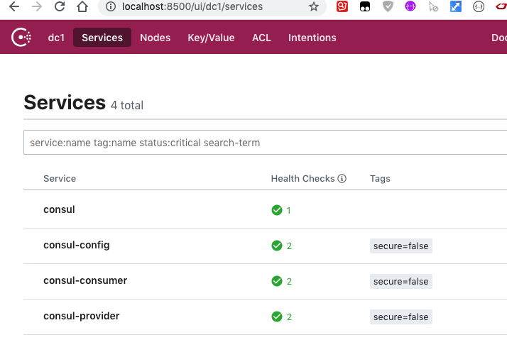
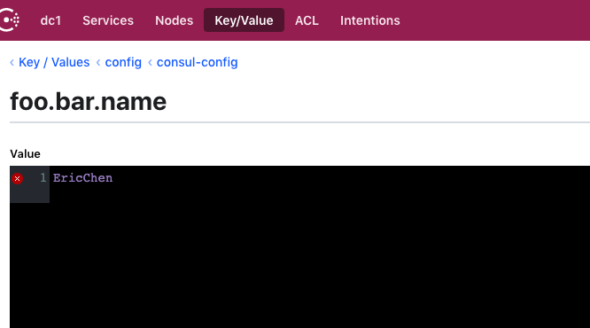
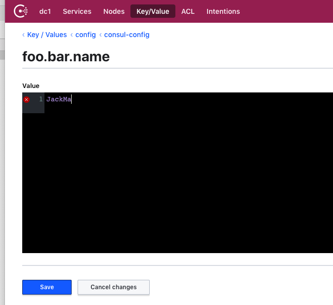

# Spring Cloud Consul

Spring Cloud COnsul 通过自动化配置,对 Spring Environment 绑定和其他惯用的 Spring 模块编程,为 SpringBoot 应用提供了 ConsulJIC恒

> 只需要一些简单的注解,就可以快速启动和配置 Consul,并用它来构建大型分布式系统

## Spring Cloud Consul 能做什么

- 服务发现, 实例可以向 Consul 服务,客户端可以通过 Springbean 来发现提供方
- 支持 ribbon ,客户端负载
- 支持 zuul 服务网关
- 分布式配置中心,使用的是 Consule 的 k/v 存储
- 控制总线,使用的是 Consul events

## DEMO

- consul-provider 用于提供服务
- consul-consumer 用于feign客户端调用
- consul-config 用于测试配置信息从 consul 获取




可以看到三个服务都起来了

#### Feign 调用

```java
/**
 * 使用 openfeign 组件，调用远程服务
 */
@FeignClient("consul-provider")
public interface HelloService {
    @RequestMapping(value = "/sayHello", method = RequestMethod.GET)
    String sayHello(@RequestParam("name") String name);
}

```

可以看到 Consul 有注册中心功能


## consul-config

通过在 consul 中配置 key/value 的值,从而使得项目中的变量值发生变化





当我们对数据进行修改的时候,观察控制台




