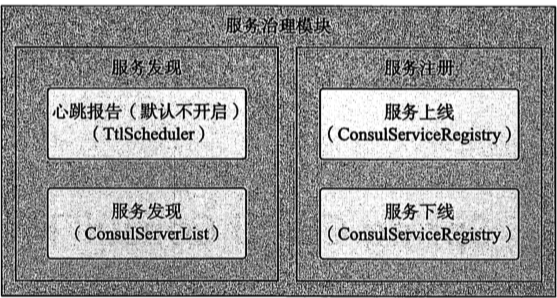
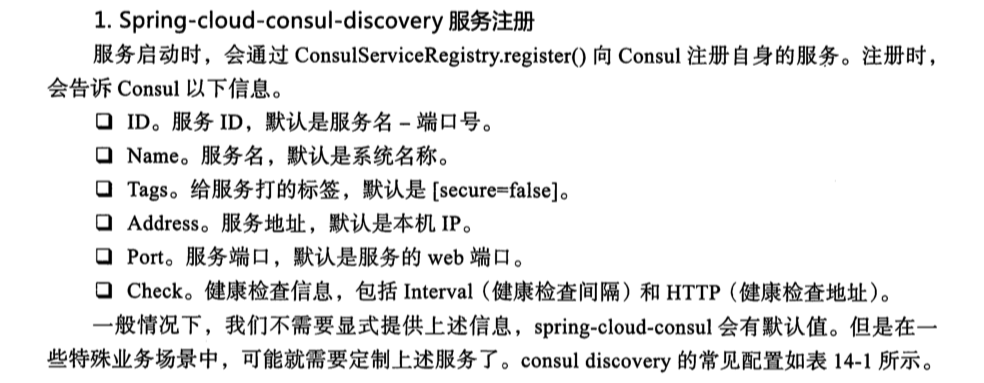
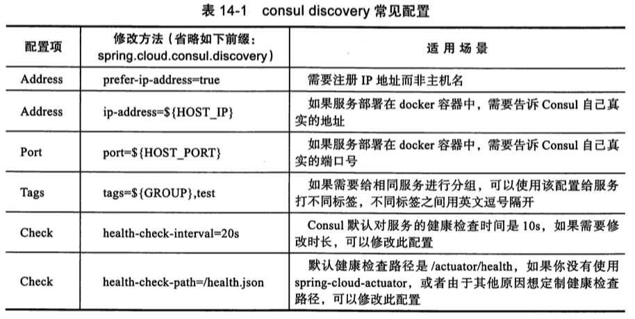
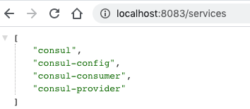

# 模块介绍

SpringCloud Consul 是在 consul-api 的基础上封装了一层功能,从而与现有 SpringCloud 组件融合,达到开箱即用

- spring-cloud-consul-binder: 对 Consul 事件功能进行封装
- spring-cloud-consul-config : 对 Consul 的配置功能封装
- spring-cloud-consul-core: 基础配置和健康检查模块
- spring-cloud-consul-discovery: 对 consul 服务治理功能进行封装

Consul 的事件功能比较弱化,应用比较多的是服务治理和配置功能,所以我们重点介绍 discory 和 config 模块

## Spring Cloud Consul Discovery



- 服务发现
  - 心跳报告
  - 服务发现
- 服务注册
  - 服务上线
  - 服务下线





```
spring:
  application:
    name: consul-register
  cloud:
    consul:
      host: 127.0.0.1    # consul 启动地址
      port: 8500         # consul 启动端口
      discovery:
        prefer-ip-address: true     # 优先使用 IP 注册
        ip-address: 127.0.0.1       # 假装部署在 docker 中,指定了宿主机 IP
        port: 8080                  # 假装部署在 docker 中,指定了宿主机端口
        health-check-interval: 20s  # 健康检查间隔时间为 20s
        health-check-path: /health  # 自定义健康检查路径
        tags: ${LANG},test          # 指定服务的标签, 用逗号隔开

```

## DiscoveryClient

我们可以使用 DiscoveryClient 获取目前所有实例

```'
    @Autowired
    private DiscoveryClient discoveryClient;


    @GetMapping("/services")
    public List<String> getService(){
        return discoveryClient.getServices();
    }
```



## Spring Cloud Consul Config

配置刷新时并没有实时生效

`org.springframework.cloud.consul.config.ConfigWatch`中有一个定时方法 `watchConfigKeyValues()`,默认每秒执行一次,去 consul 中获取最新的配置信息,一旦配置发生变化,Spring 通过 ApplicationEventPublisher 重新刷新缓存

> spring.cloud.consul.watch.delay 自定义

#### 客户端怎么知道哪些配置被更新过呢

Consul 的返回数据里,会给每一项配置加一个`consulIndex`属性,类似于版本号,如果配置更新,就会自增


