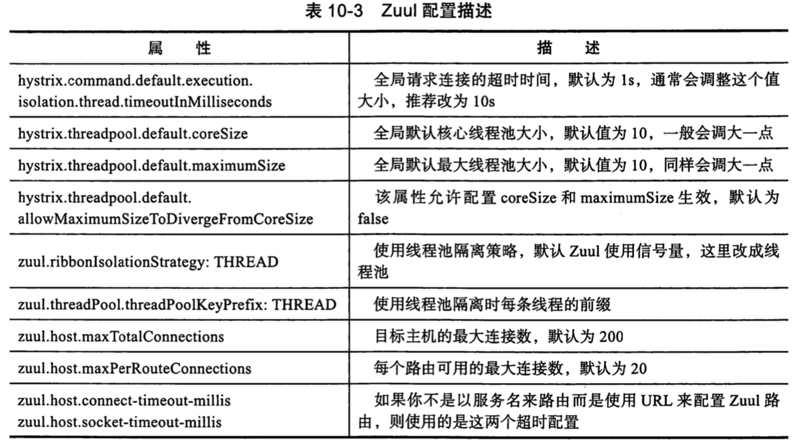

# 路由配置

### 路由配置简化与规则

- 单实例 serviceId 映射

```
zuul:
#  ignored-services: client-b    #忽略的服务，防服务侵入
#  ignored-patterns: /**/div/**  #忽略的接口，屏蔽接口
#  prefix: /pre                  #前缀
#  add-host-header: true         #重定向header问题
  routes:
    client-a: /client/**
```

从一个 `/client/**`到`client-a` 服务的一个映射规

```
zuul:
	routes:
		client-a: /client/**
```

或者

```yml
zuul:
  routes:
    client-a: 
```

## 多实例路由

默认情况下,Zuul 会使用 Eureka 中集成的基本负载均衡功能,如果想要使用 Ribbon 的负载均衡,负载均衡功能,就需要制定一个 serviceID, 此操作需要禁止 Ribbon 使用 Eureka

```yml
zuul:
  routes:
    ribbon-route:
      path: /ribbon/**
      serviceId: ribbon-route

ribbon:
  eureka:
    enabled: false  #禁止Ribbon使用Eureka

ribbon-route:
  ribbon:
    NIWSServerListClassName: com.netflix.loadbalancer.ConfigurationBasedServerList
    NFLoadBalancerRuleClassName: com.netflix.loadbalancer.RandomRule     #Ribbon LB Strategy
    listOfServers: localhost:7070,localhost:7071     #client services for Ribbon LB
```

## forward本地跳转

有时候,我们在 zuul 中会做一些逻辑处理,在网关中写好一个接口

```
@RestController
public class TestController {

	@GetMapping("/client")
	public String add(Integer a, Integer b){
		return "本地跳转：" + (a + b);
	}
}
```

使用配置文件可以本地跳转

```
zuul:
  routes:
    client-a:
      path: /client/**
      url: forward:/client
```

## 相同路径的加载规则

有一种特殊的情况,为一个映射路径指定多个 serviceId, 那么它应该加载哪个服务呢?

```
zuul:
  routes:
    client-b:
      path: /client/**
      serviceId: client-b
    client-a:
      path: /client/**
      serviceId: client-a
```

`client-a `后面的覆盖前面的

## 通用通配符

```
/** 匹配任意数量的路径与字符 
/* 匹配任意数量的字符
/? 匹配单个字符
```


## 推荐配置

```
zuul:
  ribbonIsolationStrategy: THREAD #线程池隔离策略
  threadPool:
    useSeparateThreadPools: true
    threadPoolKeyPrefix: zuulgateway
  max:
    host:
      max-per-route-connections: 200
      max-total-connections: 500
  host:
    socket-timeout-millis: 5000
    connect-timeout-millis: 10000
hystrix:
  threadpool:
    default:
      coreSize: 20
      maximumSize: 50
      maxQueueSize: -1
      allowMaximumSizeToDivergeFromCoreSize: true
  command:
    default:
      execution:
        timeout:
          enabled: false
        isolation:
          thread:
            interruptOnTimeout: false
            timeoutInMilliseconds: 15000
```


