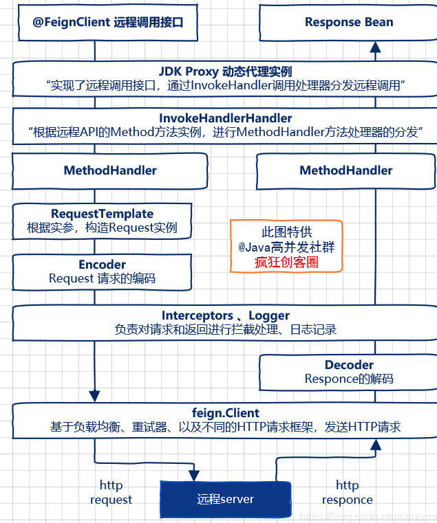

# Feign 的工作原理

- 在微服务开发时,我们会在主程序使用 @EnableFeignClients 注解开启对 Feign Client 扫描加载处理,根据 Feign Client 的规范,定义接口并添加 @FeignClients 注解

- 当程序启动时,会进行包扫描,扫描所有标注 @FeignClients 的注解的类, 并将这些信息注入到 SpringIOC 容器中,当定义 Feign 接口的方法被调用时, 通过 **JDK 代理的方式** 生成具体的 RestTemplate 

  > 在生成代理的时候,Feign 会为每一个接口方法创建一个 RequestTemplate 对象, 该对象封装了 HTTP 请求需要的全部信息,如  请求参数名   请求方法 等信息都是在这个过程中确定的

- 然后由 RequestTemplate 生成 Request , 然后把 Request 交给 Client 去处理

  Client 可以是

  - JDK 原生的 URLConnection
  - Apache 的 Http Client
  - 也可以是 OKhttp

- 最后 Client 被封装到 LoadBalanceClient 类, 这个类交给 Ribbon 负载均衡发起服务之间的调用

Feign远程调用，核心就是通过一系列的封装和处理，将以JAVA注解的方式定义的远程调用API接口，最终转换成HTTP的请求形式，然后将HTTP的请求的响应结果，解码成JAVA Bean，放回给调用者。Feign远程调用的基本流程，大致如上图所示。

从上图可以看到，Feign通过处理注解，将请求模板化，当实际调用的时候，传入参数，根据参数再应用到请求上，进而转化成真正的 Request 请求。通过Feign以及JAVA的动态代理机制，使得Java 开发人员，可以不用通过HTTP框架去封装HTTP请求报文的方式，完成远程服务的HTTP调用。

## 参考

https://www.cnblogs.com/crazymakercircle/p/11965726.html