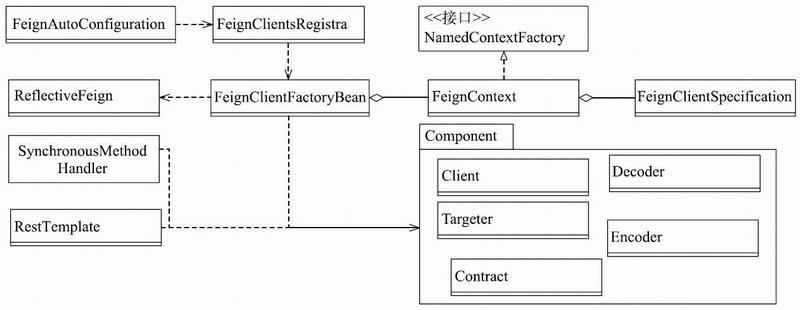
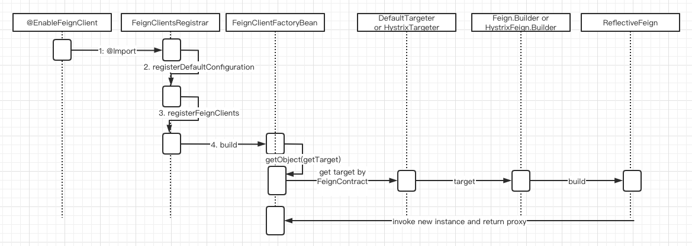

# 010-核心组件与概念

[TOC]

## 学习路线

可以沿着两条路线进行，

- 一是FeignServiceClient这样的被@FeignClient注解修饰的接口类(后续简称为FeignClient接口类)如何创建，也就是其Bean实例是如何被创建的；
- 二是调用FeignServiceClient对象的网络请求相关的函数时，OpenFeign是如何发送网络请求的。

而OpenFeign相关的类也可以以此来进行分类，

- 一部分是用来初始化相应的Bean实例的
- 一部分是用来在调用方法时发送网络请求

## 基本流程

OpenFeign会首先进行相关BeanDefinition的动态注册，然后当Spring容器注入相关实例时会进行实例的初始化，最后当FeignClient接口类实例的函数被调用时会发送网络请求。

## 类图

上图是OpenFeign相关的关键类图，其中比较重要的类为

- FeignClientFactoryBean 是创建@FeignClient修饰的接口类Bean实例的工厂类；
- FeignContext 是配置组件的上下文环境，保存着相关组件的不同实例，这些实例由不同的FeignAutoConfiguration配置类构造出来；
- SynchronousMethodHandler 是MethodHandler的子类，可以在FeignClient相应方法被调用时发送网络请求，然后再将请求响应转化为函数返回值进行输出。

## 完整类图

## 时序图

