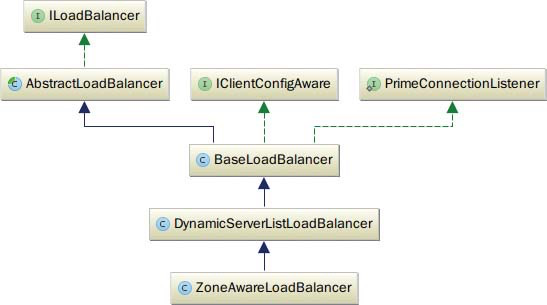
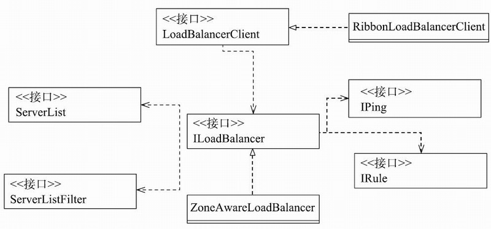

# LoadBalancer源码分析

## 目录

- [LoadBalancer是什么](#LoadBalancer是什么)
- [怎么获得ILoadBalancer](#怎么获得ILoadBalancer)
- 负载均衡

## LoadBalancer是什么

ILoadBalancer是Ribbon的关键类之一，它是定义负载均衡操作过程的接口。

Ribbon通过**SpringClientFactory**工厂类的getLoadBalancer方法可以获取ILoadBalancer实例。

## 怎么获得ILoadBalancer

根据Ribbon的组件实例化机制，ILoadBalnacer实例是在RibbonAutoConfiguration中被创建生成的。
SpringClientFactory中的实例都是RibbonClientConfiguration或者自定义Configuration配置类创建的Bean实例。

RibbonClientConfiguration还创建了IRule、IPing和ServerList等相关组件的实例。使用者可以通过自定义配置类给出上述几个组件的不同实例。

- ZoneAwareLoadBalancer是ILoadBalancer接口的实现类之一，它是Ribbon默认的ILoadBalancer接口的实例。




RibbonClientConfiguration中有关 ZoneAwareLoadBalancer 的配置如下所示：

```java
//RibbonClientConfiguration.java
@Bean
@ConditionalOnMissingBean
public ILoadBalancer ribbonLoadBalancer(IClientConfig config,
    ServerList〈Server〉 serverList, ServerListFilter〈Server〉 serverListFilter,
        IRule rule, IPing ping, ServerListUpdater serverListUpdater) {
    if (this.propertiesFactory.isSet(ILoadBalancer.class, name)) {
        return this.propertiesFactory.get(ILoadBalancer.class, config, name);
    }
    return new ZoneAwareLoadBalancer〈〉(config, rule, ping, serverList,
            serverListFilter, serverListUpdater);
}
```

## IBalancer相关的类图



其中的类都是ZoneAwareLoadBalancer构造方法所需参数实例的类型。

接下来按照ZoneAwareLoadBalancer构造函数的参数顺序来看一下与ILoadBalancer相关的重要的类，它们分别是IClientConfig、IRule、IPing、ServerList和ServerListFilter

## ZoneAwareLoadBalancer获取chooseServer方法

- ZoneAwareLoadBalancer的chooseServer方法会首先使用DynamicPropertyFactory来获取平均负载(triggeringLoadPerServerThreshold)和实例故障率(avoidZoneWithBlackoutPercetage)两个阈值，

- 然后调用ZoneAvoidanceRule的getAvailableZones方法使用这两个阈值来获取所有可用的服务区(Zone)列表，每个服务区实例中包含了一定数量的服务器实例。

- 然后调用ZoneAvoidanceRule的randomChooseZone方法从上述的服务区列表中随机选出一个服务区，最后调用该服务区对应BaseLoadBalancer实例的chooseServer方法获取到最终的服务器实例。
- ZoneAwareLoadBalancer会为不同的服务区调用不同的BaseLoadBalancer的chooseServer方法，这正体现了它类名的含义。chooseServer方法是其中最重要的方法，具体实现如下所示：

```java
//ZoneAwareLoadBalancer.java
public Server chooseServer(Object key) {
    if (!ENABLED.get() || getLoadBalancerStats().getAvailableZones().size() 〈= 1) {
            logger.debug("Zone aware logic disabled or there is only one zone");
            return super.chooseServer(key);
        }
    Server server = null;
    try {
        //获取当前有关负载均衡的服务器状态集合
        LoadBalancerStats lbStats = getLoadBalancerStats();
        Map〈String, ZoneSnapshot〉 zoneSnapshot = Zone

AvoidanceRule.createSnapshot (lbStats);
        logger.debug("Zone snapshots: {}", zoneSnapshot);
        //使用'DynamicPropertyFactory'获取平均负载的阈值
        if (triggeringLoad == null) {
            triggeringLoad = DynamicPropertyFactory.getInstance().getDoubleProperty(
                "ZoneAwareNIWSDiscoveryLoadBalancer." + this.getName() + ".triggeringLoadPerServerThreshold", 0.2d);
        }
        //使用'DynamicPropertyFactory'获取平均实例故障率的阈值
        if (triggeringBlackoutPercentage == null) {
            triggeringBlackoutPercentage = DynamicPropertyFactory.getInstance(). getDoubleProperty(
                    "ZoneAwareNIWSDiscoveryLoadBalancer." + this.getName() + ".avoidZoneWithBlackoutPercetage", 0.99999d);
        }
        //根据两个阈值来获取所有可用的服务区列表
        Set〈String〉 availableZones = ZoneAvoidanceRule.getAvailableZones(zoneSnapshot, triggeringLoad.get(), triggeringBlackoutPercentage.get());
        logger.debug("Available zones: {}", availableZones);
        if (availableZones != null &amp;&amp;　availableZones.size() 〈 zoneSnapshot.keySet().size()) {
            //随机从可用的服务区列表中选择一个服务区
            String zone = ZoneAvoidanceRule.randomChooseZone(zoneSnapshot, availableZones);
            logger.debug("Zone chosen: {}", zone);
            if (zone != null) {
                //得到zone对应的BaseLoadBalancer
                BaseLoadBalancer zoneLoadBalancer = getLoadBalancer(zone);
                server = zoneLoadBalancer.chooseServer(key);
            }
        }
    } catch (Exception e) {
            logger.error("Error choosing server using zone aware logic for load balancer={}", name, e);
    }
    if (server != null) {
        return server;
    } else {
        logger.debug("Zone avoidance logic is not invoked.");
        return super.chooseServer(key);
    }
}
```

BaseLoadBalancer对象的chooseServer方法实现比较简单，就是直接调用它的IRule成员变量的choose方法。IRule是负责实现负载均衡策略的接口，本书会在下一小节进行详细描述，BaseLoadBalancer的chooseServer函数的代码如下所示：

```java
//BaseLoadBalancer.java
public Server chooseServer(Object key) {
    if (counter == null) {
        counter = createCounter();
    }
    counter.increment();
    if (rule == null) {
        return null;

} else {
        try {
            return rule.choose(key);
        } catch (Throwable t) {
            return null;
        }
    }
}
```

## LoadBalancer的 getServer方法

#### LoadBalancer集成结构图

 

#### LoadBalancer流程图


