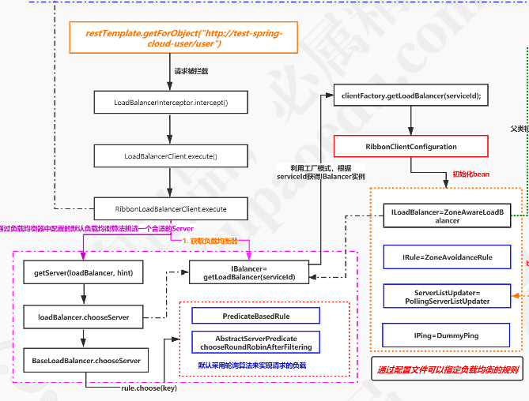

# LoadBalancer源码分析

## 核心问题

```
        return restTemplate.getForObject("http://spring-cloud-order-service/orders",String.class);
```

当 restTemplate 调用 getForObject方法的时候, 为什么会走 Ribbon 的拦截器 `org.springframework.cloud.client.loadbalancer.LoadBalancerInterceptor`

- [拦截器具体做了什么](#拦截器具体做了什么)

  > 获取一个 LoadBalancerClient 然后 通过 LoadBalancerClient  获取一个 ILoadBalancer ,然后通过这个 ILoadBalancer 获取要访问的服务


## 拦截器具体做了什么

intercept 方法是具体的拦截方法

```java
public class LoadBalancerInterceptor implements ClientHttpRequestInterceptor {

	private LoadBalancerClient loadBalancer;
	private LoadBalancerRequestFactory requestFactory;
  
  ....

	@Override
	public ClientHttpResponse intercept(final HttpRequest request, final byte[] body,
			final ClientHttpRequestExecution execution) throws IOException {
    //获取原 url
		final URI originalUri = request.getURI();
    //获取原serviceName
		String serviceName = originalUri.getHost();
		Assert.state(serviceName != null, "Request URI does not contain a valid hostname: " + originalUri);
    //执行负载均衡器的 execute 方法
		return this.loadBalancer.execute(serviceName, requestFactory.createRequest(request, body, execution));
	}
}

```

## LoadBalancerClient是个啥

```java
	@Bean
	@ConditionalOnMissingBean(LoadBalancerClient.class)
	public LoadBalancerClient loadBalancerClient() {
		return new RibbonLoadBalancerClient(springClientFactory());
	}
```

本质上就是一个 RibbonLoadBalancerClient

>  RibbonLoadBalancerClient.execute 

```java
	@Override
	public <T> T execute(String serviceId, LoadBalancerRequest<T> request) throws IOException {
    //获取一个负载均衡器
		ILoadBalancer loadBalancer = getLoadBalancer(serviceId);
    //根据负载均衡器返回 Server ,这个 Server 就是我们要访问的地址(已经实现了客户端的负载均衡)
		Server server = getServer(loadBalancer);
		if (server == null) {
			throw new IllegalStateException("No instances available for " + serviceId);
		}
		RibbonServer ribbonServer = new RibbonServer(serviceId, server, isSecure(server,
				serviceId), serverIntrospector(serviceId).getMetadata(server));

		return execute(serviceId, ribbonServer, request);
	}

```

我们可以看到核心就是和这个getLoadBalancer 方法,它选取了服务

## LoadBalancer的 getServer方法

#### LoadBalancer集成结构图

 

#### LoadBalancer流程图




getServer 方法就是根据负载均衡算法获取服务