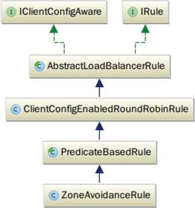
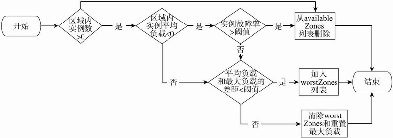

# Ribbon负载均衡算法的实现

## 目录

- [Ribbon内置的负载均衡算法](#Ribbon内置的负载均衡算法)
- [程序员自定义负载均衡算法](#程序员自定义负载均衡算法)
- [源码实现](#源码实现)

IRule是定义Ribbon负载均衡策略的接口，你可以通过实现该接口来自定义自己的负载均衡策略，RibbonClientConfiguration配置类则会给出IRule的默认实例。IRule接口的choose方法就是从一堆服务器中根据一定规则选出一个服务器。IRule有很多默认的实现类，这些实现类根据不同的算法和逻辑来进行负载均衡。

## Ribbon内置的负载均衡算法

Ribbon的负载均衡策略既有 **RoundRobinRule** 和 **RandomRule** 这样的不依赖于服务器运行状况的策略，也有 **AvailabilityFilteringRule** 和**WeightedResponseTimeRule** 等多种基于服务器运行状况决策的策略。这些策略既可以依据单个服务器的运行状况，也可以依据整个服务区的运行状况选择具体调用的服务器，适用于各种场景需求。

| 策略             | 代码类                                  | 描述                                                         |
| ---------------- | --------------------------------------- | ------------------------------------------------------------ |
| 随机策略         | RandomRule                              | 随机选择server                                               |
| 轮询策略         | [RoundRobinRule](#RoundRobinRule)       | 按照顺序选择server                                           |
| 重试策略         | RetryRule                               | 在一个配置时间内选择server不成功,则一直尝试选择一个可用的Server |
| 最低并发按策略   | BestAvailiableRule                      | 选择最小请求的服务器                                         |
| 可用过滤策略     | AvailabilityFilteringRule               | 过滤一直连接失败并被标记成 circuit trypped 的server ,过滤掉的那些高兵发的连接Server(active connections 超出设置的阈值) |
| 响应时间加全策略 | WeightedResponseTimeRule                | 根据server的响应时间分配权重,相应时间越长,权重越低,被选择到的概率就越低,响应时间越短,权重越高,被选择到的概率就越高,这个策略很贴切,总和了各种因素,如: 网络、磁盘、IO 、 等等这些因素直接影响响应时间 |
| 区域权衡策略     | [ZoneAvoidanceRule](#ZoneAvoidanceRule) | 综合判断server所在的区域的性能和server的可用性轮询选择server,并且判定一个AWS zone的运行性能是否可用,剔除不可用的Zone中的所有server |

## 程序员自定义

#### 全局策略设置

```
@Configuration
public class TestConfiguration {

	@Bean
	public IRule ribbonRule() {
		return new RandomRule();//设置为随机
	}
}
```

#### 基于注解的策略设置

```
public @interface AvoidScan {

}
```

```
@RibbonClient(name = "client-a", configuration = TestConfiguration.class)
@ComponentScan(excludeFilters = {@ComponentScan.Filter(type = FilterType.ANNOTATION, value = {AvoidScan.class})})
```

- client 的的策略使用的是`TestConfiguration`定义的
- ComponentScan 排除`AvoidScan`注解标注的类

#### 基于配置文件的配置

```yml
client-a:
  ribbon:
    ConnectTimeout: 3000 #全局请求连接的超时时间,默认 5 秒
    ReadTimeout: 60000 #全局超时是时间
    MaxAutoRetries: 0 #对第一次请求的服务的重试次数.如果要开启,需要保证服务的幂等性 ,注意
    MaxAutoRetriesNextServer: 1 #要重试的下一个服务的最大数量（不包括第一个服务）
    OkToRetryOnAllOperations: true #对所有操作请求都进行充实
    NFLoadBalancerRuleClassName: com.netflix.loadbalancer.RandomRule#ribbon:
eager-load: #饥饿加载
  enabled: true
  clients: client-a, client-b, client-c
    
```

## 源码

IRule是定义Ribbon负载均衡策略的接口，你可以通过实现该接口来自定义自己的负载均衡策略，RibbonClientConfiguration配置类则会给出IRule的默认实例。IRule接口的choose方法就是从一堆服务器中根据一定规则选出一个服务器。IRule有很多默认的实现类，这些实现类根据不同的算法和逻辑来进行负载均衡。


## RoundRobinRule

ClientConfigEnabledRoundRobinRule 是比较常用的IRule的子类之一，它使用的负载均衡策略是最为常见的Round Robin策略，即简单轮询策略

```java
    @Override
    public Server choose(Object key) {
            return roundRobinRule.choose(key);
    }
```

## ZoneAvoidanceRule

ZoneAvoidanceRule则会考虑服务器的状态，从而更好地进行负载均衡。

```java
//RibbonClientConfiguration.java
@Bean
@ConditionalOnMissingBean
public IRule ribbonRule(IClientConfig config) {
    //如果在配置中设置了Rule就返回，否则使用默认的zoneAvoidanceRule
    if (this.propertiesFactory.isSet(IRule.class, name)) {
        return this.propertiesFactory.get(IRule.class, config, name);
    }
    ZoneAvoidanceRule rule = new ZoneAvoidanceRule();
    rule.initWithNiwsConfig(config);
    return rule;
}
```

如上代码所示，ZoneAvoidanceRule是Ribbon默认的IRule实例，它使用CompositePredicate来根据服务区的运行状况和服务器的可用性选择服务器。



ZoneAvoidanceRule是根据服务器所属的服务区的运行状况和可用性来进行负载均衡。PredicateBasedRule是ZoneAvoidanceRule的基类，它选择服务器的策略是先使用ILoadBalancer获取服务器列表，再使用AbstractServerPredicate进行服务器的过滤，最后使用轮询策略从剩余的服务器列表中选出最终的服务器。

```java
public abstract class PredicateBasedRule extends ClientConfigEnabledRoundRobinRule {
    public abstract AbstractServerPredicate getPredicate();
    @Override
    public Server choose(Object key) {
        ILoadBalancer lb = getLoadBalancer();

Optional〈Server〉 server = getPredicate().chooseRoundRobinAfterFiltering(lb.getServerList(false), key);
        if (server.isPresent()) {
            return server.get();
        } else {
            return null;
        }
    }
}
```

PredicateBasedRule接口的getPredicate抽象接口需要子类实现，不同的子类提供不同的AbstractServerPredicate实例来实现不同的服务器过滤策略。而ZoneAvoidanceRule使用的是由ZoneAvoidancePredicate和AvailabilityPredicate组成的复合策略CompositePredicate，前一个判断判定一个服务区的运行状况是否可用，去除不可用的服务区的所有服务器，后一个用于过滤掉连接数过多的服务器。ZoneAvoidanceRule的getPredicate方法的相关实现如下所示：

```java
//ZoneAvoidanceRule.java
public ZoneAvoidanceRule() {
    super();
    ZoneAvoidancePredicate zonePredicate = new ZoneAvoidancePredicate(this);
    AvailabilityPredicate availabilityPredicate = new AvailabilityPredicate(this);
    compositePredicate = createCompositePredicate(zonePredicate, availabilityPredicate);
}
//将两个Predicate组合成一个CompositePredicate
private CompositePredicate createCompositePredicate(ZoneAvoidancePredicate p1, AvailabilityPredicate p2) {
    return CompositePredicate.withPredicates(p1, p2)
        .addFallbackPredicate(p2)
        .addFallbackPredicate(AbstractServerPredicate.alwaysTrue())
        .build();
}
//实现getPredicate接口，返回构造方法中生成的compositePredicate
@Override
public AbstractServerPredicate getPredicate() {
    return compositePredicate;
}

CompositePredicate的chooseRoundRobinAfterFiltering方法继承父类AbstractServerPredicate的实现。它会首先调用getEligibleServers方法通过Predicate过滤服务器列表，然后使用轮询策略选择出一个服务器进行返回，如下所示：
//AbstractServerPredicate.java

//先用Predicate来获取一个可用服务器的集合，然后用轮询算法来选择一个服务器
public Optional〈Server〉 chooseRoundRobinAfterFiltering(List〈Server〉 servers) {
    List〈Server〉 eligible = getEligibleServers(servers);
    if (eligible.size() == 0) {
        return Optional.absent();
    }
    // (i + 1) % n
    return Optional.of(eligible.get(nextIndex.getAndIncrement() % eligible.size()));
}
```

当loadBalancerKey为null时，getEligibleServers方法会使用serverOnlyPredcate来依次过滤服务器列表。getEligibleServers方法的具体实现如下所示：

```java
//AbstractServerPredicate.java
public List〈Server〉 getEligibleServers(List〈Server〉 servers, Object loadBalancerKey) {
    if (loadBalancerKey == null) {
        return ImmutableList.copyOf(Iterables.filter(servers, this.getServerOnlyPredicate()));
    } else {
        //遍历servers，调用对应Predicate的apply方法来判断该服务器是否可用
        List〈Server〉 results = Lists.newArrayList();
        for (Server server: servers) {
            if (this.apply(new PredicateKey(loadBalancerKey, server))) {
                results.add(server);
            }
        }
        return results;
    }
}
```

serverOnlyPredicate则会调用其apply方法，并将Server对象封装成PredicateKey当作参数传入。AbstractServerPredicate并没有实现apply方法，由它的子类来实现从而达到不同子类实现不同过滤策略的目的，serverOnlyPredicate的代码如下所示：

```java
//AbstractServerPredicate.java
private final Predicate〈Server〉 serverOnlyPredicate =　new Predicate〈Server〉() {
    @Override
    public boolean apply(@Nullable Server input) {
        return AbstractServerPredicate.this.apply(newPredicateKey(input));
    }
};
```

ZoneAvoidanceRule类中 CompositePredicate 对象的apply方法就会依次调用 ZoneAvoidancePredicate 和 AvailabilityPredicate 的 apply 方法。
ZoneAvoidancePredicate 以服务区(Zone)为单位考察所有服务区的整体运行情况，对于不可用的区域整个丢弃，从剩下服务区中选可用的服务器。并且会判断出最差的服务区，排除掉最差服务区。ZoneAvoidancePredicate 的 apply 方法如下代码所示。

```java

//ZoneAvoidancePredicate.java
public boolean apply(@Nullable PredicateKey input) {
    if (!ENABLED.get()) {
        return true;
    }
    String serverZone = input.getServer().getZone();
    if (serverZone == null) {
        //如果服务器没有服务区相关的信息，则直接返回
        return true;
    }
    //LoadBalancerStats存储着每个服务器或者节点的执行特征和运行记录。这些信息可供动态负载均衡策略使用
    LoadBalancerStats lbStats = getLBStats();
    if (lbStats == null) {
        //如果没有则直接返回
        return true;
    }
    if (lbStats.getAvailableZones().size() 〈= 1) {
        // 如果只有一个服务区，那么也是直接返回
        return true;
    }
    //为了效率，先看一下lbStats中记录的服务区列表是否包含当前这个服务区
     Map〈String, ZoneSnapshot〉 zoneSnapshot = ZoneAvoidanceRule.createSnapshot(lbStats);
    if (!zoneSnapshot.keySet().contains(serverZone)) {
        // 如果该serverZone不存在，那么也直接返回
        return true;
    }
    //调用ZoneAvoidanceRule的getAvailableZone方法来获取可用的服务区列表
    Set〈String〉 availableZones = ZoneAvoidanceRule.getAvailableZones(zoneSnapshot, triggeringLoad.get(), triggeringBlackoutPercentage.get());
    //判断当前服务区是否在可用服务区列表中
    if (availableZones != null) {
        return availableZones.contains(input.getServer().getZone());
    } else {
        return false;
    }
} 
```

服务区是多个服务实例的集合，不同服务区之间的服务实例相互访问会有更大的网络延迟，服务区之内的服务实例访问网络延迟较小。ZoneSnapshot存储了关于服务区的一些运行状况数据，比如说实例数量、断路器断开数、活动请求数和实例平均负载。ZoneSnapshot的定义如下所示：

```java
//ZoneSnapshot.java
public class ZoneSnapshot {
    final int instanceCount; //实例数
    final double loadPerServer; //平均负载
    final int circuitTrippedCount; //断路器断开数量
    final int activeRequestsCount; //活动请求数量
}
```

ZoneAvoidanceRule的createSnapshot方法其实就是将所有的服务区列表转化为以其名称为键值的哈希表，供ZoneAvoidancePredicate的apply方法使用，如下所示：

```java
//ZoneAvoidanceRule.java
//将LoadbalancerStats中的availableZones列表转换为Map再返回
static Map〈String, ZoneSnapshot〉 createSnapshot(LoadBalancerStats lbStats) {
        Map〈String, ZoneSnapshot〉 map = new HashMap〈String, ZoneSnapshot〉();
    for (String zone : lbStats.getAvailableZones()) {
        ZoneSnapshot snapshot = lbStats.getZoneSnapshot(zone);
        map.put(zone, snapshot);
    }
    return map;
}
```

getAvailableZones方法是用来筛选服务区列表的，首先，它会遍历一遍ZoneSnapshot哈希表，在遍历的过程中，它会做两件事情：依据ZoneSnapshot的实例数、实例的平均负载时间和实例故障率等指标将不符合标准的ZoneSnapshot从列表中删除，它会维护一个最坏ZoneSnapshot列表，当某个ZoneSnapshot的平均负载时间小于但接近全局最坏负载时间时，就会将该ZoneSnapshot加入到最坏ZoneSnapshot列表中，如果某个ZoneSnapshot的平均负载时间大于最坏负载时间时，它将会清空最坏ZoneSnapshot列表，然后以该ZoneSnapshot的平均负载时间作为全局最坏负载时间，继续最坏ZoneSnapshot列表的构建。在方法最后，如果全局最坏负载数据大于系统设定的负载时间阈值，则在最坏ZoneSnapshot列表中随机选择出一个ZoneSnapshot，将其从列表中删除。
图7-6显示了getAvailableZone方法的筛选流程。



而getAvailableZones具体实现如下所示：

```java
//ZoneAvoidanceRule.java
public static Set〈String〉 getAvailableZones(
        Map〈String, ZoneSnapshot〉 snapshot, double triggeringLoad,
        double triggeringBlackoutPercentage) {
    Set〈String〉 availableZones = new HashSet〈String〉(snapshot.keySet());
    Set〈String〉 worstZones = new HashSet〈String〉();
    double maxLoadPerServer = 0;
    boolean limitedZoneAvailability = false;
    //遍历所有的服务区来判定
    for (Map.Entry〈String, ZoneSnapshot〉 zoneEntry : snapshot.entrySet()) {
        String zone = zoneEntry.getKey();
        ZoneSnapshot zoneSnapshot = zoneEntry.getValue();
        //判定该服务区中的服务实例数
        int instanceCount = zoneSnapshot.getInstanceCount();
        if (instanceCount == 0) {
            //如果服务区中没有服务实例，那么去除掉该服务区
            availableZones.remove(zone);
            limitedZoneAvailability = true;
        } else {
            double loadPerServer = zoneSnapshot.getLoadPerServer();
            //服务区内实例平均负载小于零，或者实例故障率（断路器断开次数/实例数）大于等于阈值（默认为0.99999），则去除掉该服务区
            if (((double) zoneSnapshot.getCircuitTrippedCount())
                    / instanceCount 〉= triggeringBlackoutPercentage
                    || loadPerServer 〈 0) {
                availableZones.remove(zone);
                limitedZoneAvailability = true;
            } else {
                //如果该服务区的平均负载和最大负载的差距小于一定量，则将该服务区加入到最坏服务区集合中
                if (Math.abs(loadPerServer - maxLoadPerServer) 〈 0.000001d) {
                    worstZones.add(zone);
                } else if (loadPerServer 〉 maxLoadPerServer) {
                    //否则，如果该zone平均负载还大于最大负载
                    maxLoadPerServer = loadPerServer;
                    //清除掉最坏服务区集合，将该服务区加入
                    worstZones.clear();
                    worstZones.add(zone);
                }
            }
        }
    }
    //如果最大平均负载小于设定的阈值则直接返回
    if (maxLoadPerServer 〈 triggeringLoad &amp;&amp; !limitedZoneAvailability) {) {
        // zone override is not needed here
        return availableZones;
    }
    //如果大于，则从最坏服务区集合中随机剔除一个
    String zoneToAvoid = randomChooseZone(snapshot, worstZones);
    if (zoneToAvoid != null) {
        availableZones.remove(zoneToAvoid);
    }
    return availableZones;
}


```


ZoneAvoidancePredicate的apply方法调用结束之后，AvailabilityPredicate的apply方法也会被调用。该预测规则依据断路器是否断开或者服务器连接数是否超出阈值等标准来进行服务过滤。AvailabilityPredicate的apply方法如下所示：

```java
//AvailabilityPredicate.java
public boolean apply(@Nullable PredicateKey input) {
    LoadBalancerStats stats = getLBStats();
    if (stats == null) {
        return true;
    }
    //获得关于该服务器的信息记录
  return !shouldSkipServer(stats.getSingleServerStat(input.getServer()));
}
private boolean shouldSkipServer(ServerStats stats) {
    //如果该服务器的断路器已经打开，或者它的连接数大于预设的阈值，那么就需要将该服务器过滤掉
    if ((CIRCUIT_BREAKER_FILTERING.get() &amp;&amp; stats.isCircuitBreakerTripped())
            || stats.getActiveRequestsCount() 〉= activeConnectionsLimit.get()) {
        return true;
    }
    return false;
}
```

