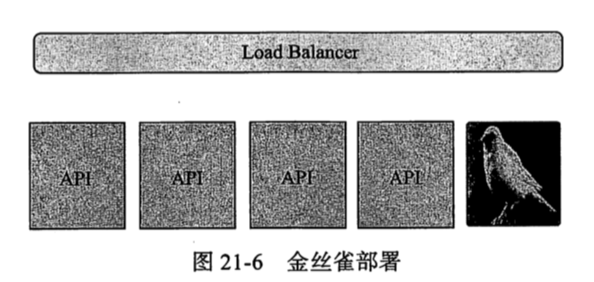

# SpringCloud 版本控制与灰度发布

- 如何保证系统的平滑上线
- 如何在上线过程中兼顾迭代功能的准确性
- 如何保证上线过程中不影响用户使用系统功能,让用户毫无感知
- 如何契合当今流行的 DevOps 理念

## 常见的发布方式

- [蓝绿发布](#蓝绿发布)
- [滚动发布](#滚动发布)
- [灰度发布](#灰度发布)
  - [A/B测试](#A/B测试)
  - [金丝雀发布](#金丝雀发布)
- 对比

#### 蓝绿发布

蓝绿发布(Blue & Green Deployment) 是一种可以"零停服"的应用发布方式,可以保证应用平滑切换上线

- 绿环境 : 旧版本
- 蓝环境 : 新版本

先由绿环境承担全部流量, 蓝环境则是一套独立的新环境应用环境,在部署之后如果测试通过,则将流量切换到蓝

就像一个开关一样

#### 滚动发布

滚动发布(Rolling Update Deployememt) 一般是将集群中的少量节点进行更新上线,然后再更新其他节点

- 每次只更新少量节点,直到更新完毕

#### 灰度发布

灰度发布(Gray Deployment) 是一个统称, 是目前应用面比较广的一种发布方式,它的思想是线上环境中部署一个新版本应用,然后引入一部分流量进入其中,如果没有发现问题就切换上线

这种方式对于测试应用在线上环境的实际表现极其有效,我们在灰度阶段就可以发现问题,及时调整,并用户无感,目前灰度发布可以分为两种

- A/B 测试
- 金丝雀部署

#### A/B测试

- A版本是线上稳定版本
- B 版本是迭代版本

如果一下切到 B 环境,可能用户会难以适应,所以先部署一个 B环境,分一部分流量过来,收集用户反馈然后逐步改进 B 版本,知道用户可以接收完全用 B 版本替换 A 版本的程度

> - A/B 发布关注的是测试过程
>
> - 蓝绿发布关注的是新版本的发布

#### 金丝雀部署

应用集群中部署一台实例作为金丝雀,引入一部分流量,收集问题,及时调整,等到达到上线标准再替换集群中的其他实例

## 对比

| 发布方式   | 优势                                      | 劣势                                                         |
| ---------- | ----------------------------------------- | ------------------------------------------------------------ |
| 蓝绿发布   | 升级回滚比较快 无序停服,风险较小     | 需要考虑好升级切换与回滚的 资源消耗是线上应用的两倍,因为要做冗余 两个版本的业务一致性问题 |
| 滚动发布   | 用户感知小                                | 发布过程较长 对发布工具要求高                            |
| A/B 测试   | 用户感知晓                                | 搭建难度较高                                                 |
| 金丝雀部署 | 用户影响小,灰度发布出现问题只影响少量用户 | 发布自动化程度不高,发布期间可引发服务中断                    |

