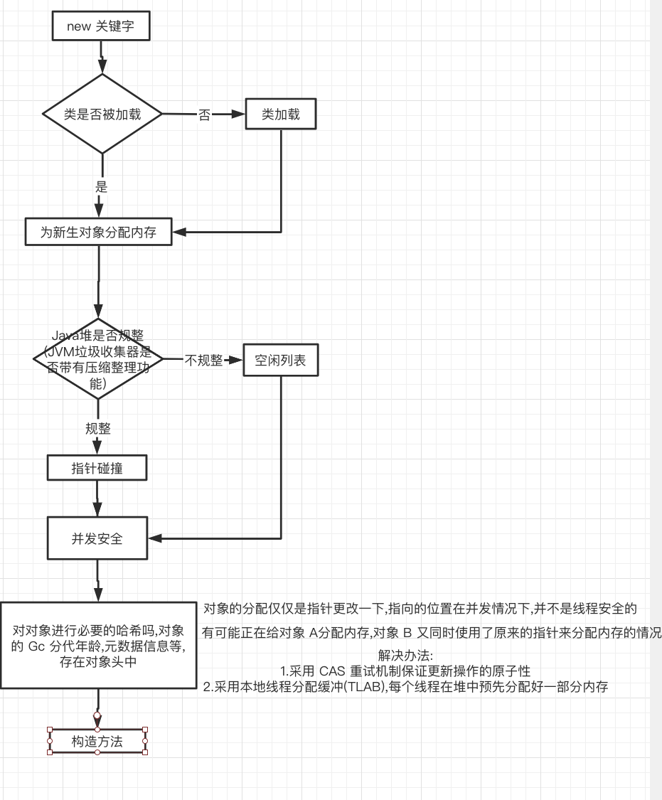

# 对象的创建

##### 程序员- new 关键字

- 虚拟机检查这个指令的参数是否能在常量池中定位到类的符号引用,检查这个符号引用代表的类是否被加载,解析和初始化
  - 没有: 执行类加载过程
- 虚拟机为新生对象分配内存,对象需要的内存在类被加载完成之后便可以完全确认

##### 分配内存空间

分配内存空间等同于把一块确定大小的内存从Java 堆中划分出来

- 如果内存是绝对规整的: 指针碰撞
- 如果内存不是绝对规整的: 空闲列表

##### 空间分配完成后

虚拟机需要将分配到的内存空间都初始化为零值(不包括对象头).

如果使用的是 TLAB , 这一工作过程也可以提前到 TLAB 分配时进行

**这个操作保证了,对象的实例字段,在 Java 代码中可以不设置初始值就直接使用.程序能访问到这些字段的数据类型所对应的零值**

##### 对对象头进行设置

例如

- 对象时哪个类的实例
- 如何才能找到类的元数据信息
- 对象的哈希码
- 对象的 GC分代年龄

##### 调用程序员的初始化方法

## 对象的创建在并发中非线程安全

对象创建主要是两个操作

- 分配内存
- 修改指针指向

有可能出现的情况是

这两个操作并不是原子操作,在高并发情况下,正在给对象 A 分配内存,指针还没来及修改,对象 B 又同时使用了原来的指针来分配内存的情况

##### 解决办法

- 对分配内存空间的动作进行同步处理- CAS 假话是哪个失败重试
- 把内存划分的动作按照线程划分在不同的空间中进行,即每个线程在 Java 堆中预先分配一小块内存,**称为本地线程分配缓冲(Thread Local Allocation Buffer , TLAB)**,哪个线程要分配内存,就在哪个线程的 TLAB 上分配,只有在 TLAB 用完并分配新的 TLAB 的时候,才需要同步锁定,虚拟机是否使用 TLAB ,可以通过-XX +/-UseTLAB 参数来设定

