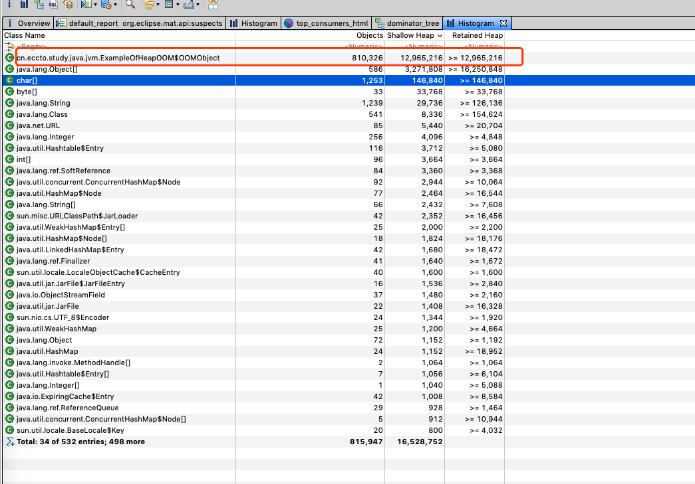
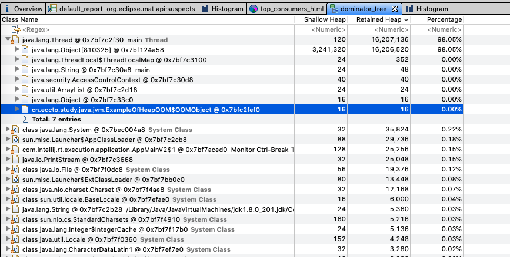

# 各类溢出的模拟


- 堆内存溢出
- 虚拟机栈和本地方法溢出
- 方法区和运行时常量池溢出
- 本机直接溢出

## Java 堆溢出

Java堆内存中存储的是对象的实例,只要不断创建对象并保证 GC roots 到对象之间有可达路径来避免垃圾回收机制清除这些对象


```java
/**
 * <p>
 * JVM 堆内存溢出测试, VM Args = -Xms20m -Xmx20m -XX:+HeapDumpOnOutOfMemoryError -XX:HeapDumpPath=/Users/ec/study/Notes/04-java/00-code/note-java
 * </p>
 *
 * @author EricChen 2020/05/02 16:55
 */
public class ExampleOfHeapOOM {
    static class OOMObject {

    }

    public static void main(String[] args) {
        List<OOMObject> list = new ArrayList<>();
        for (; ; ) {
            list.add(new OOMObject());
        }
    }
}
```


```
Exception in thread "main" java.lang.OutOfMemoryError: Java heap space
	at java.util.Arrays.copyOf(Arrays.java:3210)
	at java.util.Arrays.copyOf(Arrays.java:3181)
	at java.util.ArrayList.grow(ArrayList.java:265)
	at java.util.ArrayList.ensureExplicitCapacity(ArrayList.java:239)
	at java.util.ArrayList.ensureCapacityInternal(ArrayList.java:231)
	at java.util.ArrayList.add(ArrayList.java:462)
	at cn.eccto.study.java.jvm.ExampleOfHeapOOM.main(ExampleOfHeapOOM.java:21)
```

#### MAT排查

通过 MAT查看泄漏对象到 GC roots 的引用链路,于是就能够找到泄漏对象是通过怎么样的路径和 GCroots相关联并导致垃圾回收器无法回收的



#### 支配树



#### 虚拟机栈和本地方法栈溢出

由于在 HotSpot 虚拟机中并不区分虚拟机栈和本地方法栈

- 修改本地方法栈大小(Hotpot 无效): `-Xoss`
- 修改虚拟机栈`-Xss`

Java 虚拟机规范定义了两种异常

- 如果线程请求的栈深度大于虚拟机所允许的最大深度,将抛出 StackOverflowError
- 如果虚拟机在拓展栈时没有足够的内存空间,就会抛出 OutOfMemory 错误


#### 实验

- 使用 -Xss 参数减少占内存容量,结果:抛出StackOverflowError,异常出现时,出现的堆栈深度相应缩小

- 定义了大量的本地变量,增大此方法帧中的本地变量表的长度:结果: 抛出StackOverflowError,异常出现时,出现的堆栈深度相应缩小

  

## 创建线程导致内存溢出异常

在单个线程下,无论是由于栈帧太大还是虚拟机栈容量太小,当内存无法分配的时候,虚拟机抛出的都是 StackOverFlowError 异常

栈是每个线程私有的

```
/**
 * <p>
 * 创建线程导致内存溢出异常
 * 原因:
 * </p>
 *
 * @author EricChen 2020/05/02 17:51
 */
public class ThreadJVMOOM {

    private void dontStop() {
        while (true) {

        }
    }

    private void stackLeakByThread(){
        while (true) {
            new Thread(new Runnable() {
                @Override
                public void run() {
                    dontStop();
                }
            }).start();
        }
    }

    public static void main(String[] args) {
        ThreadJVMOOM threadJVMOOM = new ThreadJVMOOM();
        threadJVMOOM.stackLeakByThread();
    }
}

```


## 本机直接内存溢出

```
/**
 * <p>
 * 直接内存可以通过-XX MaxDirectMemorySize 指定,如果不指定,和 Xmx 一直
 * </p>
 *
 * @author EricChen 2020/05/02 17:57
 */
public class DirectMemoryOOM {

    private static final int _1MB = 1024 * 1024;

    public static void main(String[] args) throws IllegalAccessException {
        //直接通过反射获取到 Unsafe 实例进行内存分配
        Field field = Unsafe.class.getDeclaredFields()[0];
        field.setAccessible(true);
        Unsafe unsafe = (Unsafe) field.get(null);
        while (true) {
            unsafe.allocateMemory(_1MB);
        }
    }
}
```

