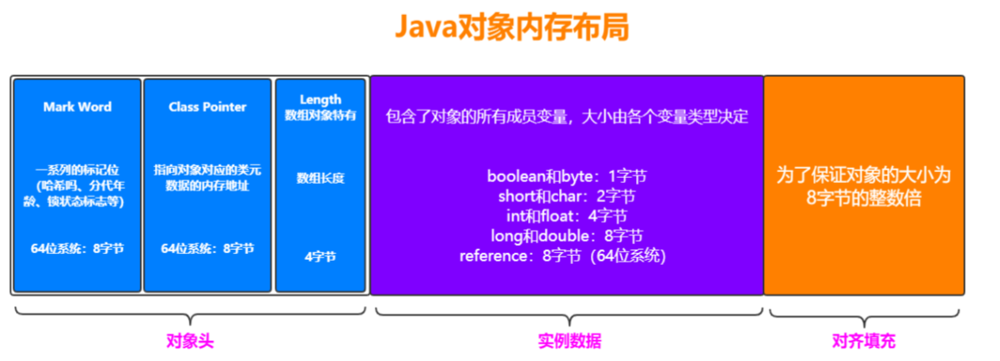

# 对象的内存布局

[TOC]

# 07-对象的内存布局

对象在内存中的布局,可以划分为 3 块部分:

- [对象头](#对象头) (header)
- [实例数据](#实例数据) Instance Data
- [对齐填充](#对齐填充) (Padding)

## 对象头

- MarkWord , 存储对象自身的运行时数据
- 类型指针.对象指向它的类元数据的指针,虚拟机通过这个指针来确定这个对象时哪个类的实例,如果对象是一个 Java数组,那再对象头中还必须提供一块用于记录数组长度的数据,因为从数组的元数据中无法确定数组的大小

## HotSpot虚拟机对象头MarkWord

#### MarkWord 内存大小

- 32 位系统: 32bit
- 64 位系统: 64bit

如果32位系统且未锁定

- 25bit 对象HashCode
- 4 bit 存储对象分代年龄
- 2 bit 用于存储锁标志位
- 1 bit 固定为0 

如果是其他非锁定状态 , 如下表:

| 存储内容                            | 标志位 | 状态           |
| ----------------------------------- | ------ | -------------- |
| 对象的哈希吗,对象分代年龄           | 01     | 未锁定         |
| 指向锁记录的指针                    | 00     | 轻量级锁定     |
| 指向重量级锁的指针                  | 10     | 膨胀(重量级锁) |
| 空,不需要记录信息                   | 11     | GC 标记        |
| 偏向线程 ID,偏向时间戳,对象分代年龄 | 01     | 可偏向         |

## 实例数据

实例数据, 是对象真正存储的有效数据, 即我们在程序代码里面锁定义的各种类型的字段定义,无论是从父类继承来的,还是在子类中定义的字段都必须记录起来

## 对齐填充

这部分不是必然存在的,也没有特别的含义,它仅仅起着占位符的作用。由于 HotSpot 虚拟机自动内存管理系统要求:

对象的起始地址必须是 8 字节的整数倍 , 换句话说就是任何对象的大小都必须是 8 字节的整数倍

对象头部分已经被精心设计成正好是 8 字节的倍数( 1倍或者是 2 倍)

因此如果对象实例数据部分没有对齐的话,就需要使用对齐填充来不全

