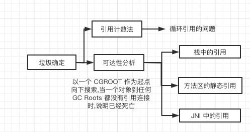

# 可达性分析算法

> 在 Java 中如果要操作对象,就必须先获取该对象的引用,因此可以通过引用计数算法来判断一个对象是否可以被回收
>
> - 当对象添加一个引用时,引用计数加一
> - 在为对象删除一个引用时,引用计数减1
> - 如果一个对象的引用计数为 0.则表示此刻这个对象没有被引用,可以被回收


## 如何确定垃圾

Java 采用引用计数法和可达性分析来确定对象是否应该被回收,其中,

- 引用计数法容易产生循环引用的问题

- 可达性分析算法通过根搜索算法(GC roots Tracing)来实现,根搜索算法以一些列 GCROOTS 的点作为起点向下搜索,在一个对象到任意 GC roots都没有引用链项链的时候,说明已经死亡

  - GC roots 可以是:

    - 虚拟机栈本地变量表里的对象引用,
    - 方法区中的静态引用
    - JNI(native 方法中引用展开分析)

    

    

## 是什么

- 给对象中添加一个引用计数器,当每有一个地方引用它时,计数器的值就加一

- 当引用失效时,计数器就减一

- 任何时刻,计数器为 0 的对象就是不可能再次被引用的对象

## 有什么问题

循环引用的问题无法解决 , 例如 objA.instance = objB , ObjB.instance = objA


```java
public class ReferenceCountingGC {

    public Object instance = null;
    private static final int _1MB = 1024 * 1024;

    private byte[] bigSize = new byte[2 * _1MB];

    public static void main(String[] args) {
        testGC();
    }
    public static void testGC() {
        ReferenceCountingGC objA = new ReferenceCountingGC();
        ReferenceCountingGC objB = new ReferenceCountingGC();
        objA.instance = objB;  //互相引用会导致引用计数算法永远不可能为 0
        objB.instance = objA;

        objA = null;
        objB = null;

        System.gc();
    }

}
```

