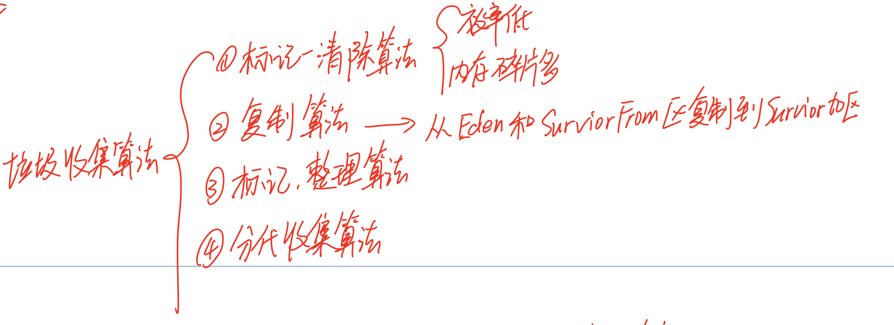
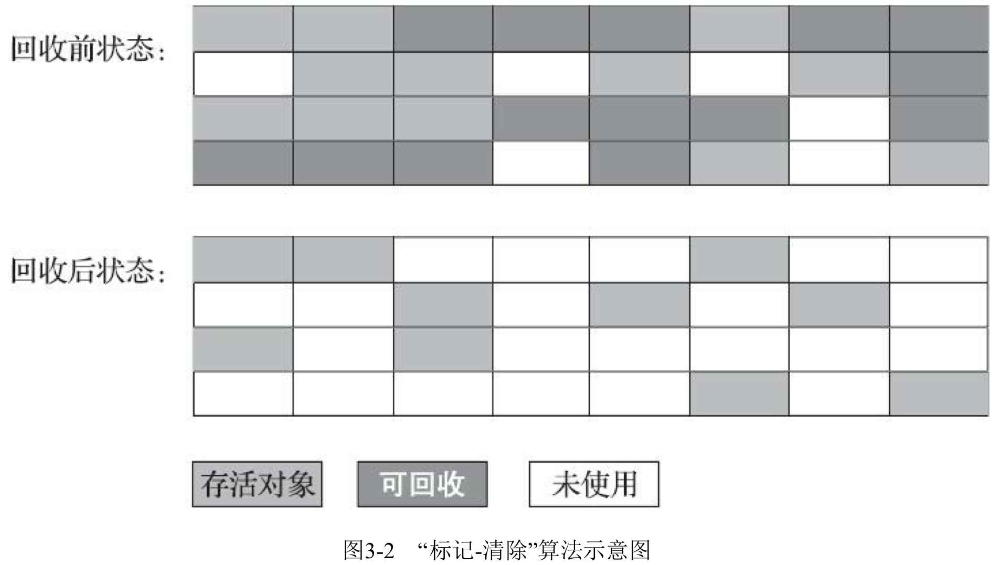
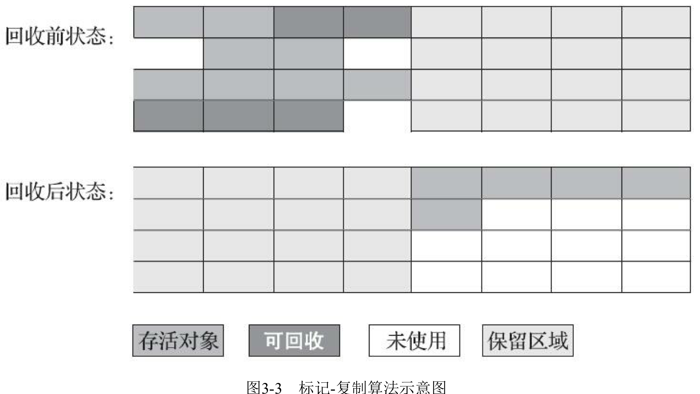
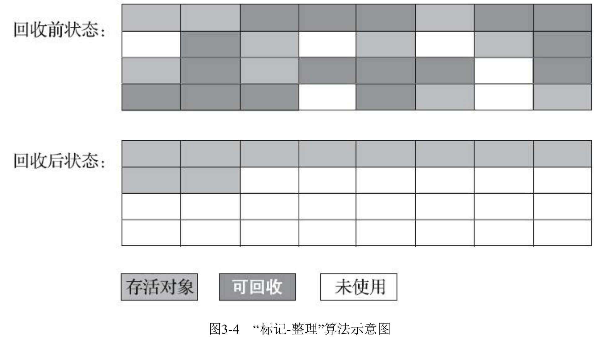
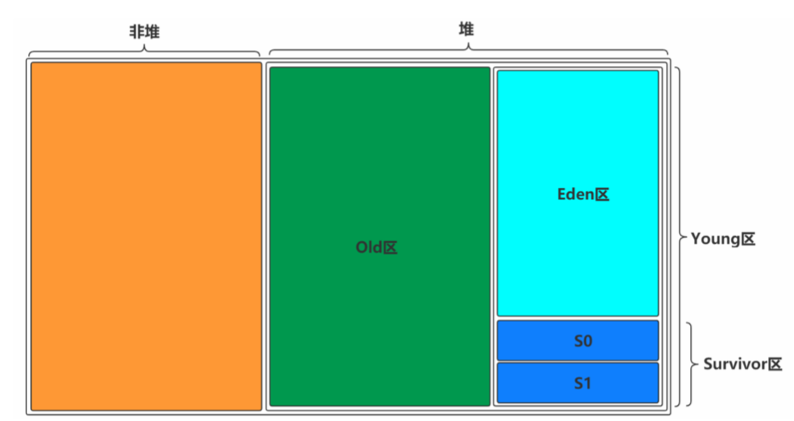

# Java 中常用的垃圾回收算法

- 标记清除算法(Mark-Sweep)
- 复制(Coping) 复制算法
- 标记整理算法 (Mark-Compact)
- 分代收集(Generational Collection) 

## 标记清除算法

分为标记和清除两个阶段

- 标记阶段 : 标记阶段标记所有需要回收的对象
- 清除阶段: 清除可回收的对象并释放其占用的内存空间

由于标记清除算法在清理对象的后没有整理可用的内存空间,因此如果内存中被回收的小对象居多,则会引起内存碎片问题,继而会引起大对象无法获得连续空间的问题

执行效率不稳定,如果 Java 堆中包含了大量对象,而且其中大部分是需要被回收的,就必须进行大量标记和清除动作,导致执行效率都随对象数量的增长而降低

## 标记-复制算法

> 复制算法为了解决标记清除算法内存碎片化的问题而设计的

标记复制算法吧

- 内存划分为两块大小相同的内存区域 1 和区域 2,
- 新生成的对象都被放在区域 1 中,在区域 1 满后对区域 1 进行标记,
- 标记后任然存活的对象全部复制到区域 2,直接清理区域 1 的内存

适用于

- 对象中的对象朝生夕死的状态时,效率高

但是

- 可用内存压缩为原来的一半,复制带来的开销

## 标记整理

> 标记整理算法结合了标记清理和标记复制的优点,标记阶段和标记清理算法一致,在标记完成后将存活的对象一道内存的另一端,然后清除改端的对象并释放内存

缺点

- 如果要移动对象效率低,必须stop the world 

> 移动则内存回收会更加复杂,不移动则内存分配时会更加复杂

## 分代收集算法

上面三种

- 标记清理
- 标记复制
- 标记整理

三个对所有类型的对象进行垃圾回收,

针对不同的对象类型,JVM 采用了不同的垃圾回收算法,这个算法成为分代收集算法

JVM 被划分成新生代和老年代

- [复制算法]新生代主要存放新生成的对象,特点是对象数量多,生命周期短,在每次进行垃圾回收时都有大量的对象被回收

> 因为存活的对象少,所以需要复制的对象也少,不存在大量对象来回复制的问题

- [标记清除]老年代主要存放大对象和生命周期长的对象,可回收的对象少

- 堆区分为两大块，一个是Old区，一个是Young区。 
- Young区分为两大块，一个是Survivor区(S0+S1)，一块是Eden区。 Eden:S0:S1=8:1:1 S0和S1一样大，也可以叫From和To。

垃圾回收时,清理 Eden 区和 ServivorFrom 区中的存活的对象复制到 ServivorTo 对象

### GC触发的时机

- 如果Eden 区和 ServivorFrom 区 没有内存分配,会触发 MinorGC
- MinorGC 后, Eden 区和 ServivorFrom 区  中存活的对象会被复制到 ServivorTo 区,如果 
- ServivorTo 区无法找到连续的内存空间存储对象,会直接将对象一道老年代
- 若是Servivor区的对象经过一次 GC后任然存活,年龄+1 .到 15岁,移动到老年区