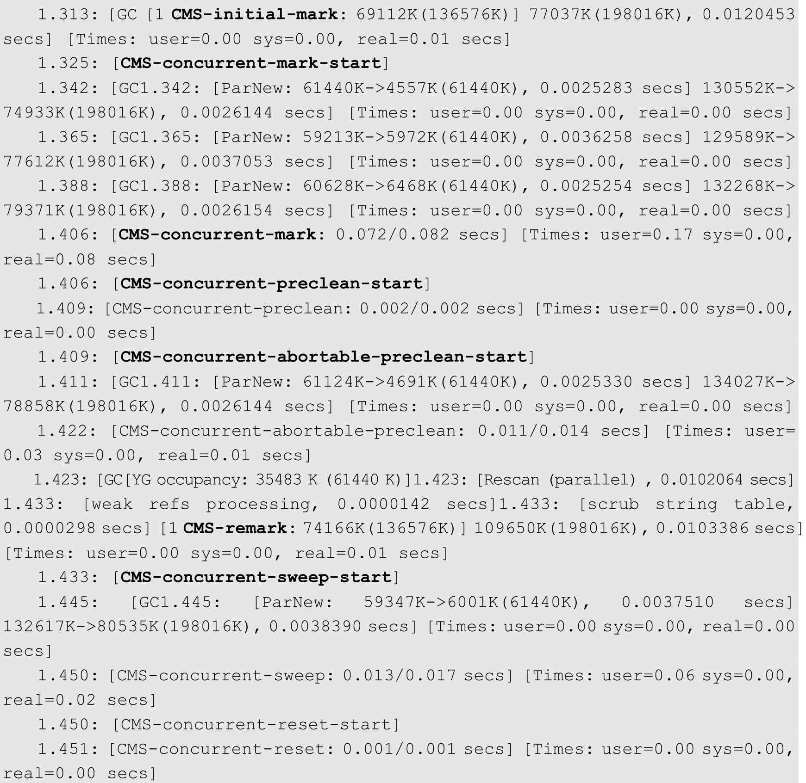

# 老年代-CMS垃圾收集器-配置以及日志分析

## 目录

[TOC]

## CMS主要的参数

### 启用CMS回收器的参数

启用CMS回收器的参数是  -XX:+UseConcMarkSweepGC

### CMS多线程数

CMS是多线程回收器，设置合理的工作线程数量对系统性能有重要的影响。

CMS默认启动的并发线程数是(ParallelGCThreads+3)/4。

ParallelGCThreads表示GC并行时使用的线程数量，如果新生代使用ParNew，那么ParallelGCThreads也就是新生代GC的线程数量。这意味着有4个ParallelGCThreads时，只有1个并发线程，而有两个并发线程时，有5~8个ParallelGCThreads线程。

并发线程数量也可以通过

- -XX:ConcGCThreads

或者

- -XX:ParallelCMSThreads

参数手工设定。

当CPU资源比较紧张时，受到CMS回收器线程的影响，应用系统的性能在垃圾回收阶段可能会非常糟糕

注意：并发是指收集器和应用线程交替执行，并行是指应用程序停止，同时由多个线程一起执行GC。因此并行回收器不是并发的，因为并行回收器执行时，应用程序完全挂起，不存在交替执行。

#### CMS垃圾回收器回收阈值

由于CMS回收器不是独占式的回收器，在CMS回收过程中，应用程序仍然在不停地工作。

在应用程序工作过程中，又会不断地产生垃圾。这些新生成的垃圾在当前CMS回收过程中是无法清除的。同时，因为应用程序没有中断，所以在CMS回收过程中，还应该确保应用程序有足够的内存可用。

因此，CMS回收器不会等待堆内存饱和时才进行垃圾回收，而是当堆内存使用率达到某一阈值时便开始进行回收，以确保应用程序在CMS工作过程中，依然有足够的空间支持应用程序运行。

这个回收阈值可以使用参数-XX:CMSInitiatingOccupancyFraction来指定，默认是68，即当老年代的空间使用率达到68%时，会执行一次CMS回收。

- **如果应用程序的内存使用率增长很快，在CMS的执行过程中，已经出现了内存不足的情况，CMS回收就会失败，虚拟机将启动老年代串行回收器进行垃圾回收。此时，应用程序将完全中断，直到垃圾回收完成，这时，应用程序的停顿时间可能会较长。**

#### 指定老年代使用率

注意：通过 -XX:CMSInitiatingOccupancyFraction 可以指定当老年代空间使用率达到多少时进行一次CMS垃圾回收。
根据应用程序的特点，可以对参数-XX:CMSInitiatingOccupancyFraction进行调优。

- 如果内存增长缓慢，则可以设置一个稍大的值，大的阈值可以有效降低CMS的触发频率，减少老年代回收的次数，可以较为明显地改善应用程序性能。
- 反之，如果应用程序内存使用率增长很快，则应该降低这个阈值，以避免频繁触发老年代串行回收器。

CMS是一个基于标记清除法的回收器 , 标记清除法将会产生大量内存碎片，离散的可用空间无法分配给较大的对象。

## CMS回收前、后老年代的情况

在这种情况下，即使堆内存仍然有较大的剩余空间，也可能会被迫进行一次垃圾回收，以换取一块可用的连续内存。这种现象对系统性能是相当不利的，为了解决这个问题，CMS回收器还提供了几个用于内存压缩整理的参数。

- **-XX:+UseCMSCompactAtFullCollection** 参数可以使CMS在垃圾收集完成后，进行一次内存碎片整理，内存碎片的整理不是并发进行的。
- **-XX:CMSFullGCsBeforeCompaction** 参数可以用于设定进行多少次CMS回收后，进行一次内存压缩

## CMS日志分析

以上信息是一次CMS回收的输出。可以看到，在CMS回收器工作过程中，包括初始化标记、并发标记、预清理、重新标记、并发清理和重发重置等几个重要阶段。在日志中，还可以看到CMS的耗时及堆内存信息。

- 在1.409秒发生abortable-preclean，表示CMS开始等待一次新生代GC。

- 在1.411秒ParNew回收器开始工作，在1.422秒abortable-preclean终止。之后，CMS根据之前新生代GC的情况，将重新标记的时间放在一个最不可能和下一次新生代GC重叠的时刻，即两次新生代GC的中间点，这里为1.423秒处。

除此之外，CMS回收器在运行时还可能输出如下日志

这说明CMS回收器并发回收失败。这很可能是应用程序在运行过程中老年代空间不够导致的。

如果在CMS工作过程中，出现非常频繁的并发模式失败，就应该考虑进行调整，尽可能预留一个较大的老年代空间。

或者可以设置一个较小的-XX:CMSInitiatingOccupancyFraction参数，降低CMS触发的阈值，使CMS在执行过程中仍然有较大的老年代空闲空间供应用程序使用。
注意：CMS回收器是一个关注停顿的垃圾回收器。同时CMS回收器在部分工作流程中，可以与用户程序同时运行，从而减少应用程序的停顿时间。

## 有关Class的回收

在使用CMS回收器时，如果需要回收Perm区，那么默认情况下，还需要触发一次Full GC，如下所示：

如果希望使用CMS回收器回收Perm区，则必须打开-XX:+CMSClassUnloadingEnabled开关。使用-XX:+CMSClassUnloadingEnabled后，如果条件允许，系统会使用CMS的机制回收Perm区的Class数据，日志如下：


