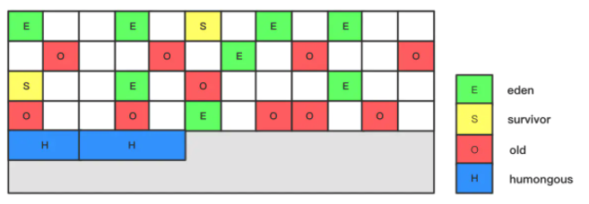

# 老年代-G1垃圾收集器

## 图解

## 目录

- [G1收集器是什么](#G1收集器是什么)
- [MixedGC模式](#MixedGC模式)
- [运行过程](#运行过程)

## 标签

- 面向停顿时间

- **延迟可控的情况下获得尽可能高的吞吐量**

- **面向服务器端应用的垃圾收集器**

## G1收集器是什么

**延迟可控的情况下获得尽可能高的吞吐量**

G1(Garbage First) **延迟可控的情况下获得尽可能高的吞吐量** 是垃圾收集器技术的新思路 , JDK7 默认垃圾收集器

- 针对**停顿时间模型**

- 面向局部收集的设计思路
- [基于Region的内存布局形式](#基于Region的内存布局形式)

-  是一款 **面向服务器端应用的垃圾收集器**

## MixedGC模式

G1 可以面向 堆内存任何部分来组成回收集进行回收 , 衡量标准不再是它属于哪个年代,而是哪块内存中存放的垃圾数量最多, 回收收益最大, 这就是 G1收集器的 MixedGC模式

## 基于Region的内存布局形式

在G1算法中，采用了另外一种完全不同的方式组织堆内存，堆内存被划分为多个大小相等的内存块（Region），

每个Region是逻辑连续的一段内存，结构如下：

每个Region被标记了E、S、O和H，说明每个Region在运行时都充当了一种角色，

- 其中H是以往算法中没有的，它代表Humongous，这表示这些Region存储的是巨型对象（humongous object，H-obj），当新建对象大小超过Region大小一半时，直接在新的一个或多个连续Region中分配，并标记为H。

## 运行过程

- [初始标记](#初始标记)
- [并发标记](#并发标记)
- [最终标记](#最终标记)
- [筛选回收](#筛选回收)

## 初始标记

仅仅标记一个GC roots 能直接关联到的对象 , 这个阶段需要停顿用户线程,但是耗时很短

## 并发标记

从GC Roots 开始对堆中的对象进行可达性分析,递归扫描堆里的对象图,找到要回收的对象,这个过程和用户线程是并发执行的

## 最终标记

对用户线程做一个短暂的暂停,用于处理并发阶段结束后仍然遗留下来的最后的少量SATB记录

## 筛选回收

- 筛选

  > 根据各个Region的回收价值和成本进行排序,根据用户所期望的停顿时间来指定回收计划,可以自由选择任意多个region构成回收集特点

- 回收

  > 把决定回收的那一部分Region 的存放对象复制到空的Region中, 再清理掉整个Region的全部空间(这个过程涉及存活对象的Region中)再清理掉整个旧的Region

## 值得注意的是

G1收集器除了并发标记之外,其余阶段也是要完全暂停用户线程的 

所以 **G1收集器并非纯粹追求低延迟,官方给它设定的目标是在延迟可控的情况下获得尽可能高的吞吐量,所以才能撑起<全功能收集器>的重任和期望**

## 与CMS的比较

- 