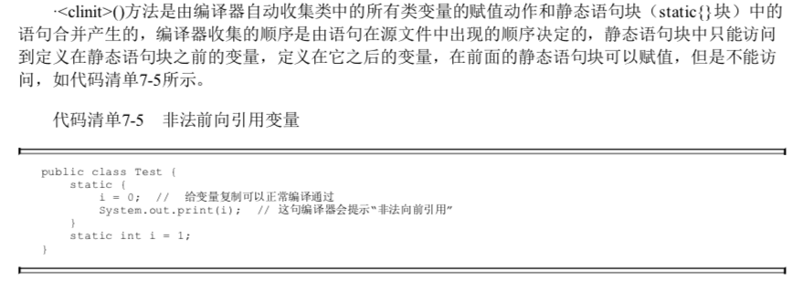
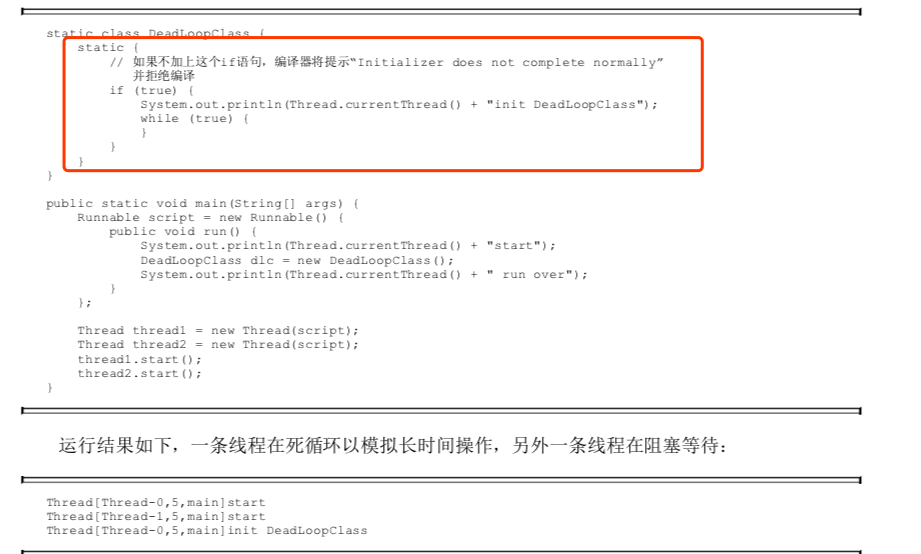

# 类加载机制-初始化阶段

## 目录

- [初始化阶段做了什么](#初始化阶段做了什么)
- [不触发初始化的情况](#不触发初始化的情况)
- [Java虚拟机保证多线程初始化](#Java虚拟机保证多线程初始化)


## 初始化阶段做了什么

加载,连接阶段程序员除了加载阶段可以通过自定义加载器的方式局部参与过程,其余动作完全由Java虚拟机来主导控制

直到初始化阶段,Java虚拟机才开始执行类中编写的Java代码, 将主导权移交给应用程序,所以:

初始化阶段就是执行类构造器`<client>()`方法的过程,

- `<client>()` 方法是 javac编译器的自动生成的

#### 非法前向引用变量



#### 第一个执行的一定是Object中的client方法

`<client>()`方法与类的构造函数不同,它不需要显示地调用父类的构造器,虚拟机会保证在子类的client 方法执行前,父类的client方法已经被执行了,因此Java虚拟机中第一个被执行client方法的一定是java.lang.Object

#### client方法的执行顺序

父类的client方法先执行,所以父类的静态语句要优先于子类的变量赋值操作,字段B 将会是2 而不是1

```java
static class Parent{
  	public static int A = 1;
  	static {
       A = 2;
    }
  public class Sub extends Parent{
    public static int B = A;
  }
  public static void main(String[] args){
    System.out.println(Sub.B);
  }
}
```

主要通过类的构造器`<client>` 方法对类进行初始化,`<client>`方法是编译阶段由编译器自动收集类中的静态语句块和变量的复制操作组成的,在一个类中既没有静态变量复制操作也没有静态语句时,编译器不会为该类生成`<client>`方法,

## Java虚拟机保证多线程初始化

Java虚拟机必须保证一个类的的 `<client>()`方法在多线程环境下被正确的加载通过,如果多个线程同时去初始化一个类,那么只会有其中一个线程去执行这个类的`<client>()`方法,其他线程都要**阻塞等待**,直到执行完成

所以`<client>()`方法不能有好时候很长的操作,这可能会造成多个进程阻塞




## 不触发初始化的情况

发生以下几种情况时 , JVM **不会执行类的初始化**

- 常量在编译的时候会将其常量值存入使用该常量类的常量池中,这个过程不需要调用常量所在的类,因此不会触发该常量类的初始化
- 在子类引用父类的静态字段时,不会触发子类的初始化,只会触发父类的初始化
- 定义对象数组,不会触发这个类的初始化
- 在使用类名获取` Class` 对象时,不会触发累的初始化
- 在使用 `Class.forName` 加载指定的类时,可以通过` initialize `参数设置是否需要对类进行初始化
- 在使用 `ClassLoader`默认的` loadClass` 方法加载类的时候不会触发该类的初始化

