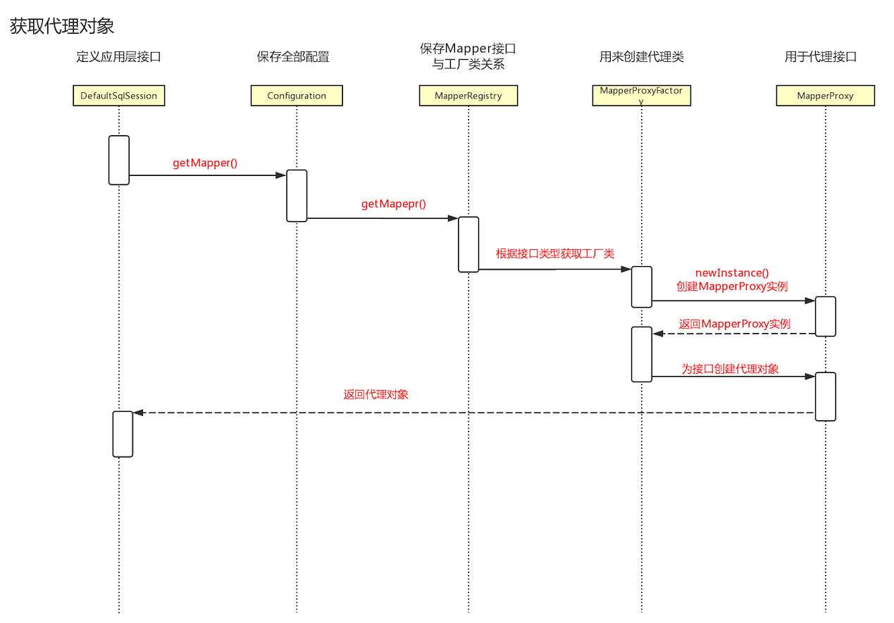

# 源码分析-Mapper 

## 对象

```java
@Test
public void testStatement() throws IOException {
    String resource = "mybatis-config.xml";
    InputStream inputStream = Resources.getResourceAsStream(resource);
    SqlSessionFactory sqlSessionFactory = new SqlSessionFactoryBuilder().build(inputStream);
    //创建会话过程
    try (SqlSession session = sqlSessionFactory.openSession()) {
        User user = session.selectOne("vip.ericchen.study.mybatis.UserMapper.selectUser", 1);
        System.out.println(user);
    }
}
```
## 时序图



## 获得 Mapper 对象

现在我们已经有一个 `DefaultSqlSession `了，必须找到` Mapper.xml `里面定义的 Statement ID，才能执行对应的 SQL 语句。
找到 `Statement ID` 有两种方式:

- 一种是直接调用 session 的方法，在参数里面传入 Statement ID，这种方式属于硬编码，我们没办法知道有多少处调用，修改起来也很麻烦。
- 另一个问题是如果参数传入错误，在编译阶段也是不会报错的，不利于预先发现问题。

所以在 MyBatis 后期的版本提供了第二种方式，就是定义一个接口，然后再调用 Mapper 接口的方法。
由于我们的接口名称跟 Mapper.xml 的 namespace 是对应的，接口的方法跟 statement ID 也都是对应的，所以根据方法就能找到对应的要执行的 SQL。

```java
    @Test
    public void testSelect() throws IOException  {
        String resource = "mybatis-config.xml";
        InputStream inputStream = Resources.getResourceAsStream(resource);
        SqlSessionFactory sqlSessionFactory = new SqlSessionFactoryBuilder().build(inputStream);
        try (SqlSession session = sqlSessionFactory.openSession()) {
            UserMapper mapper = session.getMapper(UserMapper.class);
            User user = mapper.selectUser(1);
            System.out.println(user);
        }
    }
```

在这里我们主要研究一下 Mapper 对象是怎么获得的，它的本质是什么。
`DefaultSqlSession` 的 `getMapper()`方法，调用了 `Configuration `的 `getMapper()` 方法。

`Configuration `的 `getMapper()`方法，又调用了 `MapperRegistry` 的 `getMapper()` 方法。

我们知道，在解析 mapper 标签和 Mapper.xml 的时候已经把接口类型和类型对应 的 MapperProxyFactory 放到了一个 Map 中。获取 Mapper 代理对象，实际上是从 Map 中获取对应的工厂类后，调用以下方法创建对象:

```java
MapperProxyFactory.newInstance()
```

最终通过代理模式返回代理对象:

```java
   return (T) Proxy.newProxyInstance(mapperInterface.getClassLoader(), new Class[] { mapperInterface }, mapperProxy);
```

回答了前面的问题:为什么要保存一个工厂类，它是用来创建代理对象的。

##### JDK 动态代理和 MyBatis 用到的 JDK 动态代理有什么区别? 

[07-proxy-pattern.md](../../01-design-patterns/03-structural-patterns/07-proxy-pattern.md) 