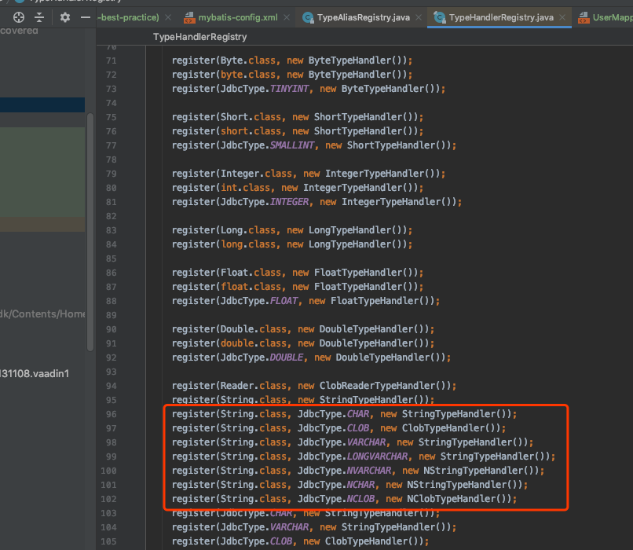

# 类型处理器（typeHandlers）

由于 Java 类型和数据库的 JDBC类型不是一一对应的(比如 String 与 varchar), 所以我们把 Java 对象转化为数据库的值,和把数据库的值转化成 Java 对象,需要经过一定的转换,这两个方向的转换都要用到 TypeHandler

无论是 MyBatis 在预处理语句（PreparedStatement）中设置一个参数时，还是从结果集中取出一个值时， 都会用类型处理器将获取的值以合适的方式转换成 Java 类型。下表描述了一些默认的类型处理器。

**提示** 从 3.4.5 开始，MyBatis 默认支持 JSR-310（日期和时间 API） 。

| 类型处理器                   | Java 类型                       | JDBC 类型                                                    |
| :--------------------------- | :------------------------------ | :----------------------------------------------------------- |
| `BooleanTypeHandler`         | `java.lang.Boolean`, `boolean`  | 数据库兼容的 `BOOLEAN`                                       |
| `ByteTypeHandler`            | `java.lang.Byte`, `byte`        | 数据库兼容的 `NUMERIC` 或 `BYTE`                             |
| `ShortTypeHandler`           | `java.lang.Short`, `short`      | 数据库兼容的 `NUMERIC` 或 `SMALLINT`                         |
| `IntegerTypeHandler`         | `java.lang.Integer`, `int`      | 数据库兼容的 `NUMERIC` 或 `INTEGER`                          |
| `LongTypeHandler`            | `java.lang.Long`, `long`        | 数据库兼容的 `NUMERIC` 或 `BIGINT`                           |
| `FloatTypeHandler`           | `java.lang.Float`, `float`      | 数据库兼容的 `NUMERIC` 或 `FLOAT`                            |
| `DoubleTypeHandler`          | `java.lang.Double`, `double`    | 数据库兼容的 `NUMERIC` 或 `DOUBLE`                           |
| `BigDecimalTypeHandler`      | `java.math.BigDecimal`          | 数据库兼容的 `NUMERIC` 或 `DECIMAL`                          |
| `StringTypeHandler`          | `java.lang.String`              | `CHAR`, `VARCHAR`                                            |
| `ClobReaderTypeHandler`      | `java.io.Reader`                | -                                                            |
| `ClobTypeHandler`            | `java.lang.String`              | `CLOB`, `LONGVARCHAR`                                        |
| `NStringTypeHandler`         | `java.lang.String`              | `NVARCHAR`, `NCHAR`                                          |
| `NClobTypeHandler`           | `java.lang.String`              | `NCLOB`                                                      |
| `BlobInputStreamTypeHandler` | `java.io.InputStream`           | -                                                            |
| `ByteArrayTypeHandler`       | `byte[]`                        | 数据库兼容的字节流类型                                       |
| `BlobTypeHandler`            | `byte[]`                        | `BLOB`, `LONGVARBINARY`                                      |
| `DateTypeHandler`            | `java.util.Date`                | `TIMESTAMP`                                                  |
| `DateOnlyTypeHandler`        | `java.util.Date`                | `DATE`                                                       |
| `TimeOnlyTypeHandler`        | `java.util.Date`                | `TIME`                                                       |
| `SqlTimestampTypeHandler`    | `java.sql.Timestamp`            | `TIMESTAMP`                                                  |
| `SqlDateTypeHandler`         | `java.sql.Date`                 | `DATE`                                                       |
| `SqlTimeTypeHandler`         | `java.sql.Time`                 | `TIME`                                                       |
| `ObjectTypeHandler`          | Any                             | `OTHER` 或未指定类型                                         |
| `EnumTypeHandler`            | Enumeration Type                | VARCHAR 或任何兼容的字符串类型，用以存储枚举的名称（而不是索引值） |
| `EnumOrdinalTypeHandler`     | Enumeration Type                | 任何兼容的 `NUMERIC` 或 `DOUBLE` 类型，存储枚举的序数值（而不是名称）。 |
| `SqlxmlTypeHandler`          | `java.lang.String`              | `SQLXML`                                                     |
| `InstantTypeHandler`         | `java.time.Instant`             | `TIMESTAMP`                                                  |
| `LocalDateTimeTypeHandler`   | `java.time.LocalDateTime`       | `TIMESTAMP`                                                  |
| `LocalDateTypeHandler`       | `java.time.LocalDate`           | `DATE`                                                       |
| `LocalTimeTypeHandler`       | `java.time.LocalTime`           | `TIME`                                                       |
| `OffsetDateTimeTypeHandler`  | `java.time.OffsetDateTime`      | `TIMESTAMP`                                                  |
| `OffsetTimeTypeHandler`      | `java.time.OffsetTime`          | `TIME`                                                       |
| `ZonedDateTimeTypeHandler`   | `java.time.ZonedDateTime`       | `TIMESTAMP`                                                  |
| `YearTypeHandler`            | `java.time.Year`                | `INTEGER`                                                    |
| `MonthTypeHandler`           | `java.time.Month`               | `INTEGER`                                                    |
| `YearMonthTypeHandler`       | `java.time.YearMonth`           | `VARCHAR` 或 `LONGVARCHAR`                                   |
| `JapaneseDateTypeHandler`    | `java.time.chrono.JapaneseDate` | `DATE`                                                       |

你可以重写类型处理器或创建你自己的类型处理器来处理不支持的或非标准的类型。 具体做法为：实现 `org.apache.ibatis.type.TypeHandler` 接口， 或继承一个很便利的类 `org.apache.ibatis.type.BaseTypeHandler`， 然后可以选择性地将它映射到一个 JDBC 类型。比如：

```
// ExampleTypeHandler.java
@MappedJdbcTypes(JdbcType.VARCHAR)
public class ExampleTypeHandler extends BaseTypeHandler<String> {

// 从 Java 类型转化为 JDBC 类型,get 方法时从 JDBC 类型转化成 Java 类型的
  @Override
  public void setNonNullParameter(PreparedStatement ps, int i, String parameter, JdbcType jdbcType) throws SQLException {
    ps.setString(i, parameter);
  }
// 获取空结果集,根据列名
  @Override
  public String getNullableResult(ResultSet rs, String columnName) throws SQLException {
    return rs.getString(columnName);
  }

//获取空结果集,根据下标值
  @Override
  public String getNullableResult(ResultSet rs, int columnIndex) throws SQLException {
    return rs.getString(columnIndex);
  }

// CallableStatement 存储过程使用
  @Override
  public String getNullableResult(CallableStatement cs, int columnIndex) throws SQLException {
    return cs.getString(columnIndex);
  }
}
<!-- mybatis-config.xml -->
<typeHandlers>
  <typeHandler handler="org.mybatis.example.ExampleTypeHandler"/>
</typeHandlers>
```

使用上述的类型处理器将会覆盖已经存在的处理 Java 的 String 类型属性和 VARCHAR 参数及结果的类型处理器。 要注意 MyBatis 不会通过窥探数据库元信息来决定使用哪种类型，所以你必须在参数和结果映射中指明那是 VARCHAR 类型的字段， 以使其能够绑定到正确的类型处理器上。这是因为 MyBatis 直到语句被执行时才清楚数据类型。

通过类型处理器的泛型，MyBatis 可以得知该类型处理器处理的 Java 类型，不过这种行为可以通过两种方法改变：

- 在类型处理器的配置元素（typeHandler 元素）上增加一个 `javaType` 属性（比如：`javaType="String"`）；
- 在类型处理器的类上（TypeHandler class）增加一个 `@MappedTypes` 注解来指定与其关联的 Java 类型列表。 如果在 `javaType` 属性中也同时指定，则注解方式将被忽略。

可以通过两种方式来指定被关联的 JDBC 类型：

- 在类型处理器的配置元素上增加一个 `jdbcType` 属性（比如：`jdbcType="VARCHAR"`）；
- 在类型处理器的类上增加一个 `@MappedJdbcTypes` 注解来指定与其关联的 JDBC 类型列表。 如果在 `jdbcType` 属性中也同时指定，则注解方式将被忽略。

当在 `ResultMap` 中决定使用哪种类型处理器时，此时 Java 类型是已知的（从结果类型中获得），但是 JDBC 类型是未知的。 因此 Mybatis 使用 `javaType=[Java 类型], jdbcType=null` 的组合来选择一个类型处理器。 这意味着使用 `@MappedJdbcTypes` 注解可以*限制*类型处理器的范围，同时除非显式的设置，否则类型处理器在 `ResultMap` 中将是无效的。 如果希望在 `ResultMap` 中使用类型处理器，那么设置 `@MappedJdbcTypes` 注解的 `includeNullJdbcType=true` 即可。 然而从 Mybatis 3.4.0 开始，如果**只有一个**注册的类型处理器来处理 Java 类型，那么它将是 `ResultMap` 使用 Java 类型时的默认值（即使没有 `includeNullJdbcType=true`）。

最后，可以让 MyBatis 为你查找类型处理器：

```
<!-- mybatis-config.xml -->
<typeHandlers>
  <package name="org.mybatis.example"/>
</typeHandlers>
```

注意在使用自动发现功能的时候，只能通过注解方式来指定 JDBC 的类型。

你可以创建一个能够处理多个类的泛型类型处理器。为了使用泛型类型处理器， 需要增加一个接受该类的 class 作为参数的构造器，这样在构造一个类型处理器的时候 MyBatis 就会传入一个具体的类。

```
//GenericTypeHandler.java
public class GenericTypeHandler<E extends MyObject> extends BaseTypeHandler<E> {

  private Class<E> type;

  public GenericTypeHandler(Class<E> type) {
    if (type == null) throw new IllegalArgumentException("Type argument cannot be null");
    this.type = type;
  }
  ...
```

### 处理枚举类型

若想映射枚举类型 `Enum`，则需要从 `EnumTypeHandler` 或者 `EnumOrdinalTypeHandler` 中选一个来使用。

比如说我们想存储取近似值时用到的舍入模式。默认情况下，MyBatis 会利用 `EnumTypeHandler` 来把 `Enum` 值转换成对应的名字。

**注意 `EnumTypeHandler` 在某种意义上来说是比较特别的，其他的处理器只针对某个特定的类，而它不同，它会处理任意继承了 `Enum` 的类。**

不过，我们可能不想存储名字，相反我们的 DBA 会坚持使用整形值代码。那也一样轻而易举： 在配置文件中把 `EnumOrdinalTypeHandler` 加到 `typeHandlers` 中即可， 这样每个 `RoundingMode` 将通过他们的序数值来映射成对应的整形数值。

```
<!-- mybatis-config.xml -->
<typeHandlers>
  <typeHandler handler="org.apache.ibatis.type.EnumOrdinalTypeHandler" javaType="java.math.RoundingMode"/>
</typeHandlers>
```

但是怎样能将同样的 `Enum` 既映射成字符串又映射成整形呢？

自动映射器（auto-mapper）会自动地选用 `EnumOrdinalTypeHandler` 来处理， 所以如果我们想用普通的 `EnumTypeHandler`，就必须要显式地为那些 SQL 语句设置要使用的类型处理器。

（下一节才开始介绍映射器文件，如果你是首次阅读该文档，你可能需要先跳过这里，过会再来看。）

```
<!DOCTYPE mapper
    PUBLIC "-//mybatis.org//DTD Mapper 3.0//EN"
    "http://mybatis.org/dtd/mybatis-3-mapper.dtd">

<mapper namespace="org.apache.ibatis.submitted.rounding.Mapper">
	<resultMap type="org.apache.ibatis.submitted.rounding.User" id="usermap">
		<id column="id" property="id"/>
		<result column="name" property="name"/>
		<result column="funkyNumber" property="funkyNumber"/>
		<result column="roundingMode" property="roundingMode"/>
	</resultMap>

	<select id="getUser" resultMap="usermap">
		select * from users
	</select>
	<insert id="insert">
	    insert into users (id, name, funkyNumber, roundingMode) values (
	    	#{id}, #{name}, #{funkyNumber}, #{roundingMode}
	    )
	</insert>

	<resultMap type="org.apache.ibatis.submitted.rounding.User" id="usermap2">
		<id column="id" property="id"/>
		<result column="name" property="name"/>
		<result column="funkyNumber" property="funkyNumber"/>
		<result column="roundingMode" property="roundingMode" typeHandler="org.apache.ibatis.type.EnumTypeHandler"/>
	</resultMap>
	<select id="getUser2" resultMap="usermap2">
		select * from users2
	</select>
	<insert id="insert2">
	    insert into users2 (id, name, funkyNumber, roundingMode) values (
	    	#{id}, #{name}, #{funkyNumber}, #{roundingMode, typeHandler=org.apache.ibatis.type.EnumTypeHandler}
	    )
	</insert>

</mapper>
```

注意，这里的 select 语句强制使用 `resultMap` 来代替 `resultType`。

## TypeHandlerRegistry类型处理器注册中心

维护了内置的类型转换工具,又 Java 类型到 JDBC 类型的映射,或者是其他类型的互转方式



需要自定义时,实现一个`BaseTypeHandler`的实现类

```java
/**
 * <p>
 * A custom {@link TypeHandler}
 * </p>
 *
 * @author EricChen 2020/02/21 13:13
 */
public class MyTypeHandler implements TypeHandler<String> {
    @Override
    public void setParameter(PreparedStatement ps, int i, String parameter, JdbcType jdbcType) throws SQLException {
        // 设置 String 类型的参数的时候调用，Java类型到JDBC类型
        // 注意只有在字段上添加typeHandler属性才会生效
        // insertBlog name字段
        System.out.println("---------------setNonNullParameter1："+parameter);
        ps.setString(i, parameter);
    }

    @Override
    public String getResult(ResultSet rs, String columnName) throws SQLException {
        // 根据列名获取 String 类型的参数的时候调用，JDBC类型到java类型
        // 注意只有在字段上添加typeHandler属性才会生效
        System.out.println("---------------getNullableResult1："+columnName);
        return rs.getString(columnName);
    }

    @Override
    public String getResult(ResultSet rs, int columnIndex) throws SQLException {
        // 根据下标获取 String 类型的参数的时候调用
        System.out.println("---------------getNullableResult2："+columnIndex);
        return rs.getString(columnIndex);
    }

    @Override
    public String getResult(CallableStatement cs, int columnIndex) throws SQLException {
        System.out.println("---------------getNullableResult3：");
        return cs.getString(columnIndex);
    }
}

```

注册

```xml
<?xml version="1.0" encoding="UTF-8" ?>
<!DOCTYPE configuration
        PUBLIC "-//mybatis.org//DTD Config 3.0//EN"
        "http://mybatis.org/dtd/mybatis-3-config.dtd">
<configuration>

    <typeHandlers>
        <typeHandler handler="vip.ericchen.study.mybatis.typehandler.MyTypeHandler"/>
    </typeHandlers>

</configuration>
```

使用,在插入字段时指定typeHandler, 会走 handler 的`setParameter`方法

```xml
    <insert id="insertBlog" parameterType="blog">
     insert into blog (bid, name, author_id)
        values (#{bid,jdbcType=INTEGER}, #{name,jdbcType=VARCHAR,typeHandler=vip.ericchen.study.mybatis.typehandler.MyTypeHandler}, #{authorId,jdbcType=INTEGER})
    </insert>
```

在解析的`resultMap`字段上,会调用`getResult`的方法

```xml
    <resultMap id="userWithDeptQueryMap" type="vip.ericchen.study.mybatis.entity.User">
        <id column="id" property="id" jdbcType="INTEGER"></id>
        <result column="name" property="name" jdbcType="VARCHAR" typeHandler="vip.ericchen.study.mybatis.typehandler.MyTypeHandler"/>
        <result column="age" property="age" jdbcType="INTEGER"/>
    </resultMap>
```

