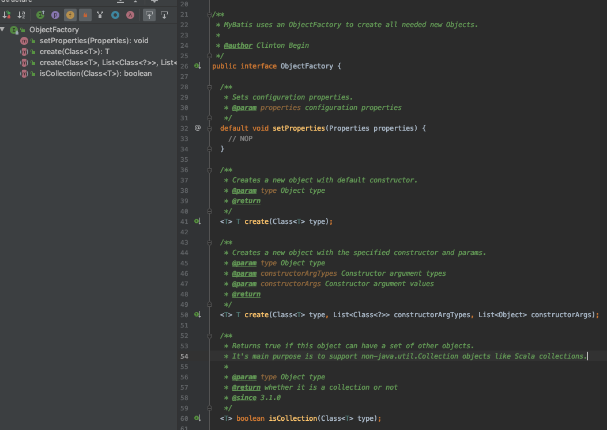
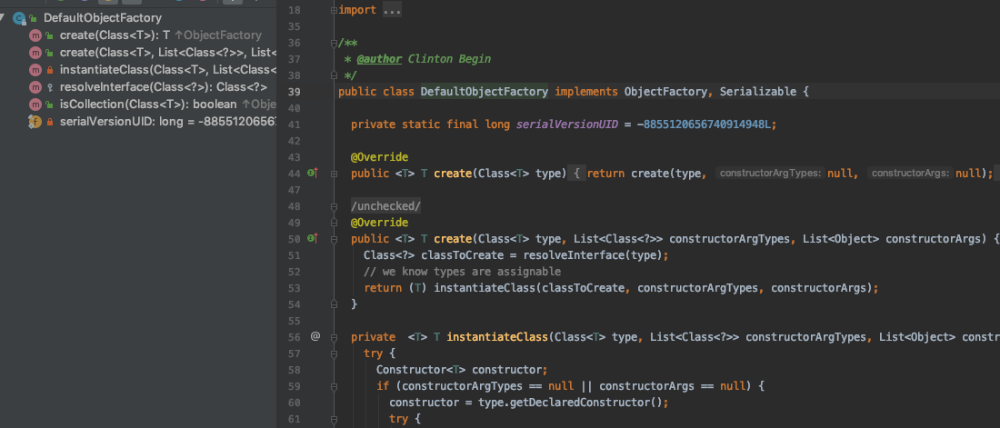

# 对象工厂（objectFactory）

## 是什么

当我们把数据库返回的结果集转化为实例对象的时候,需要创建对象的实例,由于我们不知道需要处理的类型是什么,有哪些属性,所以不能用 new 的方式去创建,在 Mybatis里面, 提供了一个工厂类的接口,`ObjectFactory`专门用来创建对象的实例



整个接口也非常简单,

- setProperties 主要是设置的参数,一般是 Configuration对象的参数
- create 创建对象,调用无参的构造函数
- create 调用有参数的构造函数
- isCoolection 是否是集合


## 详细介绍

往往这种接口在框架中都会提供一个标注的实现类, Mybatis 提供的是一个`DefaultObjectFactory`,一般情况下,需要修改对象工厂的行为,直接继承和这个类,




## 自定义 ObjectFactory

MyBatis 每次创建结果对象的新实例时，它都会使用一个对象工厂（ObjectFactory）实例来完成。 默认的对象工厂需要做的仅仅是实例化目标类，要么通过默认构造方法，要么在参数映射存在的时候通过参数构造方法来实例化。 如果想覆盖对象工厂的默认行为，则可以通过创建自己的对象工厂来实现。比如：

```java
// ExampleObjectFactory.java
public class ExampleObjectFactory extends DefaultObjectFactory {
  public Object create(Class type) {
    return super.create(type);
  }
  public Object create(Class type, List<Class> constructorArgTypes, List<Object> constructorArgs) {
    return super.create(type, constructorArgTypes, constructorArgs);
  }
  public void setProperties(Properties properties) {
    super.setProperties(properties);
  }
  public <T> boolean isCollection(Class<T> type) {
    return Collection.class.isAssignableFrom(type);
  }}

```

当然也需要在配置文件中注册这些 实现类

```
<!-- mybatis-config.xml -->
<objectFactory type="org.mybatis.example.ExampleObjectFactory">
  <property name="someProperty" value="100"/>
</objectFactory>
```


ObjectFactory 接口很简单，它包含两个创建用的方法，一个是处理默认构造方法的，另外一个是处理带参数的构造方法的。 最后，setProperties 方法可以被用来配置 ObjectFactory，在初始化你的 ObjectFactory 实例后， objectFactory 元素体中定义的属性会被传递给 setProperties 方法。

## 一些问题

#### 什么时候调用了 ObJectFactory.create 方法?

创建`DefaultResultHandler`的时候,和创建对象的时候,ResultHandler 是结果集处理器,在默认的情况下,会创建一个列表对象用于处理添加结果集的行信息


#### 返回结果集的时候,ObjectFactory和 TypeHandler 哪个先工作

- 先 ObjectFactory ,后 TypeHandler