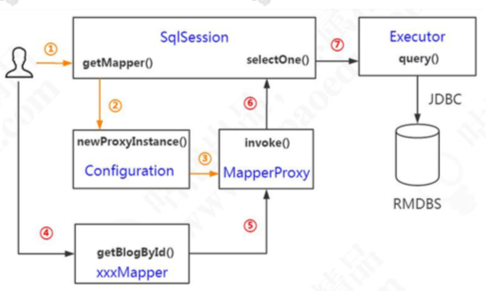

#  Fake Mybatis Ecbatis

要模仿一个 mybatis ,需要提供的核心对象

## 核心对象

- 存放参数和结果集映射,存放 Sql 语句,需要定义一个配置类(Configuration)
- 存放 Mapper 类和 Statement 的映射关系,需要一个` MapperRegistry`

- 执行对数据库的操作,处理参数和结果集映射,创建和释放资源,我们需要定义一个执行器(Executor)
- 直接与用户对接的API 应用层 `SqlSession`,对应着一次数据库会话
- 用户定义的 Mapper 接口需要一个代理映射到指定的 sql 语句(Statement) 我们需要一个` MapperProxy` 类

#### 流程

1. 定义 Mapper 接口和方法,用来调用数据库操作
2. 定义配置类 Configuration
3. 定义接口类 `SqlSession`,它有一个`getMapper()`方法,我们会从配置`Configuratuin` 中获取到代理对象`MapperProxy`
4. 这个时候,调用 Mapper 内的方法实际上就是调用了 `MapperProxy`中的 invoke 方法(JDK 代理)
5. 代理对象`MapperProxy`对象的 invoke 方法调用 `SqlSession`对象中的查询方法
6.  `SqlSession`对象中的查询方法调用 Executor 中的 query 方法
7. 执行器 Executor 的 `query()`方法里面就是对 JDBC底层的封装
8. `ResultHandler` 处理结果集
9. `StatementHandler` 处理查询中使用到的 `Statement`
10. `ParameterHandler` 处理查询参数