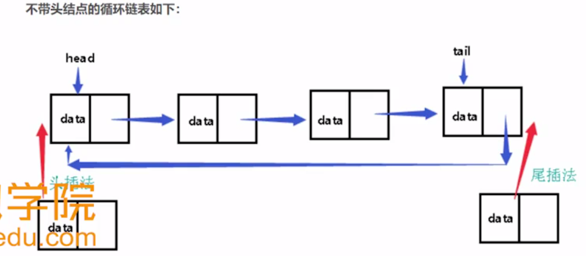

# 040-循环链表

[TOC]

- 循环单链表

> 与单链表的区别在于，表中最后一个节点的指针不为null，而改为指向头结点（第一个节点）的指针，从而使整个链表形成一个环状
>
> 判断循环链表是否为空，判断是否等于头指针
>
> 只有一个尾指针的循环单链表，可以方便的操作表头和表尾。因为尾指针的后继就是头指针O（1）

- 循环双链表

> 与双链表的区别在于，头节点的prior 指针指向尾节点，尾节点的next指针指向头结点

## 图示

