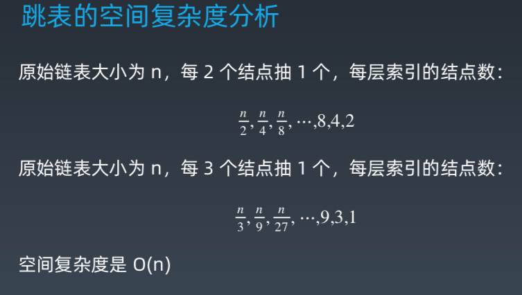
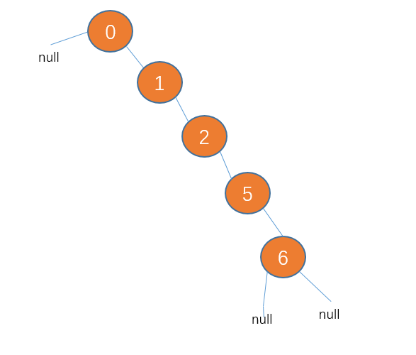

# 050-跳表

[TOC]

## 跳表复杂度

### 时间复杂度


## 空间复杂度



## 为什么需要跳表

假如我们要用某种数据结构来维护一组**有序**的int型数据的集合，并且希望这个数据结构在插入、删除、查找等操作上能够尽可能着快速，那么，你会用什么样的数据结构呢？

- 列表 
  - 查找时间复杂度 O(logn) , 二分法
  - 插入时间复杂度 O(n) , 移动元素

- 链表
  - 查找时间复杂度是 ,遍历查找, 时间复杂度是O(n)
  - 找到元素后, 插入、删除时间复杂度 O(1) ,**注意是找到后,查找时间复杂度也算上的话就是 O(n)**

## 什么是跳跃链表


对于具有 n 个元素的链表，我们可以采取 (logn + 1) 层指针路径的形式**，**就可以实现在 O(logn) 的时间复杂度内，查找到某个目标元素了，这种数据结构，我们也称之为跳跃表**，**跳跃表也可以算是链表的一种变形，只是它具有二分查找的功能。

#### 插入和删除

上面例子中，9个结点，一共4层，可以说是理想的跳跃表了，不过随着我们对跳跃表进行插入/删除结点的操作，那么跳跃表结点数就会改变，意味着跳跃表的层数也会动态改变。

这里我们面临一个问题，就是**新插入的结点应该跨越多少层？**

这个问题已经有大牛替我们解决好了，采取的策略是通过**抛硬币来决定新插入结点跨越的层数**：每次我们要插入一个结点的时候，就来抛硬币，如果抛出来的是**正面**，则继续抛，直到出现**负面**为止，统计这个过程中出现正面的**次数**，这个次数作为结点跨越的层数。

通过这种方法，可以尽可能着接近理想的层数。大家可以想一下为啥会这样呢？

##### **插入**

例如，我们要插入结点 3，4，通过抛硬币知道3，4跨越的层数分别为 0，2 (层数从0开始算)，则插入的过程如下：

插入 3，跨越0层。


插入 4，跨越2层。


**删除**

解决了插入之后，我们来看看删除，删除就比较简单了，例如我们要删除4，那我们直接把4及其所跨越的层数删除就行了。


### 小结

跳跃表的插入与删除至此都讲完了，总结下跳跃表的有关性质：

(1). 跳跃表的每一层都是一条**有序的链表**.

(2). 跳跃表的查找次数近似于层数，时间复杂度为O(logn)，插入、删除也为 O(logn)。

(3). 最底层的链表包含所有元素。

(4). 跳跃表是一种随机化的数据结构(通过抛硬币来决定层数)。

(5). 跳跃表的空间复杂度为 O(n)。

### 跳跃表 vs 二叉查找树

有人可能会说，也可以采用二叉查找树啊，因为查找查找树的插入、删除、查找也是近似 O(logn) 的时间复杂度。

不过，二叉查找树是有可能出现一种极端的情况的，就是如果插入的数据刚好一直有序，那么所有节点会偏向某一边。例如



这种接结构会导致二叉查找树的查找效率变为 O(n),这会使二叉查找树大打折扣。

### 跳跃表 vs 红黑树

红黑可以说是二叉查找树的一种变形，红黑在查找，插入，删除也是近似O(logn)的时间复杂度，但学过红黑树的都知道，红黑树比跳跃表复杂多了，反正我是被红黑树虐过。在选择一种数据结构时，有时候也是需要考虑学习成本的。

而且红黑树插入，删除结点时，是通过调整结构来保持红黑树的平衡，比起跳跃表直接通过一个随机数来决定跨越几层，在时间复杂度的花销上是要高于跳跃表的。

当然，红黑树并不是一定比跳跃表差，在有些场合红黑树会是更好的选择，所以选择一种数据结构，关键还得看场合。

总上所述，维护一组有序的集合，并且希望在查找、插入、删除等操作上尽可能快，那么跳跃表会是不错的选择。redis 中的数据数据便是采用了跳跃表，当然，ridis也结合了哈希表等数据结构，采用的是一种复合数据结构。

**代码如下**

```java
  1//节点
  2class Node{
  3    int value = -1;
  4    int level;//跨越几层
  5    Node[] next;//指向下一个节点
  6
  7    public Node(int value, int level) {
  8        this.value = value;
  9        this.level = level;
 10        this.next = new Node[level];
 11    }
 12}
 13//跳跃表
 14public class SkipList {
 15    //允许的最大层数
 16    int maxLevel = 16;
 17    //头节点，充当辅助。
 18    Node head = new Node(-1, 16);
 19    //当前跳跃表节点的个数
 20    int size = 0;
 21    //当前跳跃表的层数,初始化为1层。
 22    int levelCount = 1;
 23
 24
 25    public Node find(int value) {
 26        Node temp = head;
 27        for (int i = levelCount - 1; i >= 0; i--) {
 28            while (temp.next[i] != null && temp.next[i].value < value) {
 29                temp = temp.next[i];
 30            }
 31        }
 32        //判断是否有该元素存在
 33        if (temp.next[0] != null && temp.next[0].value == value) {
 34            System.out.println(value + "  查找成功");
 35            return temp.next[0];
 36        } else {
 37            return null;
 38        }
 39    }
 40    // 为了方便，跳跃表在插入的时候，插入的节点在当前跳跃表是不存在的
 41    //不允许插入重复数值的节点。
 42    public void insert(int value) {
 43        int level = getLevel();
 44        Node newNode = new Node(value, level);
 45        //update用于记录要插入节点的前驱
 46        Node[] update = new Node[level];
 47
 48        Node temp = head;
 49        for (int i = level - 1; i >= 0; i--) {
 50            while (temp.next[i] != null && temp.next[i].value < value) {
 51                temp = temp.next[i];
 52            }
 53            update[i] = temp;
 54        }
 55        //把插入节点的每一层连接起来
 56        for (int i = 0; i < level; i++) {
 57            newNode.next[i] = update[i].next[i];
 58            update[i].next[i] = newNode;
 59        }
 60        //判断是否需要更新跳跃表的层数
 61        if (level > levelCount) {
 62            levelCount = level;
 63        }
 64        size++;
 65        System.out.println(value + " 插入成功");
 66    }
 67
 68    public void delete(int value) {
 69        Node[] update = new Node[levelCount];
 70        Node temp = head;
 71
 72        for (int i = levelCount - 1; i >= 0; i--) {
 73            while (temp.next[i] != null && temp.next[i].value < value) {
 74                temp = temp.next[i];
 75            }
 76            update[i] = temp;
 77        }
 78
 79        if (temp.next[0] != null && temp.next[0].value == value) {
 80            size--;
 81            System.out.println(value + " 删除成功");
 82            for (int i = levelCount - 1; i >= 0; i--) {
 83                if (update[i].next[i] != null && update[i].next[i].value == value) {
 84                    update[i].next[i] = update[i].next[i].next[i];
 85                }
 86            }
 87        }
 88    }
 89
 90    //打印所有节点
 91    public void printAllNode() {
 92        Node temp = head;
 93        while (temp.next[0] != null) {
 94            System.out.println(temp.next[0].value + "  ");
 95            temp = temp.next[0];
 96        }
 97    }
 98
 99    //模拟抛硬币
100    private int getLevel() {
101        int level = 1;
102        while (true) {
103            int t = (int)(Math.random() * 100);
104            if (t % 2 == 0) {
105                level++;
106            } else {
107                break;
108            }
109        }
110        System.out.println("当前的level = " + level);
111        return level;
112    }
113
114    //测试数据
115    public static void main(String[] args) {
116        SkipList list = new SkipList();
117        for (int i = 0; i < 6; i++) {
118            list.insert(i);
119        }
120        list.printAllNode();
121        list.delete(4);
122        list.printAllNode();
123        System.out.println(list.find(3));
124        System.out.println(list.size + " " + list.levelCount);
125    }
126}
```

