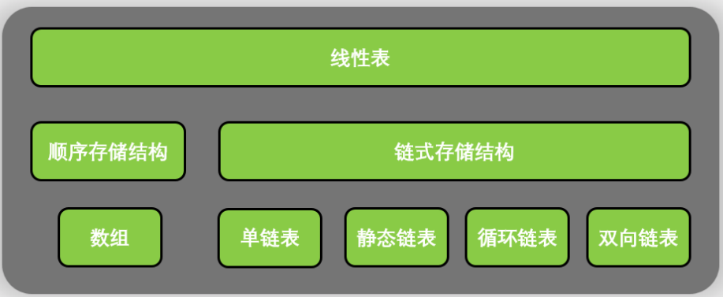

# 线性表

## 什么是线性表

线性表是一种逻辑结构，相同数据类型的n个数据元素的有限序列，除第一个元素外，每个元素有且仅有一个直接前驱，除最后一个元素外，每个元素 **有且仅有一个直接后继**

**线性表有以下特点**

- 元素个数有限
- 逻辑上元素有先后次序
- 数据类型相同
- 仅讨论元素间的逻辑过关系

## 线性表的分类

- 顺序存储 
  -   顺序表
- 链式存储
  - 单链表（指针实现）
  - 双链表（指针实现）
  - 循环链表（指针实现）
  - 静态链表 （数组实现）

## 数组和链表的区别

| -    | 数组 | 链表 |
| ---- | ---- | ---- |
| 读取 | O(1) | O(n) |
| 插入 | O(n) | O(1) |
| 删除 | O(n) | O(1) |

### 数组优点

- 随机访问性强
- 查找速度快

### 数组缺点

- 插入和删除效率低
- 可能浪费内存
- 内存空间要求高，必须是足够的连续内存空间
- 数组大小固定，不能动态拓展

### 链表的优点

- 插入删除速度快
- 内存利用率高
- 大小没有固定，扩展灵活

### 链表的缺点

- 不能随机访问，必须从第一个开始遍历，效率低