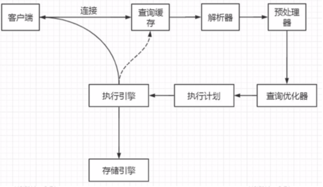
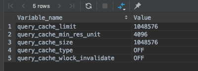

#  MySQL查询缓存

> 

- Query Cache 在生产中建议关闭,因为它只能缓存静态数据信息,一旦数据发生变化,经常读写,Query Cache 就成了鸡肋

- 一般数据仓储类可以考虑开启


#### MySQL 5.6 之后的缓存默认是关闭的。

```sql
show variables like 'query_cache%';
```



默认关闭的意思就是不推荐使用，为什么 MySQL 不推荐使用它自带的缓存呢?

- 主要是因为 MySQL 自带的缓存的应用场景有限，第一个是它要求 SQL 语句必须一 模一样，中间多一个空格，字母大小写不同都被认为是不同的的 SQL。

- 第二个是表里面任何一条数据发生变化的时候，这张表所有缓存都会失效，所以对 于有大量数据更新的应用，也不适合。

所以缓存这一块，我们还是交给 ORM 框架(比如 MyBatis 默认开启了一级缓存)， 或者独立的缓存服务，比如 Redis 来处理更合适。

**在`MySQL 8.0` 中，查询缓存已经被移除了。**

## 关闭 MySQL 查询缓存

- `query_cache_size` 设置为 0
- `query_cache_type`设置为 OFF

> query_cahe_type 要在启动前挂壁,启动后即使设置为 off 也会影响 tps