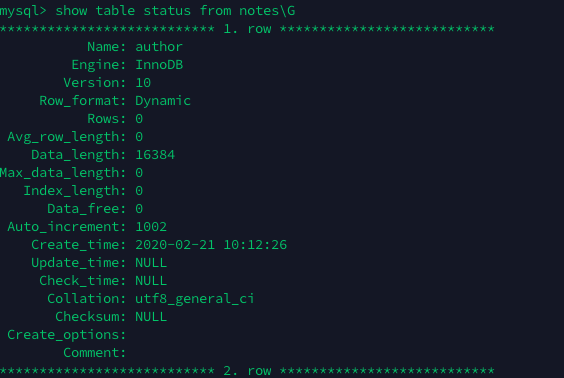
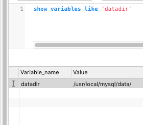

# 存储引擎

1、从逻辑的角度来说，我们的数据是放在哪里的，或者说放在一个什么结构里面?

 2、执行计划在哪里执行?是谁去执行?

### 存储引擎基本介绍

在关系型数据库里面，数据是放在什么结构里面的? (放在表 Table 里面的)
我们可以把这个表理解成 Excel 电子表格的形式。所以我们的表在存储数据的同时，
还要组织数据的存储结构，这个存储结构就是由我们的存储引擎决定的，所以我们也可 以把存储引擎叫做表类型。
在 MySQL 里面，支持多种存储引擎，他们是可以替换的，所以叫做插件式的存储引 擎。为什么要搞这么多存储引擎呢?一种还不够用吗?

### 查看存储引擎

比如我们数据库里面已经存在的表，我们怎么查看它们的存储引擎呢?

```
show table status from 'demo';
```




在 MySQL 里面，我们创建的每一张表都可以指定它的存储引擎，而不是一个数据库只能使用一个存储引擎。存储引擎的使用是以表为单位的。而且，创建表之后还可以修 改存储引擎。

我们说一张表使用的存储引擎决定我们存储数据的结构，那在服务器上它们是怎么 存储的呢?我们先要找到数据库存放数据的路径:

```
show variables like 'datadir';
```




## 常见存储引擎

MyISAM 和 InnoDB 是我们用得最多的两个存储引擎，在 MySQL 5.5 版本之前， 默认的存储引擎是 MyISAM，它是 MySQL 自带的。我们创建表的时候不指定存储引擎， 它就会使用 MyISAM 作为存储引擎。

MyISAM 的前身是 ISAM(Indexed Sequential Access Method:利用索引，顺序 存取数据的方法)。
5.5 版本之后默认的存储引擎改成了 InnoDB，它是第三方公司为 MySQL 开发的。 为什么要改呢?最主要的原因还是 InnoDB 支持事务，支持行级别的锁，对于业务一致 性要求高的场景来说更适合。

### 数据库支持的存储引擎

#### 用这个命令查看数据库对存储引擎的支持情况:

```java
show engines;
```

其中有存储引擎的描述和对事务、XA 协议和 Savepoints 的支持。

- XA 协议用来实现**分布式事务**(分为本地资源管理器，事务管理器)。 
- **Savepoints 用来实现子事务(嵌套事务)**。创建了一个 Savepoints 之后，事务就可以回滚到这个点，不会影响到创建 Savepoints 之前的操作。


## MyISAM(3 个文件)

These tables have a small footprint. Table-level locking limits the performance in read/write workloads, so it is often used in read-only or read-mostly workloads in Web and data warehousing configurations.

应用范围比较小。表级锁定限制了读/写的性能，因此在 Web 和数据仓库配置中， 它通常用于只读或以读为主的工作。

特点:

- 支持表级别的锁(插入和更新会锁表)。
- 不支持事务。 
- 拥有较高的插入(insert)和查询(select)速度。
- 存储了表的行数(count 速度更快)。

(怎么快速向数据库插入 100 万条数据?我们有一种先用 MyISAM 插入数据，然后
修改存储引擎为 InnoDB 的操作。)

-  适合:**只读之类的数据分析的项目。**

## InnoDB(2 个文件)

MySQL  5.7 中的默认存储引擎。

- InnoDB 是一个事务安全(与 ACID 兼容)的 MySQL 存储引擎，它具有提交、回滚和崩溃恢复功能来保护用户数据。

- InnoDB 行级锁(不升级 为更粗粒度的锁)和 Oracle 风格的一致非锁读提高了多用户并发性和性能。
- InnoDB 将 用户数据存储在聚集索引中，以减少基于主键的常见查询的 I/O。为了保持数据完整性，

- nnoDB 还支持外键引用完整性约束。 

特点:

- 支持事务，支持外键，因此数据的完整性、一致性更高。

- 支持行级别的锁和表级别的锁。 
- 支持读写并发，写不阻塞读(MVCC)。 
- 特殊的索引存放方式，可以减少 IO，提升查询效率。 

**适合:经常更新的表，存在并发读写或者有事务处理的业务系统**

## Memory(1 个文件)

将所有数据存储在 RAM 中，以便在需要快速查找非关键数据的环境中快速访问。

这个引擎以前被称为堆引擎。其使用案例正在减少;

InnoDB 及其缓冲池内存区域提供了一 种通用、持久的方法来将大部分或所有数据保存在内存中，而 `ndbcluster` 为大型分布式 数据集提供了快速的键值查找。
特点:

- 把数据放在内存里面，读写的速度很快，但是数据库重启或者崩溃，数据会全部消 失。

**只适合做临时表。将表中的数据存储到内存中。**

## CSV(3 个文件)

它的表实际上是带有逗号分隔值的文本文件。csv 表允许以 csv 格式导入或转储数据， 以便与读写相同格式的脚本和应用程序交换数据。

因为 csv 表没有索引，所以通常在正 常操作期间将数据保存在 innodb 表中，并且只在导入或导出阶段使用 csv 表。

**特点:不允许空行，不支持索引。格式通用，可以直接编辑，适合在不同数据库之间导入导出。**

## Archive(2 个文件)

那些些紧凑的未索引的表用于存储和检索大量很少引用的历史、存档或安全审计信息。

 **特点:不支持索引，不支持 update delete。**

这是 MySQL 里面常见的一些存储引擎，我们看到了，不同的存储引擎提供的特性都 不一样，它们有不同的存储机制、索引方式、锁定水平等功能。
我们在不同的业务场景中对数据操作的要求不同，就可以选择不同的存储引擎来满 足我们的需求，这个就是 MySQL 支持这么多存储引擎的原因。

## 如何选择存储引擎?

- 如果对数据一致性要求比较高，需要事务支持，可以选择 InnoDB。
-  如果数据查询多更新少，对查询性能要求比较高，可以选择 MyISAM。 
- 如果需要一个用于查询的临时表，可以选择 Memory。