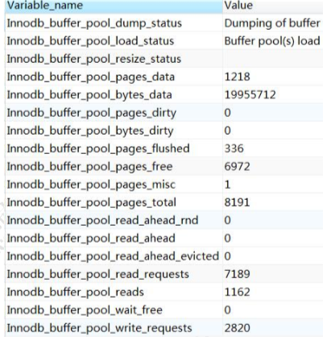
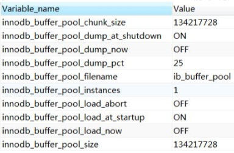
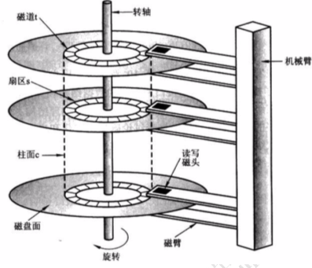
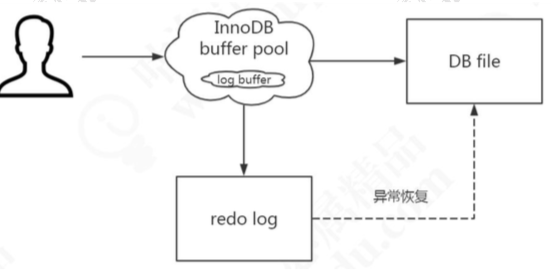
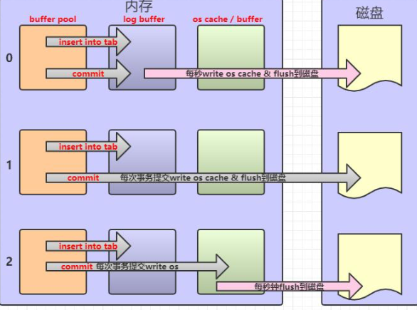
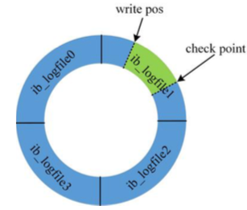
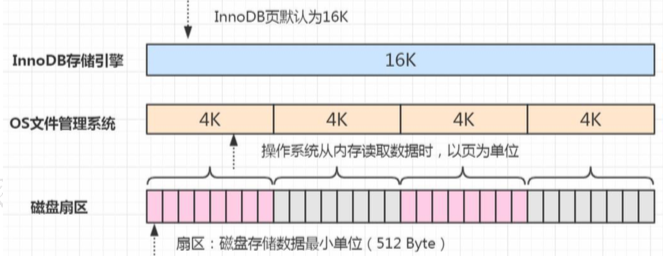
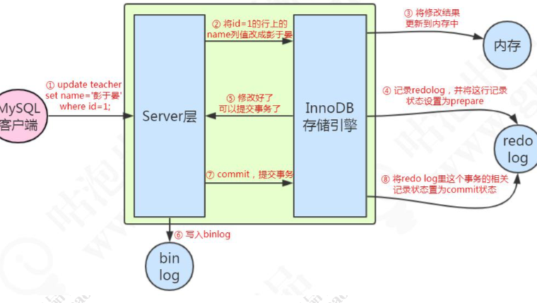

# 一条更新 SQL 是如何执行的

数据库里面，我们说的 update 操作其实包括了更新、插入和删除。如果大家有看 过 MyBatis 的源码，应该知道 Executor 里面也只有 doQuery()和 doUpdate()的方法， 没有 doDelete()和 doInsert()。

更新流程和查询流程有什么不同呢?

基本流程也是一致的，也就是说，它也要经过解析器、优化器的处理，最后交给执 行器。

 区别就在于拿到符合条件的数据之后的操作。

## 缓冲池 Buffer Pool

InnnoDB 的数据都是放在磁盘上的，InnoDB 操作数据有一个最小的逻辑单位，叫做页(索引页和数据页)。我们对于数据的操作，不是每次都直接操作磁盘，因为磁盘的速度太慢了。

InnoDB 使用了一种缓冲池的技术，也就是把磁盘读到的页放到一 块内存区域里面。这个内存区域就叫 Buffer Pool。


下一次读取相同的页，先判断是不是在缓冲池里面，如果是，就直接读取，不用再次访问磁盘。

修改数据的时候，先修改缓冲池里面的页。内存的数据页和磁盘数据不一致的时候， 我们把它叫做脏页。InnoDB 里面有专门的后台线程把 Buffer Pool 的数据写入到磁盘， 每隔一段时间就一次性地把多个修改写入磁盘，这个动作就叫做刷脏。

Buffer Pool 是 InnoDB 里面非常重要的一个结构，它的内部又分成几块区域。这里 我们趁机到官网来认识一下 InnoDB 的内存结构和磁盘结构。

## InnoDB 内存结构和磁盘结构


### 内存结构

Buffer Pool 主要分为 3 个部分: `Buffer Pool`、`Change Buffer`、`Adaptive Hash Index`，另外还有一个`(redo) log buffer`。

#### Buffer Pool

Buffer Pool 缓存的是页面信息，包括数据页、索引页。 查看服务器状态，里面有很多跟 Buffer Pool 相关的信息:



`Buffer Pool` 默认大小是 `128M(134217728 字节)`，可以调整。

查看参数(系统变量):

```
SHOW VARIABLES like '%innodb_buffer_pool%';
```

这些参数都可以在官网查到详细的含义，用搜索功能。



内存的缓冲池写满了怎么办?(Redis 设置的内存满了怎么办?)InnoDB 用 LRU 算法来管理缓冲池(链表实现，不是传统的 LRU，分成了 young 和 old)，经过淘汰的 数据就是热点数据。

内存缓冲区对于提升读写性能有很大的作用。思考一个问题: 当需要更新一个数据页时，如果数据页在 Buffer Pool 中存在，那么就直接更新好了。 否则的话就需要从磁盘加载到内存，再对内存的数据页进行操作。也就是说，如果
没有命中缓冲池，至少要产生一次磁盘 IO，有没有优化的方式呢?

#### Change Buffer 写缓冲

如果这个数据页不是唯一索引，不存在数据重复的情况，也就不需要从磁盘加载索 引页判断数据是不是重复(唯一性检查)。这种情况下可以先把修改记录在内存的缓冲 池中，从而提升更新语句(Insert、Delete、Update)的执行速度。
这一块区域就是 Change Buffer。5.5 之前叫 Insert Buffer 插入缓冲，现在也能支 持 delete 和 update。
最后把 Change Buffer 记录到数据页的操作叫做 merge。什么时候发生 merge? 有几种情况:

在访问这个数据页的时候，或者通过后台线程、或者数据库 shut down、 redo log 写满时触发。

如果数据库大部分索引都是非唯一索引，并且业务是写多读少，不会在写数据后立 刻读取，就可以使用 Change Buffer(写缓冲)。写多读少的业务，调大这个值:

```
SHOW VARIABLES LIKE 'innodb_change_buffer_max_size';
```

代表 Change Buffer 占 Buffer Pool 的比例，默认 25%。

#### Adaptive Hash Index

专门把一种哈希的索引放到内存

#### (redo) Log Buffer

思考一个问题:如果 Buffer Pool 里面的脏页还没有刷入磁盘时，数据库宕机或者重 启，这些数据丢失。如果写操作写到一半，甚至可能会破坏数据文件导致数据库不可用。
为了避免这个问题，InnoDB 把所有对页面的修改操作专门写入一个日志文件，并且 在数据库启动时从这个文件进行恢复操作(实现 crash-safe)——用它来实现事务的持久性。


这个文件就是磁盘的 redo log (叫做重做日志)，对应于/var/lib/mysql/目录下的 ib_logfile0 和 ib_logfile1，每个 48M。

这种日志和磁盘配合的整个过程，其实就是 MySQL 里的 WAL 技术 (Write-Ahead Logging)，它的关键点就是先写日志，再写磁盘。

```
show variables like 'innodb_log%';
```

- innodb_log_file_size
  指定每个文件的大小，默认 48M
- innodb_log_files_in_group
  指定文件的数量，默认为 2
- innodb_log_group_home_dir
  指定文件所在路径，相对或绝对。如果不指定，则为 datadir 路径。

同样是写磁盘，为什么不直接写到 db file 里面去?为什么先写日志再写磁盘? 我们先来了解一下随机 I/O 和顺序 I/O 的概念。 磁盘的最小组成单元是扇区，通常是 512 个字节。 操作系统和内存打交道，最小的单位是页 Page。 操作系统和磁盘打交道，读写磁盘，最小的单位是块 Block。



如果我们所需要的数据是随机分散在不同页的不同扇区中，那么找到相应的数据需 要等到磁臂旋转到指定的页，然后盘片寻找到对应的扇区，才能找到我们所需要的一块 数据，一次进行此过程直到找完所有数据，这个就是随机 IO，读取数据速度较慢。

假设我们已经找到了第一块数据，并且其他所需的数据就在这一块数据后边，那么就不需要重新寻址，可以依次拿到我们所需的数据，这个就叫顺序 IO。

刷盘是随机 I/O，而记录日志是顺序 I/O，顺序 I/O 效率更高。因此先把修改写入日志，可以延迟刷盘时机，进而提升系统吞吐。

当然 redo log 也不是每一次都直接写入磁盘，在 Buffer Pool 里面有一块内存区域 (Log Buffer)专门用来保存即将要写入日志文件的数据，默认 16M，它一样可以节省 磁盘 IO。



```
SHOW VARIABLES LIKE 'innodb_log_buffer_size';
```

需要注意:redo log 的内容主要是用于崩溃恢复。磁盘的数据文件，数据来自 buffer pool。redo log 写入磁盘，不是写入数据文件。

那么，Log Buffer 什么时候写入 log file?

在我们写入数据到磁盘的时候，操作系统本身是有缓存的。flush 就是把操作系统缓 冲区写入到磁盘。

log buffer 写入磁盘的时机，由一个参数控制，默认是 1。

```
SHOW VARIABLES LIKE 'innodb_flush_log_at_trx_commit';
```

- 0(延迟写)
  log buffer 将每秒一次地写入 log file 中，并且 log file 的 flush 操作同时进行。 该模式下，在事务提交的时候，不会主动触发写入磁盘的操作。
- 1(默认，实时写，实时刷)
  每次事务提交时 MySQL 都会把 log buffer 的数据写入 log file，并且刷到磁盘 中去。
- 2(实时写，延 迟刷)
  每次事务提交时 MySQL 都会把 log buffer 的数据写入 log file。但是 flush 操 作并不会同时进行。该模式下，MySQL 会每秒执行一次 flush 操作。




这是内存结构的第 4 块内容，redo log，它又分成内存和磁盘两部分。redo log 有 什么特点?

- redo log 是 InnoDB 存储引擎实现的，并不是所有存储引擎都有。 
- 不是记录数据页更新之后的状态，而是记录这个页做了什么改动，属于物理日志
- redo log 的大小是固定的，前面的内容会被覆盖。



check point 是当前要覆盖的位置。如果 write pos 跟 check point 重叠，说明 redo log 已经写满，这时候需要同步 redo log 到磁盘中。
这是 MySQL 的内存结构，总结一下，分为:
Buffer pool、change buffer、Adaptive Hash Index、 log buffer。

磁盘结构里面主要是各种各样的表空间，叫做 Table space。

## 磁盘结构

表空间可以看做是 InnoDB 存储引擎逻辑结构的最高层，所有的数据都存放在表空间中。InnoDB 的表空间分为 5 大类。

#### 系统表空间 system tablespace

在默认情况下 InnoDB 存储引擎有一个共享表空间(对应文件/var/lib/mysql/ ibdata1)，也叫系统表空间。

InnoDB 系统表空间包含 InnoDB 数据字典和双写缓冲区，Change Buffer 和 Undo Logs)，如果没有指定 file-per-table，也包含用户创建的表和索引数据。

1、undo 在后面介绍，因为有独立的表空间。

2、数据字典:由内部系统表组成，存储表和索引的元数据(定义信息)。 

3、双写缓冲(InnoDB 的一大特性)。

InnoDB 的页和操作系统的页大小不一致，InnoDB 页大小一般为 16K，操作系统页 大小为 4K，InnoDB 的页写入到磁盘时，一个页需要分 4 次写。



如果存储引擎正在写入页的数据到磁盘时发生了宕机，可能出现页只写了一部分的 情况，比如只写了 4K，就宕机了，这种情况叫做部分写失效(partial page write)，可 能会导致数据丢失。

```
show variables like 'innodb_doublewrite';
```

我们不是有 redo log 吗?但是有个问题，如果这个页本身已经损坏了，用它来做崩 溃恢复是没有意义的。所以在对于应用 redo log 之前，需要一个页的副本。如果出现了 写入失效，就用页的副本来还原这个页，然后再应用 redo log。这个页的副本就是 double write，InnoDB 的双写技术。通过它实现了数据页的可靠性。

跟 redo log 一样，double write 由两部分组成，一部分是内存的 double write，一个部分是磁盘上的 double write。因为 double write 是顺序写入的，不会带来很大的 开销。

在默认情况下，所有的表共享一个系统表空间，这个文件会越来越大，而且它的空间不会收缩。

#### 独占表空间 file-per-table tablespaces

我们可以让每张表独占一个表空间。这个开关通过 innodb_file_per_table 设置，默 认开启。

```
SHOW VARIABLES LIKE 'innodb_file_per_table';
```

开启后，则每张表会开辟一个表空间，这个文件就是数据目录下的 ibd 文件(例如 /var/lib/mysql/gupao/user_innodb.ibd)，存放表的索引和数据。

但是其他类的数据，如回滚(undo)信息，插入缓冲索引页、系统事务信息，二次 写缓冲(Double write buffer)等还是存放在原来的共享表空间内。

#### 通用表空间 general tablespaces

通用表空间也是一种共享的表空间，跟 ibdata1 类似。
可以创建一个通用的表空间，用来存储不同数据库的表，数据路径和文件可以自定 义。语法:

```
create tablespace ts2673 add datafile '/var/lib/mysql/ts2673.ibd' file_block_size=16K engine=innodb;
```

在创建表的时候可以指定表空间，用 ALTER 修改表空间可以转移表空间。

```
create table t2673(id integer) tablespace ts2673;
```

- 不同表空间的数据是可以移动的。
-  删除表空间需要先删除里面的所有表:

```
drop table t2673;
drop tablespace ts2673;
```

#### 临时表空间 temporary tablespaces

存储临时表的数据，包括用户创建的临时表，和磁盘的内部临时表。对应数据目录 下的 ibtmp1 文件。当数据服务器正常关闭时，该表空间被删除，下次重新产生。

#### Redo log

磁盘结构里面的 redo log，在前面已经介绍过了。

#### undo log tablespace

`undolog`( 撤 销 日 志 或 回 滚 日 志 )记 录 了 **事 务 发 生 之 前** 的 数 据 状 态( 不 包 括 `select` )。 如果修改数据时出现异常，可以用 undo log 来实现回滚操作(保持原子性)。

在执行 undo 的时候，仅仅是将数据从逻辑上恢复至事务之前的状态，而不是从物 理页面上操作实现的，属于逻辑格式的日志。

`redo Log` 和 `undo Log` 与事务密切相关，统称为事务日志。
undo Log 的数据默认在系统表空间 ibdata1 文件中，因为共享表空间不会自动收 缩，也可以单独创建一个 undo 表空间。

```
show global variables like '%undo%';
```

有了这些日志之后，我们来总结一下一个更新操作的流程，这是一个简化的过程。

name 原值是 qingshan。

```
update user set name = 'penyuyan' where id=1;
```

1、事务开始，从内存或磁盘取到这条数据，返回给 Server 的执行器; 

2、执行器修改这一行数据的值为 penyuyan;

3、记录 name=qingshan 到 undo log;

4、记录 name=penyuyan 到 redo log; 5、调用存储引擎接口，在内存(Buffer Pool)中修改 name=penyuyan; 

6、 事务提交。

内存和磁盘之间，工作着很多后台线程。

#### 后台线程

后台线程的主要作用是负责刷新内存池中的数据和把修改的数据页刷新到磁盘。后 台线程分为:

- master thread，负责刷新缓存数据到磁盘并协调调度其它后台进程。
- IO thread，分为 insert buffer、log、read、write 进程。分别用来处理 insert buffer、 重做日志、读写请求的 IO 回调。
- purge thread，用来回收 undo 页。
- page cleaner thread,用来刷新脏页。

除了 InnoDB 架构中的日志文件，MySQL 的 Server 层也有一个日志文件，叫做
binlog，它可以被所有的存储引擎使用。

#### Binlog

一般用于主从复制

**binlog 以事件的形式记录了所有的 DDL 和 DML 语句(因为它记录的是操作而不是 数据值，属于逻辑日志)，可以用来做主从复制和数据恢复。**

跟 redo log 不一样，它的文件内容是可以追加的，没有固定大小限制。

在开启了 binlog 功能的情况下，我们可以把 binlog 导出成 SQL 语句，把所有的操 作重放一遍，来实现数据的恢复。
binlog 的另一个功能就是用来实现主从复制，它的原理就是从服务器读取主服务器 的 binlog，然后执行一遍。

有了这两个日志之后，我们来看一下一条更新语句是怎么执行的:



例如一条语句:update teacher set name='盆鱼宴' where id=1;

- 先查询到这条数据，如果有缓存，也会用到缓存。
- 把 name 改成盆鱼宴，然后调用引擎的 API 接口，写入这一行数据到内存，同时
- 记录 redo log。这时 redo log 进入 prepare 状态，然后告诉执行器，执行完成了，可 以随时提交。
- 执行器收到通知后记录 binlog，然后调用存储引擎接口，设置 redo log 为 commit 状态。
- 更新完成。

这张图片的重点(没必要背下来):

- 先记录到内存，再写日志文件。
- 记录 redo log 分为两个阶段。
- 存储引擎和 Server 记录不同的日志。 
- 先记录 redo，再记录 binlog


